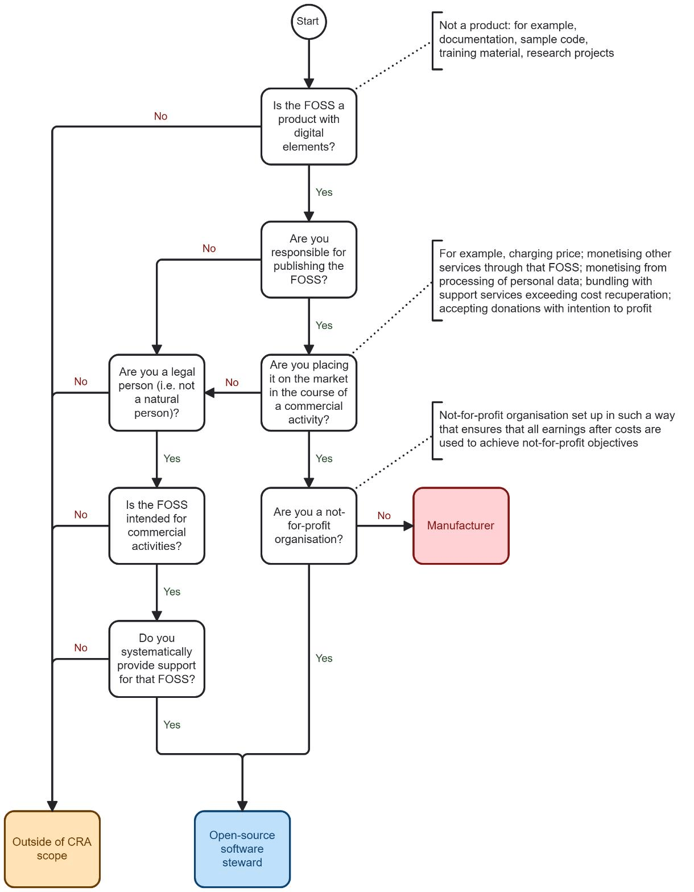
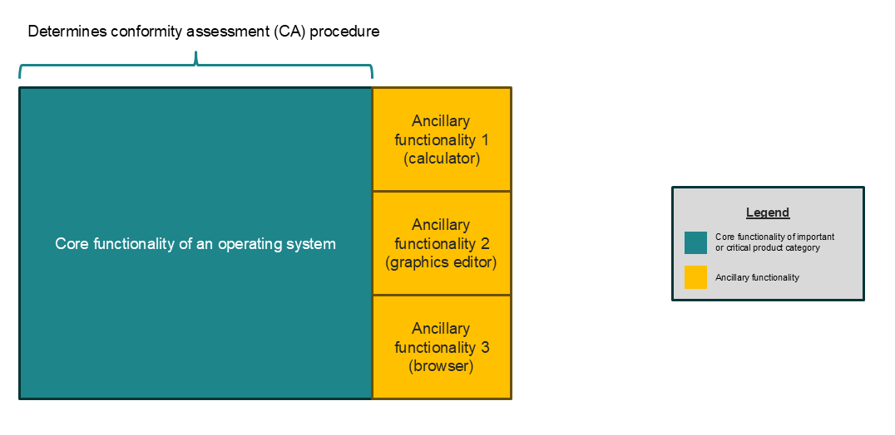
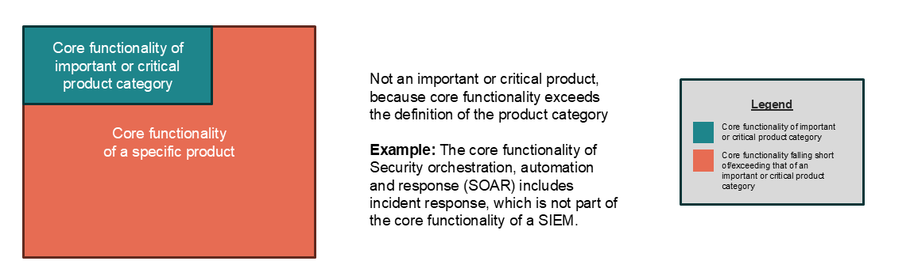
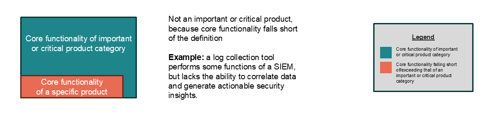
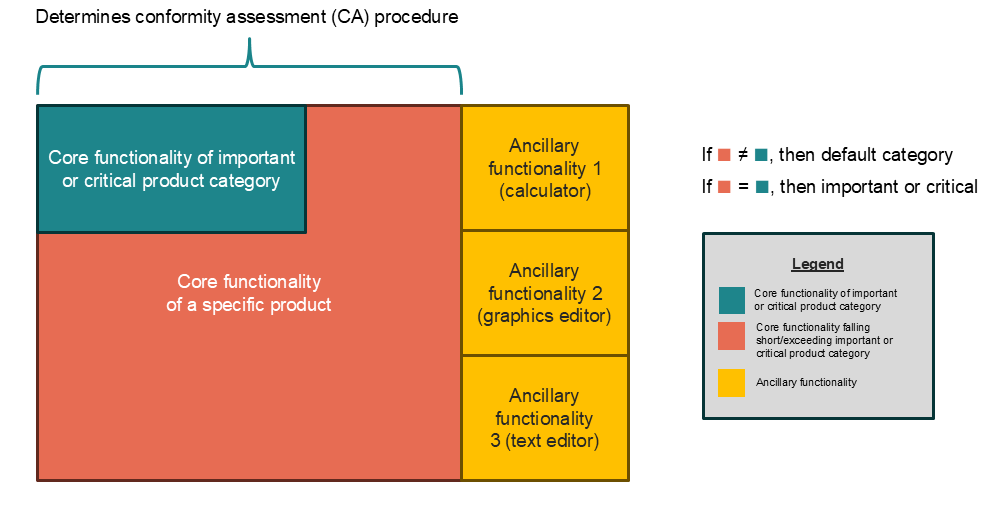
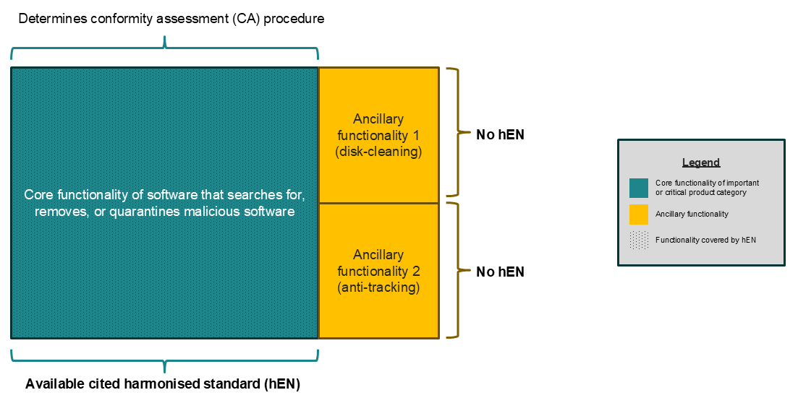
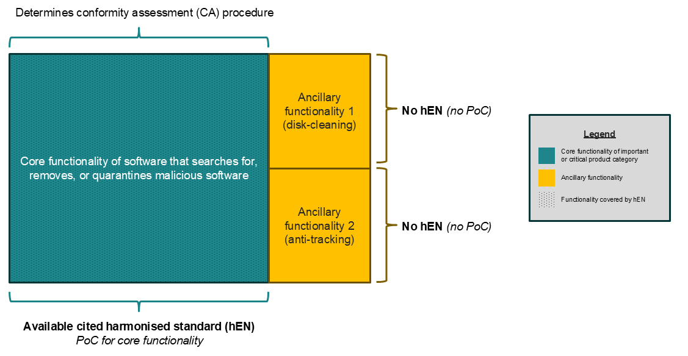
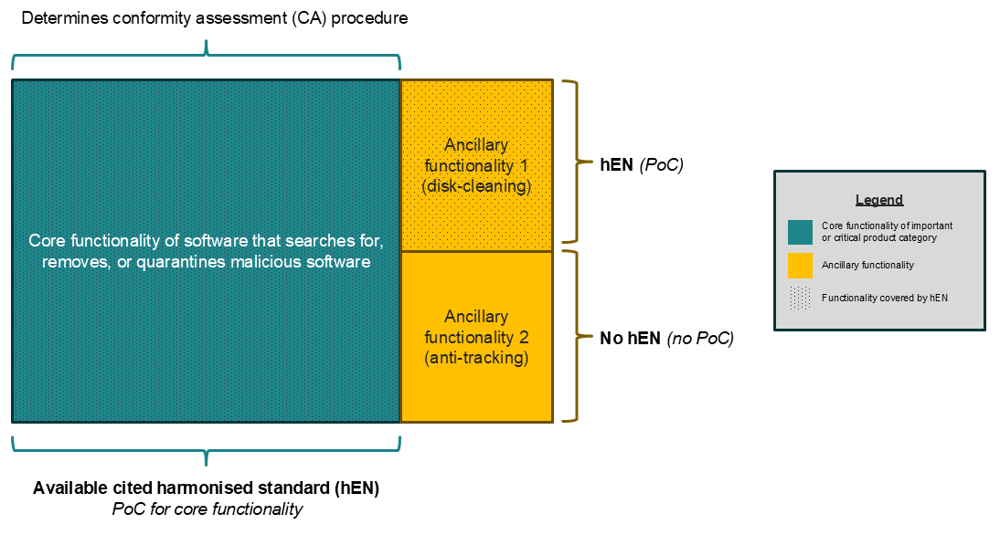
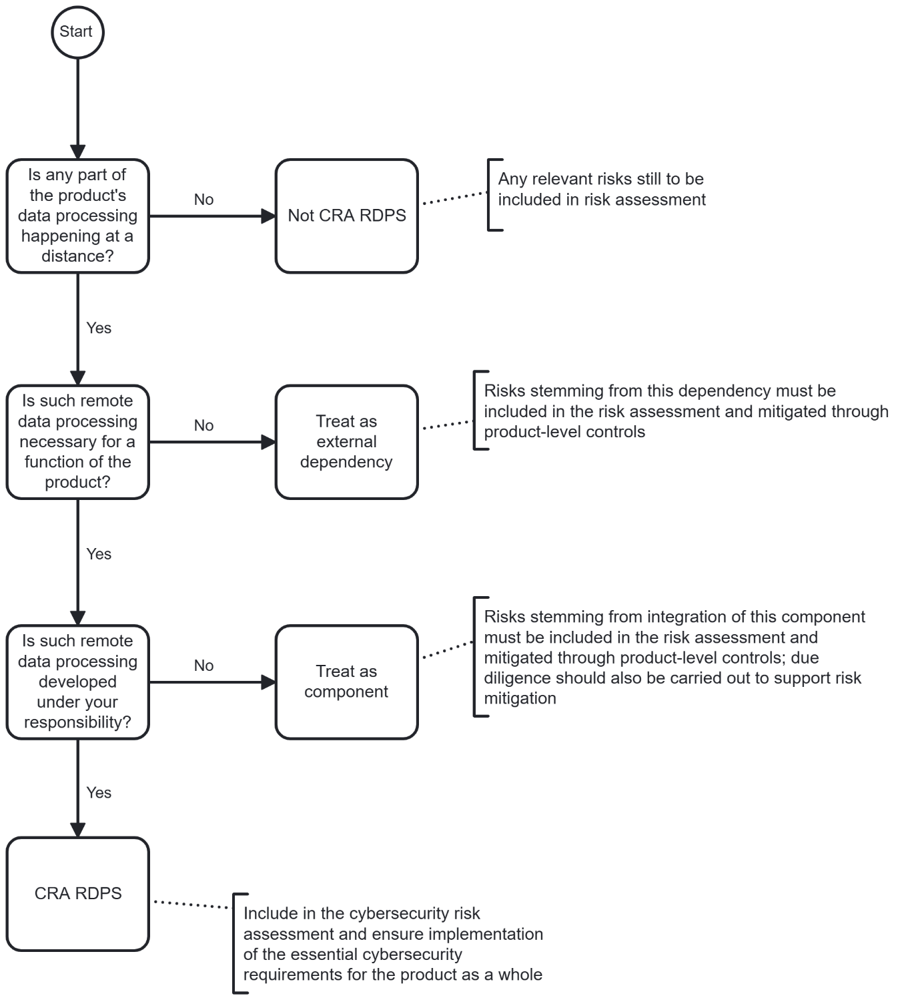
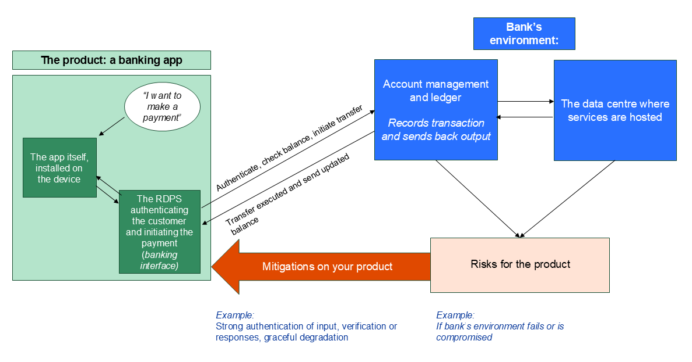

# Leitlinien der Kommission zur Anwendung der Verordnung (EU) 2024/2847 (Gesetz über die Cyber-Resilienz)

**EUROPÄISCHE KOMMISSION**
Brüssel, den 27.7.2026 C(2026) 5252 final

**ANHANG**

Mitteilung an die Kommission
Genehmigung des Inhalts des Entwurfs der Mitteilung der Kommission – Leitlinien der Kommission zur Anwendung der Verordnung (EU) 2024/2847 (Gesetz über die Cyber-Resilienz)

---

## Inhaltsverzeichnis

1. [Einleitung](#1-einleitung)
   - [1.1 Das Gesetz über die Cyber-Resilienz](#11-das-gesetz-über-die-cyber-resilienz)
   - [1.2 Zweck der Leitlinien](#12-zweck-der-leitlinien)
2. [Anwendungsbereich](#2-anwendungsbereich)
   - [2.1 Inverkehrbringen](#21-inverkehrbringen)
   - [2.2 Software als Produkt mit digitalen Elementen](#22-software-als-produkt-mit-digitalen-elementen)
   - [2.3 Computercode](#23-computercode)
   - [2.4 Kombination aus Hardware und Software, die ein Produkt mit digitalen Elementen bildet](#24-kombination-aus-hardware-und-software-die-ein-produkt-mit-digitalen-elementen-bildet)
   - [2.5 Datenverbindung](#25-datenverbindung)
   - [2.6 Komplexe Systeme](#26-komplexe-systeme)
   - [2.7 Produkte mit digitalen Elementen, die vor dem Anwendungsbeginn des CRA entworfen wurden](#27-produkte-mit-digitalen-elementen-die-vor-dem-anwendungsbeginn-des-cra-entworfen-wurden)
3. [Freie und Open-Source-Software](#3-freie-und-open-source-software)
   - [3.1 Feststellung, ob freie und Open-Source-Software in der Verantwortung einer Person liegt](#31-feststellung-ob-freie-und-open-source-software-in-der-verantwortung-einer-person-liegt)
   - [3.2 Feststellung, ob freie und Open-Source-Software auf dem EU-Markt in Verkehr gebracht wird](#32-feststellung-ob-freie-und-open-source-software-auf-dem-eu-markt-in-verkehr-gebracht-wird)
   - [3.3 Open-Source-Software-Verwalter (Stewards)](#33-open-source-software-verwalter-stewards)
   - [3.4 Mitwirkende und nachgelagerte Nutzungen](#34-mitwirkende-und-nachgelagerte-nutzungen)
   - [3.5 Veranschaulichende Szenarien](#35-veranschaulichende-szenarien)
4. [Wesentliche Änderungen und Ersatzteile](#4-wesentliche-änderungen-und-ersatzteile)
   - [4.1 Physische Reparaturen](#41-physische-reparaturen)
   - [4.2 Ersatzteile](#42-ersatzteile)
   - [4.3 Software-Updates als wesentliche Änderungen](#43-software-updates-als-wesentliche-änderungen)
   - [4.4 Folgen einer wesentlichen Änderung](#44-folgen-einer-wesentlichen-änderung)
5. [Supportzeitraum](#5-supportzeitraum)
   - [5.1 Wesentliche Änderungen und der Supportzeitraum](#51-wesentliche-änderungen-und-der-supportzeitraum)
6. [Wichtige und kritische Produkte mit digitalen Elementen](#6-wichtige-und-kritische-produkte-mit-digitalen-elementen)
   - [6.1 Kernfunktionalität](#61-kernfunktionalität)
   - [6.2 Konformitätsbewertung für wichtige und kritische Produkte mit digitalen Elementen](#62-konformitätsbewertung-für-wichtige-und-kritische-produkte-mit-digitalen-elementen)
   - [6.3 Auswirkungen auf die Konformitätsvermutung](#63-auswirkungen-auf-die-konformitätsvermutung)
7. [Bewertung des Cybersicherheitsrisikos und Integration von Produkten mit digitalen Elementen und Komponenten](#7-bewertung-des-cybersicherheitsrisikos-und-integration-von-produkten-mit-digitalen-elementen-und-komponenten)
   - [7.1 Zur Bewertung und Behandlung von Cybersicherheitsrisiken](#71-zur-bewertung-und-behandlung-von-cybersicherheitsrisiken)
   - [7.2 Zur Konzeption, Entwicklung und Herstellung von Produkten mit digitalen Elementen in einer Weise, die ein angemessenes Cybersicherheitsniveau auf der Grundlage der Risiken gewährleistet](#72-zur-konzeption-entwicklung-und-herstellung-von-produkten-mit-digitalen-elementen-in-einer-weise-die-ein-angemessenes-cybersicherheitsniveau-auf-der-grundlage-der-risiken-gewährleistet)
   - [7.3 Risikobewertung und Sorgfaltspflicht in Bezug auf externe Abhängigkeiten und integrierte Komponenten](#73-risikobewertung-und-sorgfaltspflicht-in-bezug-auf-externe-abhängigkeiten-und-integrierte-komponenten)
   - [7.4 Wiederverwendung von Risikobewertungen und Konformitätsdokumentation für Produktfamilien mit digitalen Elementen](#74-wiederverwendung-von-risikobewertungen-und-konformitätsdokumentation-für-produktfamilien-mit-digitalen-elementen)
8. [Fern-Datenverarbeitung](#8-fern-datenverarbeitung)
   - [8.1 Was gilt als Lösung zur Fern-Datenverarbeitung für ein Produkt mit digitalen Elementen?](#81-was-gilt-als-lösung-zur-fern-datenverarbeitung-für-ein-produkt-mit-digitalen-elementen)
   - [8.2 Praktische und technische Auswirkungen von Lösungen zur Fern-Datenverarbeitung und die Inanspruchnahme von Drittlösungen](#82-praktische-und-technische-auswirkungen-von-lösungen-zur-fern-datenverarbeitung-und-die-inanspruchnahme-von-drittlösungen)
   - [8.3 Anwendungsfälle für Lösungen zur Fern-Datenverarbeitung](#83-anwendungsfälle-für-lösungen-zur-fern-datenverarbeitung)
9. [Zusätzliche Elemente](#9-zusätzliche-elemente)
   - [9.1 Meldepflichten](#91-meldepflichten)
   - [9.2 Umgang mit Schwachstellen](#92-umgang-mit-schwachstellen)
   - [9.3 Zusammenspiel mit anderen Rechtsvorschriften](#93-zusammenspiel-mit-anderen-rechtsvorschriften)

---

## 1 Einleitung

### 1.1 Das Gesetz über die Cyber-Resilienz

1. Die Verordnung (EU) 2024/2847 des Europäischen Parlaments und des Rates vom 23. Oktober 2024 über horizontale Cybersicherheitsanforderungen für Produkte mit digitalen Elementen und zur Änderung der Verordnungen (EU) Nr. 168/2013 und (EU) 2019/1020 sowie der Richtlinie (EU) 2020/1828 (Gesetz über die Cyber-Resilienz)1 trat am 10. Dezember 2024 in Kraft. Die Verordnung zielt darauf ab, den Ansatz der EU in Bezug auf Cybersicherheit zu stärken, die Cyber-Resilienz auf EU-Ebene zu verbessern und das Funktionieren des Binnenmarktes durch die Schaffung eines einheitlichen Rechtsrahmens für wesentliche Cybersicherheitsanforderungen für das Inverkehrbringen von Produkten mit digitalen Elementen auf dem EU-Markt sowie während des Lebenszyklus eines Produkts mit digitalen Elementen zu verbessern.

2. Das Gesetz über die Cyber-Resilienz (CRA) baut auf dem Neuen Rechtsrahmen (NLF) der EU auf, der in der Verordnung (EG) Nr. 765/2008 des Europäischen Parlaments und des Rates vom 9. Juli 2008 über die Vorschriften für die Akkreditierung und Marktüberwachung im Zusammenhang mit der Vermarktung von Produkten und zur Aufhebung der Verordnung (EWG) Nr. 339/93 und dem Beschluss Nr. 768/2008/EG des Europäischen Parlaments und des Rates vom 9. Juli 2008 über einen gemeinsamen Rechtsrahmen für die Vermarktung von Produkten und zur Aufhebung des Beschlusses 93/465/EWG des Rates2 festgelegt ist.

3. Die Marktüberwachung und Durchsetzung obliegt den nationalen Marktüberwachungsbehörden. Produkte mit digitalen Elementen, die in den Anwendungsbereich des CRA fallen, unterliegen der Verordnung (EU) 2019/1020 des Europäischen Parlaments und des Rates vom 20. Juni 2019 über die Marktüberwachung und die Konformität von Produkten und zur Änderung der Richtlinie 2004/42/EG und der Verordnungen (EG) Nr. 765/2008 und (EU) Nr. 305/2011. Die Kommission und die Agentur der Europäischen Union für Cybersicherheit (ENISA) unterstützen die Wirtschaftsakteure und die Mitgliedstaaten bei der Anwendung des CRA.

> 1 ABl. L, 2024/2847, 20.11.2024, ELI: http://data.europa.eu/eli/reg/2024/2847/oj
>
> 2 Das Arbeitsprogramm der Kommission für 2026 sieht die Vorlage eines „Europäischen Produktgesetzes" vor, das den NLF und die Vorschriften für die Marktüberwachung und Normung aktualisiert: https://eur-lex.europa.eu/legal-content/EN/TXT/?uri=CELEX:52025DC0870

### 1.2 Zweck der Leitlinien

4. Artikel 26 Absatz 1 des CRA verpflichtet die Kommission, Leitlinien zu veröffentlichen, um die Wirtschaftsakteure bei der Anwendung der Verordnung zu unterstützen, wobei der Schwerpunkt insbesondere auf der Erleichterung der Compliance für Kleinstunternehmen sowie kleine und mittlere Unternehmen (KMU) liegt. Artikel 26 Absatz 2 legt die Mindestaspekte fest, die in den Leitlinien behandelt werden sollten. Dazu gehören: (i) der Anwendungsbereich des CRA (insbesondere Lösungen zur Fern-Datenverarbeitung und freie und Open-Source-Software); (ii) der Begriff der „Supportzeiträume"; (iii) das Zusammenspiel zwischen dem CRA und anderen EU-Rechtsvorschriften; und (iv) das Konzept der „wesentlichen Änderung".

5. Am 3. Dezember 2025 veröffentlichte die Kommission eine Reihe von häufig gestellten Fragen (FAQs), die den Wirtschaftsakteuren die Vorbereitung auf die Umsetzung des CRA erleichtern sollen3.

6. Diese Leitlinien sollen den Wirtschaftsakteuren die Einhaltung des CRA erleichtern und die Tätigkeiten der Marktüberwachungsbehörden, benennenden Behörden und benannten Stellen unterstützen, um eine harmonisierte Durchsetzung des CRA in der gesamten Union zu gewährleisten. Diese Leitlinien sind nicht darauf ausgelegt, den CRA in seinem gesamten Anwendungsbereich abzudecken, sondern sollen vielmehr Klarheit über die Begründung bestimmter Schlüsselbestimmungen und deren praktische Umsetzung schaffen. Diese Leitlinien betreffen den CRA und sind nicht auf andere EU-Rechtsvorschriften anwendbar.

7. Die Interessenträger wurden bei der Ausarbeitung dieser Leitlinien umfassend konsultiert, einschließlich der Expertengruppe für Cybersicherheit von Produkten mit digitalen Elementen4 und durch eine öffentliche Konsultation, die zwischen dem 3. März und dem 13. April 2026 stattfand5.

8. Diese Leitlinien sind für Wirtschaftsakteure oder andere dem CRA unterliegende Akteure nicht verbindlich. Eine verbindliche Auslegung des CRA kann nur der Gerichtshof der Europäischen Union vornehmen. Dennoch legen diese Leitlinien die Auslegung des CRA durch die Kommission dar, mit dem Ziel, die Compliance zu unterstützen und zur wirksamen Umsetzung der Verordnung beizutragen. Darüber hinaus enthalten die Leitlinien eine Reihe von Beispielen, um die Anwendung spezifischer Bestimmungen zu veranschaulichen. Diese Beispiele sind jedoch nicht dazu gedacht, eine Einzelfallprüfung zu ersetzen, die immer erforderlich sein wird, um den Besonderheiten jedes Einzelfalls Rechnung zu tragen.

9. Im Einklang mit Artikel 26 des CRA kann die Kommission die Ausgabe weiterer Leitlinien in Erwägung ziehen, einschließlich Leitlinien, die sich an Hersteller richten, die dem CRA und anderen Harmonisierungsrechtsvorschriften der Union oder anderen verwandten Rechtsakten der Union unterliegen. Diese Leitlinien könnten beispielsweise Fragen zum Zusammenspiel zwischen dem CRA und der Verordnung (EU) 2024/1689 zur Festlegung harmonisierter Vorschriften für künstliche Intelligenz (KI-Verordnung) sowie der Verordnung (EU) 2022/2554 über die digitale operative Resilienz im Finanzsektor (DORA) behandeln.

> 3 Die FAQs können über die Website der Kommission zur CRA-Umsetzung von der dedizierten FAQ-Webseite heruntergeladen werden.
>
> 4 Expertengruppe für Cybersicherheit von Produkten mit digitalen Elementen im Register der Expertengruppen der Kommission und ähnlicher Einrichtungen.
>
> 5 Öffentliche Konsultation zum Entwurf der Leitlinien der Kommission zum Gesetz über die Cyber-Resilienz.

---

## 2 Anwendungsbereich

### 2.1 Inverkehrbringen

10. Der CRA gilt für Produkte mit digitalen Elementen, die auf dem EU-Markt bereitgestellt werden. Der Begriff der „Bereitstellung auf dem Markt" ist in Artikel 3 Nummer 22 des CRA definiert als „die entgeltliche oder unentgeltliche Abgabe eines Produkts mit digitalen Elementen zum Vertrieb oder zur Verwendung auf dem Unionsmarkt im Rahmen einer gewerblichen Tätigkeit". Gemäß Artikel 3 Nummer 21 wird ein Produkt mit digitalen Elementen in Verkehr gebracht, wenn es erstmals auf dem Markt bereitgestellt wird.

11. Die neueste Ausgabe des „Blue Guide" (Leitfaden für die Umsetzung der EU-Produktrichtlinien) aus dem Jahr 2022 (nachfolgend „der Blue Guide")6 enthält Leitlinien, die das Verständnis der EU-Produktrichtlinien und ihre einheitliche Anwendung in den verschiedenen sektoralen Rechtsrahmen, die an den neuen Rechtsrahmen (NLF) wie den CRA angeglichen sind, erleichtern. Der Blue Guide weist darauf hin, dass die Begriffe „Inverkehrbringen" und „Bereitstellung auf dem Markt" so zu verstehen sind, dass sie sich „auf jedes einzelne Produkt und nicht auf eine Produktart beziehen, unabhängig davon, ob es als Einzelstück oder in Serie hergestellt wurde" (Abschnitt 2.3).

12. Für „traditionellere" Produkte mit digitalen Elementen, die unter den NLF fallen, wie z. B. Hardware in Form von Maschinen oder Funkanlagen mit digitalen Elementen, ist das Konzept des „Inverkehrbringens" gut etabliert, und der Blue Guide bietet weitere Leitlinien zur Klärung, wann solche Produkte als in Verkehr gebracht gelten. Die „zusammenfassenden Beispiele" in Abschnitt 2.12 des Blue Guide liefern weitere Beispiele für das Konzept des „Inverkehrbringens".

13. Angesichts der Natur immaterieller Produkte mit digitalen Elementen, wie z. B. eigenständiger Software, ist jedoch eine weitere Klärung erforderlich, wann solche Produkte mit digitalen Elementen als in Verkehr gebracht gelten. Sobald die Herstellungsphase der Software abgeschlossen ist und das Produkt mit digitalen Elementen potenziellen Nutzern auf dem EU-Markt zum Vertrieb oder zur Verwendung angeboten wird, kann davon ausgegangen werden, dass sein Hersteller mehrere Kopien desselben Softwareprodukts mit digitalen Elementen hergestellt und zum Vertrieb oder zur Verwendung abgegeben hat. Tatsächlich unterliegt eigenständige Software, anders als materielle Produkte mit digitalen Elementen, keinen physischen Produktions- oder Lagerbeschränkungen: Jeder Akt der Bereitstellung der Software zum Download oder Vertrieb führt zur Erstellung einer neuen identischen Kopie für den Nutzer. Solange diese Version der Software nicht in einer Weise geändert wird, die die Compliance mit dem CRA beeinträchtigt, gilt das Inverkehrbringen auf dem EU-Markt als zum Zeitpunkt des ersten Angebots zum Vertrieb oder zur Verwendung erfolgt. Die Möglichkeit des nachfolgenden Downloads oder Vertriebs dieser Version des Softwareprodukts mit digitalen Elementen ist daher als ein Fall anzusehen, in dem dieses Softwareprodukt mit digitalen Elementen bereitgestellt wird7.

14. Daher sollte ein eigenständiges Softwareprodukt mit digitalen Elementen als in Verkehr gebracht gelten, wenn seine Herstellungsphase abgeschlossen ist und diese Software erstmals im Rahmen einer gewerblichen Tätigkeit zum Vertrieb oder zur Verwendung auf dem EU-Markt abgegeben wird. Der Hersteller sollte als gleichzeitig mehrere Kopien desselben Softwareprodukts mit digitalen Elementen in Verkehr gebracht habend angesehen werden. Obwohl mehrere Kopien derselben Software weiterhin einzelne Produkte mit digitalen Elementen sind, gelten sie daher unabhängig davon, wann der Besitz oder die Nutzung jeder einzelnen Kopie auf eine andere natürliche oder juristische Person übergeht, als gleichzeitig in Verkehr gebracht. Wenn der Hersteller die Software jedoch in verschiedenen Varianten anbietet, die sich in ihren enthaltenen Komponenten, Konfigurationen oder aktivierten Funktionen unterscheiden (z. B. Builds für verschiedene Betriebssysteme oder Bündel mit unterschiedlichen Funktionsumfängen), können diese Varianten nicht als mehrere Kopien desselben Softwareprodukts mit digitalen Elementen angesehen werden. Daher sollten sie für die Zwecke des Inverkehrbringens als unterschiedliche Produkte mit digitalen Elementen behandelt werden.

> **Beispiel 1:** Am 1. Januar 2028 stellt Unternehmen A erstmals Version 1.0.0 seiner Software X über seine Website zum Vertrieb bereit. Am selben Tag kauft Kunde 1 eine Kopie der Version 1.0.0 der Software X. Am 15. Januar 2028 kauft Kunde 2 eine Kopie der Version 1.0.0 der Software X. Beide Kopien der Version 1.0.0 der Software X werden am 1. Januar 2028 in Verkehr gebracht.

15. Angesichts der iterativen Natur der Softwareentwicklung sollte ferner klargestellt werden, dass nachfolgende Iterationen eines Softwareprodukts mit digitalen Elementen als neu in Verkehr gebracht gelten, wenn diese Iterationen eine „wesentliche Änderung" eines bereits in Verkehr gebrachten Softwareprodukts mit digitalen Elementen darstellen, wie in Erwägungsgrund 41 des CRA angegeben. Iterationen, die keine wesentlichen Änderungen darstellen, erfordern nicht, dass der Hersteller ein neues Konformitätsbewertungsverfahren durchführt, und ändern daher nicht das Datum des Inverkehrbringens dieser Software. Weitere Leitlinien zum Konzept der wesentlichen Änderungen finden Sie in Abschnitt 4 „Wesentliche Änderungen".

> **Beispiel 2:** Am 1. Januar 2028 stellt Unternehmen A erstmals Version 1.0.0 seiner Software X über seine Website zum Vertrieb bereit. Am selben Tag kauft Kunde 1 eine Kopie der Version 1.0.0 der Software X. Am 15. Januar 2028 veröffentlicht Unternehmen A eine aktualisierte Version 1.0.1 der Software X, die keine wesentliche Änderung darstellt. Am 30. Januar 2028 kauft Kunde 2 eine Kopie der Version 1.0.1 der Software X. Beide Kopien der Version 1.0.0 und 1.0.1 der Software X gelten als am 1. Januar 2028 in Verkehr gebracht.

16. Die in den Nummern 13, 14 und 15 dargelegten Leitlinien gelten ausschließlich, sofern es sich bei dem Produkt mit digitalen Elementen um eigenständige Software handelt. Dies ist beispielsweise nicht der Fall, wenn die Software mit Hardware kombiniert wird, wie in Abschnitt 2.4 „Kombination aus Hardware und Software, die ein Produkt bildet", erörtert.

> 6 Commission notice – The 'Blue Guide' on the implementation of EU product rules 2022 (Text with EEA relevance) 2022/C 247/01, ABl. C 247, 29.6.2022, S. 1–152.
>
> 7 Gemäß Artikel 13 Absatz 11 können Hersteller öffentliche Software-Archive unterhalten, die den Benutzerzugriff auf historische Versionen verbessern. In solchen Fällen sind die Nutzer klar und leicht zugänglich über die Risiken der Verwendung nicht mehr unterstützter Software zu informieren.

### 2.2 Software als Produkt mit digitalen Elementen

17. Artikel 3 Absatz 1 des CRA definiert ein Produkt mit digitalen Elementen als „ein Software- oder Hardwareprodukt und seine Lösungen zur Fern-Datenverarbeitung, einschließlich Software- oder Hardwarekomponenten, die separat in Verkehr gebracht werden". Solche Produkte mit digitalen Elementen fallen in den Anwendungsbereich des CRA, wenn ihr bestimmungsgemäßer Zweck oder ihre vernünftigerweise vorhersehbare Verwendung eine direkte oder indirekte logische oder physische Datenverbindung zu einem Gerät oder Netzwerk beinhaltet.

18. Der CRA kann daher eine Reihe von Produkten mit digitalen Elementen abdecken, darunter: (i) eigenständige Software, wie Apps und Computerprogramme, unabhängig davon, ob sie digital oder physisch vertrieben werden; (ii) Hardware mit eingebetteter Software (z. B. Internet-of-Things-Geräte, Laptops, Tablets); (iii) eigenständige Hardware (z. B. integrierte Schaltkreise, Motherboards); und (iv) jede Kombination aus Hardware und Software, die separat geliefert wird, aber dazu bestimmt ist, zusammen zu arbeiten.

19. Eigenständige Software fällt daher in den Anwendungsbereich des CRA, wenn sie als Produkt mit digitalen Elementen in Verkehr gebracht wird. Es ist hilfreich, zwischen Softwareprodukten mit digitalen Elementen, die dem CRA unterliegen, und der Fernbereitstellung von Dienstleistungen, die nicht in den Anwendungsbereich des CRA fallen, zu unterscheiden.

20. Damit Software in den Anwendungsbereich des CRA fällt, muss ein Softwareprodukt mit digitalen Elementen einem Nutzer bereitgestellt, von diesem Nutzer bezogen und auf oder als Teil eines elektronischen Informationssystems auf der Seite des Nutzers betrieben werden. Software, die heruntergeladen, installiert oder auf andere Weise dem Nutzer bereitgestellt wird und auf dem elektronischen Informationssystem des Nutzers ausgeführt wird, erfüllt diese Kriterien, einschließlich beispielsweise der Fälle, in denen sie die Form einer Browser-Erweiterung oder einer mit Web-Technologien entwickelten, aber zur lokalen Ausführung bereitgestellten Anwendung annimmt.

21. Im Gegensatz dazu ist Software, die remote ausgeführt wird und vom Nutzer lediglich aufgerufen wird, allein auf dieser Grundlage kein Produkt mit digitalen Elementen. Die Erwägungsgründe 11 und 12 des CRA ziehen diese Unterscheidung tatsächlich, indem sie erklären, dass die Verarbeitung oder Speicherung aus der Ferne nur insoweit unter den CRA fällt, als sie für ein Produkt mit digitalen Elementen notwendig ist, um seine Funktionen zu erfüllen (d. h. durch das Konzept der Fern-Datenverarbeitung, wie in Artikel 3 Nummer 2 definiert), und nicht als solche als Produkte mit digitalen Elementen. Dies ist typischerweise der Fall für Webanwendungen, einschließlich Progressive Web Apps (PWA), wenn sie ausschließlich über einen Webbrowser aufgerufen werden. Dasselbe gilt für Websites: Obwohl Websites in begrenztem Umfang technisch auf dem Gerät des Nutzers laufen und ausgeführt werden können, folgt aus Erwägungsgrund 12 des CRA, dass Websites selbst nicht als Produkte mit digitalen Elementen zu betrachten sind und nur dann in den Anwendungsbereich des CRA fallen, wenn sie die Funktionalität eines Produkts mit digitalen Elementen unterstützen, d. h. insoweit, als sie als Fern-Datenverarbeitung qualifizieren (wie weiter in Abschnitt 8 und insbesondere 8.1.2 erläutert).

> **Beispiel 3:** Eine mobile Anwendung, die ein Nutzer aus einem App-Store herunterlädt und auf seinem Smartphone installiert, wird dem Nutzer bereitgestellt und auf dem Gerät des Nutzers ausgeführt und ist daher ein Produkt mit digitalen Elementen. Wenn sie im Rahmen einer gewerblichen Tätigkeit in Verkehr gebracht wird, kann sie in den Anwendungsbereich des CRA fallen.

> **Beispiel 4:** Eine Desktop-Anwendung, die mit Web-Technologien erstellt, aber zur lokalen Installation verpackt wurde, wird dem Nutzer bereitgestellt und auf dem Gerät des Nutzers ausgeführt und ist daher ein Produkt mit digitalen Elementen. Wenn sie im Rahmen einer gewerblichen Tätigkeit in Verkehr gebracht wird, kann sie in den Anwendungsbereich des CRA fallen.

> **Beispiel 5:** Eine Webanwendung, auf die der Nutzer ausschließlich über einen Webbrowser zugreift, ist kein Produkt mit digitalen Elementen. Sofern sie nicht die Funktionalität eines Produkts mit digitalen Elementen unterstützt, fällt sie nicht in den Anwendungsbereich des CRA. Im Gegensatz dazu ist eine Anwendung, die dem Nutzer als lokal installierter Client bereitgestellt wird und auf dem Gerät des Nutzers ausgeführt wird, ein Produkt mit digitalen Elementen. Wenn sie im Rahmen einer gewerblichen Tätigkeit in Verkehr gebracht wird, kann sie in den Anwendungsbereich des CRA fallen. Wenn dieser Client zur Erfüllung einer oder mehrerer seiner Funktionen auf eine Datenverarbeitung aus der Ferne angewiesen ist, die die Definition der Fern-Datenverarbeitung erfüllt, ist diese Datenverarbeitung aus der Ferne ebenfalls Teil des Produkts mit digitalen Elementen.

> **Beispiel 6:** Eine Website, die ihren Besuchern lediglich Informationen präsentiert und nicht die Funktionalität eines Produkts mit digitalen Elementen unterstützt, ist selbst kein Produkt mit digitalen Elementen. Sie fällt daher nicht in den Anwendungsbereich des CRA.

### 2.3 Computercode

22. Es ist auch hilfreich zu klären, ob Quellcode ein Softwareprodukt mit digitalen Elementen darstellen kann. Der CRA definiert Software als „den Teil eines elektronischen Informationssystems, der aus Computercode besteht" (Artikel 3 Nummer 4). Computercode kann die Form von (i) Maschinencode annehmen, bei dem es sich um den direkt vom Prozessor eines Computers ausgeführten Befehlssatz in binärem Format handelt; oder (ii) Quellcode, d. h. den in einer Programmiersprache geschriebenen Befehls- und Anweisungssatz, der kompiliert oder interpretiert werden muss, um von einem Computer ausgeführt zu werden. Die im CRA festgelegte Definition von Software umfasst beides.

23. Eine separate Frage ist, ob eine bestimmte Abgabe von Computercode das Inverkehrbringen eines Produkts mit digitalen Elementen auf dem EU-Markt darstellt, was eine Abgabe im Rahmen einer gewerblichen Tätigkeit erfordert. Dies ist für Quellcode oft nicht der Fall. Beispielsweise gilt eine natürliche oder juristische Person, die freien und Open-Source-Computercode auf öffentlich zugänglichen Repositories teilt, im Allgemeinen nicht als Inverkehrbringer dieses Codes auf dem EU-Markt im Sinne des CRA (wie in Abschnitt 3 „Freie und Open-Source-Software" ausführlicher erörtert). Unfertiger Code, der während der Entwurfs- und Entwicklungsphase eines Produkts mit digitalen Elementen geteilt wird (z. B. zum Testen oder Überprüfen), gilt ebenfalls nicht als im Sinne des CRA in Verkehr gebracht, da seine Herstellungsphase nicht abgeschlossen ist. Ebenso gilt Beispiel- oder Demo-Code, der als Teil von Tutorials oder Schulungsmaterialien bereitgestellt wird, nicht als im Sinne des CRA in Verkehr gebracht8.

24. Wenn ein Hersteller seinen Kunden jedoch Computercode als Produkt mit digitalen Elementen bereitstellt, gilt dieser Code als in Verkehr gebracht, unabhängig davon, ob es sich um Maschinencode oder Quellcode handelt9.

> **Beispiel 7:** Unternehmen A lizenziert Quellcode an Unternehmen B für eine anpassbare interne Plattform und stellt diesen Quellcode in einer Textdatei bereit. Auch wenn dieser Quellcode von Unternehmen B vor der Verwendung weiter angepasst und kompiliert werden muss, bringt Unternehmen A diesen Quellcode in Verkehr und unterliegt daher dem CRA. Unternehmen A ist nicht für die Compliance von Unternehmen B mit dem CRA in Bezug auf die nachfolgenden Anpassungen und die Kompilierung dieses Codes verantwortlich.

> 8 Es sei auch daran erinnert, dass Artikel 4 Absatz 3 es Herstellern erlaubt, unfertige Software, die der Verordnung nicht entspricht (z. B. Alpha-Versionen, Beta-Versionen oder Release Candidates), auf dem Markt bereitzustellen, sofern die unfertige Software nur für die Zeit bereitgestellt wird, die erforderlich ist, um sie zu testen und Feedback zu sammeln.
>
> 9 Andererseits ist anzumerken, dass Computercode selbst für die Zwecke des Produkthaftungsrechts kein Produkt darstellt und Hersteller, die solchen Code in Verkehr bringen, daher nicht nach der Richtlinie (EU) 2024/2853 (Produkthaftungsrichtlinie) haftbar gemacht werden können. Erwägungsgrund 13 dieser Richtlinie besagt, dass „Informationen jedoch nicht als Produkt zu betrachten sind und die Produkthaftungsvorschriften daher nicht für den Inhalt digitaler Dateien, wie z. B. Mediendateien oder E-Books, oder den bloßen Quellcode von Software, gelten sollten". Dies schließt nicht aus, dass Hersteller nach nationalem Deliktsrecht haftbar sein können.

### 2.4 Kombination aus Hardware und Software, die ein Produkt mit digitalen Elementen bildet

25. Ob Software Teil eines Produkts mit digitalen Elementen ist, sollte nicht danach bestimmt werden, wie oder wann diese Software dem Nutzer geliefert wird, sondern danach, ob die Software angesichts des bestimmungsgemäßen Zwecks und der vernünftigerweise vorhersehbaren Verwendung des Produkts notwendig ist, damit das Produkt mit digitalen Elementen seine beabsichtigten Funktionen erfüllen kann. Wenn ein Hardwareprodukt mit digitalen Elementen so konzipiert ist, dass es mit einer bestimmten, vom selben Hersteller bereitgestellten Software zusammenarbeitet, um seine Funktionen zu erfüllen, bilden die Hardware und diese Software zusammen das Produkt mit digitalen Elementen. Software, die zur Bedienung, Konfiguration, Steuerung oder Verwendung eines Produkts mit digitalen Elementen gemäß seinem bestimmungsgemäßen Zweck erforderlich ist, ist daher Teil des Produkts mit digitalen Elementen, auch wenn sie über einen separaten Kanal bezogen wird (z. B. einen App-Store, einen Download-Link oder einen anderen digitalen Kanal, nachdem das Hardwareprodukt mit digitalen Elementen in Verkehr gebracht wurde). Ihr Inverkehrbringen erfolgt somit zum gleichen Zeitpunkt wie das Inverkehrbringen der Einheiten des Hardwareprodukts mit digitalen Elementen.

> **Beispiel 8:** Ein Netzwerkdrucker wird als Hardwareprodukt mit digitalen Elementen in Verkehr gebracht, während die Softwaretreiber, die zum Senden von Druckaufträgen, zur Konfiguration des Geräts und zur Verwaltung seines Betriebs erforderlich sind, zum Download von der Website des Herstellers bereitgestellt werden. Obwohl der Drucker und die Treiber über verschiedene Kanäle geliefert werden, bilden sie zusammen ein einziges Produkt mit digitalen Elementen, da der Drucker seinen bestimmungsgemäßen Zweck ohne die Treiber nicht erfüllen kann.

> **Beispiel 9:** Ein Fitness-Wearable wird in Verkehr gebracht, um die Herzfrequenz und Aktivität eines Nutzers zu messen, während eine vom Hersteller bereitgestellte Smartphone-Anwendung erforderlich ist, um die Messungen anzuzeigen, den Verlauf anzuzeigen und die Konfiguration des Geräts zu ermöglichen. Obwohl die Anwendung separat über einen App-Store heruntergeladen wird, bilden das Wearable und die Anwendung zusammen ein einziges Produkt mit digitalen Elementen, da sie so konzipiert und beabsichtigt sind, zusammen zu arbeiten, um die Funktionalität des Produkts mit digitalen Elementen bereitzustellen.

### 2.5 Datenverbindung

26. Artikel 2 Absatz 1 besagt, dass der CRA „für Produkte mit digitalen Elementen gilt, die auf dem Markt bereitgestellt werden und deren bestimmungsgemäßer Zweck oder vernünftigerweise vorhersehbare Verwendung eine direkte oder indirekte logische oder physische Datenverbindung zu einem Gerät oder Netzwerk beinhaltet". Der Anwendungsbereich des CRA ist daher nicht an das bloße Vorhandensein von Elektronik gebunden, sondern an die Fähigkeit eines Produkts mit digitalen Elementen, digitale Informationen auszutauschen.

27. Während die Begriffe „logische Verbindung" und „physische Verbindung" in Artikel 3 definiert sind, definiert der CRA weder „Datenverbindung" noch „digitale Daten". Es ist daher hilfreich, eine Auslegung dessen zu geben, was eine Datenverbindung ist, um die Grenze des Anwendungsbereichs des CRA zu klären. Diese Grenze ist besonders wichtig, um Produkte mit digitalen Elementen, die lediglich elektrische Signale verwenden, von solchen zu unterscheiden, die an der digitalen Kommunikation teilnehmen und daher Cybersicherheitsrisiken ausgesetzt sind.

28. Auf der grundlegendsten Ebene beinhaltet eine Datenverbindung die Übertragung von Informationen in binärer Form, d. h. als eine Folge von 0en und 1en. Das einfache Ein- und Ausschalten eines Ausgangs (d. h. 0/1) stellt für sich genommen keine Datenverbindung dar, wenn diese Zustände nicht dazu bestimmt sind, Daten darzustellen, oder nicht von einem digitalen Eingang gelesen werden. Damit eine Datenverbindung besteht, müssen die binären Zustände von einer Quelle absichtlich als Informationen kodiert werden und in der Lage sein, am Ziel als Informationen dekodiert zu werden. Mit anderen Worten, es muss einen Sender geben, der absichtlich digitale Symbole nach einem definierten Schema erzeugt, und einen Empfänger, der in der Lage ist, diese Symbole als Daten zu interpretieren. Wenn elektrische oder elektronische Signale ausschließlich zum Auslösen oder Versorgen einer Funktion verwendet werden, ohne digital kodierte Informationen zu übermitteln, besteht für die Zwecke des CRA keine Datenverbindung, und daher fällt das Produkt mit digitalen Elementen nicht in den Anwendungsbereich von Artikel 2 Absatz 1.

### 2.6 Komplexe Systeme

29. Produkte mit digitalen Elementen im Anwendungsbereich des CRA können nicht nur aus einzelnen Geräten oder Softwarekomponenten bestehen, sondern auch aus komplexen Systemen, einschließlich Systemen, die aus mehreren Hardware- und Softwareelementen bestehen, die zusammenarbeiten, um eine bestimmte Funktion zu erfüllen. Wenn ein solches System als einziges Produkt mit digitalen Elementen in Verkehr gebracht wird, stellt es ein Produkt mit digitalen Elementen im Sinne des CRA dar.

30. Solche komplexen Systeme sind oft durch lange Entwurfs- und Entwicklungszyklen gekennzeichnet, mit Verträgen, die möglicherweise vor der Anwendung des CRA unterzeichnet wurden, langen betrieblichen Lebensdauern und einem hohen Maß an technischer und organisatorischer Komplexität. Solche Systeme, die nach dem Anwendungsbeginn des CRA in Verkehr gebracht werden sollen, können auf Komponenten zurückgreifen, die vor dem Anwendungsbeginn des CRA in Verkehr gebracht wurden, auf etablierte Architekturen oder auf weit verbreitete Interoperabilitätsstandards, einschließlich Standards, auf die in anderen EU-Rechtsvorschriften oder sektorspezifischen Rahmenwerken verwiesen wird. Infolgedessen können bestimmte technische Merkmale dieser Systeme schwer oder unverhältnismäßig zu ändern sein, ohne ihren bestimmungsgemäßen Zweck, ihre Sicherheit, Zuverlässigkeit oder Interoperabilität mit der bestehenden Infrastruktur zu beeinträchtigen.

31. Diese Merkmale schließen komplexe Systeme nicht von sich aus aus dem Anwendungsbereich des CRA aus. Sie veranschaulichen vielmehr die Anwendung des risikobasierten Ansatzes des CRA, der es ermöglicht, die Compliance auf unterschiedliche Weise nachzuweisen, abhängig von den Merkmalen und Einschränkungen des Produkts mit digitalen Elementen, in Übereinstimmung mit Artikel 13 Absatz 3 des CRA. Diese Merkmale sind Teil seines bestimmungsgemäßen Zwecks und seines Betriebskontextes und daher relevant bei der Bewertung der Compliance mit den wesentlichen Cybersicherheitsanforderungen (den „wesentlichen Anforderungen"). Insbesondere erkennt Erwägungsgrund 55 ausdrücklich an, dass bestimmte wesentliche Anforderungen möglicherweise nicht vollständig mit der Natur eines Produkts mit digitalen Elementen vereinbar sind. Dies kann beispielsweise der Fall sein, wenn die Compliance zwingende Interoperabilitätsanforderungen oder das ordnungsgemäße Funktionieren des Systems untergraben würde.

32. Dementsprechend sind die Hersteller verpflichtet, Cybersicherheitsrisiken auf der Grundlage der in Artikel 13 Absatz 2 genannten Cybersicherheits-Risikobewertung anzugehen. Wie auch in Erwägungsgrund 55 erläutert, sind in einigen Fällen spezifische wesentliche Anforderungen nicht anwendbar oder können aufgrund des bestimmungsgemäßen Zwecks des Produkts mit digitalen Elementen, das die Interaktion mit bestehenden Abhängigkeiten erfordert oder bestimmten Interoperabilitätsanforderungen folgen muss, nicht durch die Implementierung von Sicherheitsmaßnahmen auf dem neuesten Stand der Technik erfüllt werden. In solchen Fällen sollten die Hersteller diese spezifischen Einschränkungen identifizieren und dokumentieren, die damit verbundenen Risiken bewerten und geeignete alternative oder kompensierende Risikominderungsmaßnahmen implementieren, um die Sicherheit des Produkts mit digitalen Elementen nicht zu untergraben. Für diese Zwecke spielen sowohl die technische Dokumentation gemäß Artikel 31 als auch die Informationen und Anweisungen für den Nutzer gemäß Anhang II eine Schlüsselrolle bei der transparenten Beschreibung der identifizierten Einschränkungen, der damit verbundenen Cybersicherheitsrisiken und der implementierten Risikominderungsmaßnahmen. In Übereinstimmung mit der Verpflichtung, die Risikobewertung während des Supportzeitraums auf dem neuesten Stand zu halten, sollten die Hersteller auch regelmäßig neu bewerten, ob solche Einschränkungen weiterhin bestehen. Wenn solche Einschränkungen im Laufe der Zeit aufgehoben oder verringert werden können, sollten die Hersteller das Produkt mit digitalen Elementen entsprechend aktualisieren, damit es ein angemessenes Cybersicherheitsniveau erreichen kann10.

> **Beispiel 10:** Ein Hersteller bringt ein Produkt mit digitalen Elementen auf den Markt, das über ein Netzwerkprotokoll mit externen Systemen kommuniziert. Im Rahmen der Anwendung der wesentlichen Anforderungen stellt der Hersteller auf der Grundlage der Cybersicherheits-Risikobewertung fest, dass die Verwendung eines sicheren Kommunikationsprotokolls erforderlich ist, um die Vertraulichkeit und Integrität der vom Produkt mit digitalen Elementen ausgetauschten Daten zu gewährleisten. Sein bestimmungsgemäßer Zweck umfasst jedoch die Interoperabilität mit bestehenden Systemen, die nur ein älteres oder weniger sicheres Protokoll unterstützen. In solchen Fällen kann der Hersteller dieses Protokoll implementieren, wenn dies zur Erreichung der Interoperabilität erforderlich ist, vorausgesetzt, die damit verbundenen Cybersicherheitsrisiken werden auf andere Weise identifiziert und gemindert. Wenn es für das Produkt mit digitalen Elementen technisch machbar ist, sowohl das sichere als auch das weniger sichere Protokoll zu unterstützen, wird erwartet, dass der Hersteller das sichere Protokoll implementiert und dessen Verwendung standardmäßig aktiviert. Das weniger sichere Protokoll wäre nur dort zulässig, wo es für die Interoperabilität erforderlich ist.

> **Beispiel 11:** Ein Hersteller eines industriellen Automatisierungssystems kauft einige Mikrocontroller, bevor der CRA in Anwendung tritt. Der Hersteller führt die Cybersicherheits-Risikobewertung für sein industrielles Automatisierungssystem durch, das nach dem Anwendungsbeginn des CRA in Verkehr gebracht werden soll. Auf der Grundlage dieser Cybersicherheits-Risikobewertung identifiziert der Hersteller keine spezifischen Cybersicherheitsrisiken, die mit der Verwendung eines dieser Mikrocontroller verbunden sind. Der Hersteller integriert ihn in sein industrielles Automatisierungssystem und stellt sicher, dass das Produkt mit digitalen Elementen als Ganzes (das industrielle Automatisierungssystem) die wesentlichen Anforderungen erfüllt.

> 10 Es ist anzumerken, dass die in diesem Absatz dargelegten Überlegungen gegebenenfalls auf alle Produkte mit digitalen Elementen im Anwendungsbereich des CRA anwendbar sein können und nicht nur auf „komplexe Systeme".

### 2.7 Produkte mit digitalen Elementen, die vor dem Anwendungsbeginn des CRA entworfen wurden

33. In einigen Fällen wird ein Hersteller nach dem Anwendungsbeginn des CRA am 11. Dezember 2027 Einheiten eines Produkts mit digitalen Elementen in Verkehr bringen, die in Übereinstimmung mit einem Typ oder Modell hergestellt wurden, das vor dem Datum der Anwendung des CRA entworfen und entwickelt wurde. In solchen Fällen erfordert die Compliance mit dieser Verordnung nicht notwendigerweise, dass diese Einheiten des Produkts mit digitalen Elementen neu gestaltet werden. Der Hersteller ist verpflichtet, eine Cybersicherheits-Risikobewertung gemäß Artikel 13 Absatz 2 des CRA durchzuführen, um auf der Grundlage des bestimmungsgemäßen Zwecks und der vernünftigerweise vorhersehbaren Verwendung des Produkts mit digitalen Elementen zu bestimmen, welche der in Anhang I Teil I aufgeführten wesentlichen Anforderungen für dieses Produkt mit digitalen Elementen gelten und wie diese Anforderungen umgesetzt werden.

34. Wenn das Ergebnis dieser Risikobewertung zeigt, dass das Produkt mit digitalen Elementen bereits über geeignete und wirksame Sicherheitsmaßnahmen verfügt, die die relevanten Risiken adressieren, kann der Hersteller auf diese bestehenden Maßnahmen zurückgreifen, um die Compliance mit dem CRA nachzuweisen. Der CRA legt an sich keine Verpflichtung fest, neue Sicherheitsfunktionen einzuführen oder das Produkt mit digitalen Elementen neu zu gestalten, wenn dies nicht erforderlich ist, um die identifizierten Risiken anzugehen.

35. Dennoch unterliegt der Hersteller weiterhin den im CRA festgelegten Verpflichtungen. Dazu gehört die Sicherstellung, dass vor dem Inverkehrbringen des Produkts mit digitalen Elementen das anwendbare Konformitätsbewertungsverfahren durchgeführt, die EU-Konformitätserklärung ausgestellt und die CE-Kennzeichnung angebracht wurde. Die Compliance mit diesen Anforderungen ist unabhängig davon, ob das Design des Produkts mit digitalen Elementen infolge der Risikobewertung geändert werden musste. Für Produkte mit digitalen Elementen, die vor dem Datum der Anwendung des CRA entworfen, aber nach diesem Datum in Verkehr gebracht werden, wenn es dem Hersteller nicht möglich ist, nachzuweisen, wie die Risikobewertung während der Entwurfs- und Entwicklungsphase des Produkts mit digitalen Elementen berücksichtigt wurde, sollte die Verpflichtung gemäß Artikel 13 Absatz 2 so verstanden werden, dass sie von den Herstellern verlangt, eine Cybersicherheits-Risikobewertung durchzuführen und auf dieser Grundlage nachzuweisen, dass das Produkt mit digitalen Elementen über angemessene Sicherheitsmaßnahmen verfügt, um Cybersicherheitsrisiken zu minimieren, Vorfälle zu verhindern und ihre Auswirkungen zu minimieren, einschließlich in Bezug auf die Gesundheit und Sicherheit der Nutzer.

36. Dementsprechend können Produkte mit digitalen Elementen, die vor dem Anwendungsbeginn des CRA entworfen wurden, unter dem CRA in Verkehr gebracht werden, ohne neu gestaltet zu werden, vorausgesetzt, der Hersteller kann durch die Cybersicherheits-Risikobewertung und die technische Dokumentation nachweisen, dass das Produkt mit digitalen Elementen angesichts seines bestimmungsgemäßen Zwecks und seiner vernünftigerweise vorhersehbaren Verwendung ein angemessenes Cybersicherheitsniveau erreicht und die wesentlichen Cybersicherheitsanforderungen erfüllt.

37. Darüber hinaus ist es hilfreich, die Anwendung der Konformitätsbewertungsverpflichtungen für Hersteller von Produkten mit digitalen Elementen zu klären, die nach dem Anwendungsbeginn des CRA in Verkehr gebracht, aber in Übereinstimmung mit einem Typ oder Modell hergestellt werden, das vor diesem Datum entworfen und entwickelt wurde. Gemäß Artikel 13 Absatz 12 ist der Hersteller verpflichtet, durch das relevante Konformitätsbewertungsverfahren nachzuweisen, dass sein Produkt mit digitalen Elementen den geltenden wesentlichen Anforderungen entspricht, und Beweise dafür in die technische Dokumentation des Produkts aufzunehmen (Anhang VII Nummer 6).

38. Die Anwendung solcher Anforderungen muss jedoch im Lichte der Cybersicherheits-Risikobewertung und des Cybersicherheitsrisikoprofils des Produkts mit digitalen Elementen ausgelegt werden. Insbesondere bei Produkten mit digitalen Elementen, die vor dem Datum der Anwendung des CRA entworfen (aber nach diesem Datum in Verkehr gebracht) wurden und den Konformitätsbewertungsverfahren gemäß Artikel 32 Absatz 1 unterliegen, sollte die Verpflichtung, im Rahmen des Konformitätsbewertungsverfahrens Beweise vorzulegen, wenn die Risikobewertung zeigt, dass das Produkt mit digitalen Elementen bereits über geeignete und wirksame Sicherheitsmaßnahmen zur Bewältigung der Risiken dieses Produkts verfügt, nicht so verstanden werden, dass der Hersteller Testergebnisse vorlegen muss, die die ursprünglichen Entwurfs- und Entwicklungsphasen solcher Produkte mit digitalen Elementen abdecken. Dies wäre nicht notwendig, da es nicht zur Erhöhung der Sicherheit des Produkts mit digitalen Elementen selbst beitragen würde. Wo Tests dennoch erforderlich sein mögen, wird von den Herstellern nicht erwartet, dass sie Beweise für Tests vorlegen, die an allen Produktvarianten durchgeführt wurden, sondern sie können solche Tests über Familien von Produkten mit digitalen Elementen gruppieren, wie weiter in Abschnitt 7.4 „Wiederverwendung von Risikobewertungen und Konformitätsdokumentation für Produktfamilien mit digitalen Elementen" erörtert.

39. Nichtsdestotrotz sollte der Hersteller nachweisen, wie er die in Anhang I Teil II dargelegten Prozesse zum Umgang mit Schwachstellen einhält, er sollte seine Risikobewertung gemäß Artikel 13 Absatz 3 auf dem neuesten Stand halten und alle anderen im CRA festgelegten Verpflichtungen erfüllen, einschließlich der Bereitstellung von Informationen und Anweisungen für die Nutzer gemäß Artikel 13 Absatz 18.

> **Beispiel 12:** Ein Hersteller bringt einen Mikrocontroller auf den Markt, der vor dem Datum der Anwendung des CRA entworfen und entwickelt wurde. Der Mikrocontroller ist dafür bestimmt, in eine Reihe von elektronischen Produkten mit digitalen Elementen integriert zu werden, einschließlich Produkte mit digitalen Elementen mit Konnektivitätsfunktionen. Bevor er nach der Anwendung des CRA neue Einheiten des Mikrocontrollers in Verkehr bringt, führt der Hersteller eine Cybersicherheits-Risikobewertung gemäß Artikel 13 Absatz 2 durch. Auf der Grundlage des bestimmungsgemäßen Zwecks des Mikrocontrollers und seiner vernünftigerweise vorhersehbaren Verwendung identifiziert der Hersteller relevante Cybersicherheitsrisiken, wie z. B. unbefugter Zugriff, Manipulation von Software oder Daten und Missbrauch verfügbarer Schnittstellen. Das Ergebnis der Risikobewertung zeigt, dass der Mikrocontroller, wie ursprünglich entworfen, bereits über geeignete und wirksame Sicherheitsmaßnahmen verfügt, die die identifizierten Risiken angehen. Der Hersteller kommt daher zu dem Schluss, dass das Produkt mit digitalen Elementen die relevanten wesentlichen Anforderungen gemäß Anhang I Teil I erfüllt und dass keine Neugestaltung oder Einführung zusätzlicher Sicherheitsfunktionen erforderlich ist. Wenn es nicht möglich ist, nachzuweisen, wie eine Cybersicherheits-Risikobewertung während der ursprünglichen Entwurfs- und Entwicklungsphase berücksichtigt wurde, dokumentiert der Hersteller eine aktuelle Cybersicherheits-Risikobewertung und erklärt, wie das bestehende Design und die Maßnahmen die identifizierten Risiken mindern. Der Hersteller ist nicht verpflichtet, historische Entwurfs- oder Testdokumentationen neu zu erstellen, da dies nicht zur Verbesserung der Cybersicherheit des Produkts mit digitalen Elementen beitragen würde. Wenn mehrere Varianten des Mikrocontrollers auf demselben Design basieren und dasselbe Cybersicherheitsrisikoprofil aufweisen, kann sich der Hersteller auch auf repräsentative Beweise stützen, die die relevante Produktfamilie abdecken. Der Hersteller stellt außerdem die Compliance mit den Anforderungen an den Umgang mit Schwachstellen gemäß Anhang I Teil II sicher, unter anderem durch die Aufrechterhaltung von Prozessen zur Behebung von Schwachstellen und durch die regelmäßige Überprüfung der Cybersicherheits-Risikobewertung gemäß Artikel 13 Absatz 3. Unter diesen Umständen kann der vor dem Datum der Anwendung des CRA entworfene Mikrocontroller in Verkehr gebracht werden, ohne neu gestaltet zu werden, vorausgesetzt, der Hersteller kann durch die Cybersicherheits-Risikobewertung und die technische Dokumentation nachweisen, dass er angesichts seines bestimmungsgemäßen Zwecks und seiner vernünftigerweise vorhersehbaren Verwendung ein angemessenes Cybersicherheitsniveau erreicht und die geltenden wesentlichen Anforderungen erfüllt.

---

## 3 Freie und Open-Source-Software

40. Wie in Abschnitt 2.1 „Inverkehrbringen" in Erinnerung gerufen, gilt der CRA für Produkte mit digitalen Elementen, die erstmals im Rahmen einer gewerblichen Tätigkeit auf dem EU-Markt bereitgestellt werden (d. h. „in Verkehr gebracht"), sowie für jede nachfolgende Instanz, die eine weitere Bereitstellung desselben Produkts mit digitalen Elementen auf dem Markt darstellt. Der Blue Guide (Abschnitt 2.2) stellt klar, dass „gewerbliche Tätigkeit" so zu verstehen ist, dass sie die Bereitstellung von Waren, entgeltlich oder unentgeltlich, in einem geschäftlichen Kontext umfasst und nur von Fall zu Fall unter Berücksichtigung der Regelmäßigkeit der Lieferungen, der Merkmale des Produkts, der Absichten des Lieferanten usw. beurteilt werden kann.

41. Die Abgabe im Rahmen einer gewerblichen Tätigkeit ist durch eine Reihe von Umständen gekennzeichnet, die im Blue Guide ausführlich dokumentiert und in Erwägungsgrund 15 des CRA in Erinnerung gerufen werden. Dazu können die direkte Erhebung eines Preises sowie „die Erhebung eines Preises für technische Support-Dienstleistungen, wenn dies nicht nur der Deckung der tatsächlichen Kosten dient, durch die Absicht der Monetarisierung, beispielsweise durch die Bereitstellung einer Softwareplattform, über die der Hersteller andere Dienstleistungen monetarisiert, durch die Bedingung der Nutzung, dass personenbezogene Daten aus anderen Gründen als ausschließlich zur Verbesserung der Sicherheit, Kompatibilität oder Interoperabilität der Software verarbeitet werden, oder durch die Annahme von Spenden, die die mit dem Entwurf, der Entwicklung und der Bereitstellung eines Produkts mit digitalen Elementen verbundenen Kosten übersteigen" (Erwägungsgrund 15)11.

42. Der CRA erkennt jedoch die Besonderheiten der verschiedenen Arten der Entwicklung und Veröffentlichung „freier und Open-Source-Software" (FOSS) an und bietet einige Leitlinien, um zu ermitteln, ob eine FOSS ein im Sinne des CRA in Verkehr gebrachtes Produkt mit digitalen Elementen (d. h. im Rahmen einer gewerblichen Tätigkeit) ist. Wie in Erwägungsgrund 18 erläutert, sollten „die bloßen Umstände, unter denen das Produkt mit digitalen Elementen entwickelt wurde, oder wie die Entwicklung finanziert wurde, [...] bei der Bestimmung der gewerblichen oder nicht-gewerblichen Natur dieser Tätigkeit nicht berücksichtigt werden". Genauer gesagt: „Um sicherzustellen, dass es eine klare Unterscheidung zwischen den Entwicklungs- und Bereitstellungsphasen gibt, sollte die Bereitstellung von Produkten mit digitalen Elementen, die als freie und Open-Source-Software qualifizieren und die von ihren Herstellern nicht monetarisiert werden, nicht als gewerbliche Tätigkeit angesehen werden".

43. Es ist daher hilfreich, (i) zu klären, was FOSS ist; (ii) wann sie als in der Verantwortung einer natürlichen oder juristischen Person befindlich gilt; und (iii) Beispiele zu geben, um den Interessenträgern zu helfen zu verstehen, wann der Vertrieb von FOSS ein Inverkehrbringen darstellt. Wenn FOSS nicht in Verkehr gebracht wird, fällt sie außerhalb des Anwendungsbereichs des CRA, es sei denn, die sie veröffentlichende Stelle ist eine juristische Person, die die Definition eines „Open-Source-Software-Verwalters" (nachfolgend „Verwalter") gemäß Artikel 3 Nummer 14 erfüllt. In diesem Fall unterliegt sie nur den in Artikel 24 festgelegten Verpflichtungen.

44. Artikel 3 Nummer 48 definiert FOSS als „Software, deren Quellcode offen geteilt wird und die unter einer freien und Open-Source-Lizenz bereitgestellt wird, die alle Rechte vorsieht, sie frei zugänglich, nutzbar, modifizierbar und verteilbar zu machen". Obwohl diese Leitlinien keine spezifischen freien und Open-Source-Lizenzen identifizieren, die mit der in Artikel 3 Nummer 48 festgelegten Definition vereinbar sind, folgt aus dem Wortlaut dieser Bestimmung, dass nur Software, die kumulativ zwei Bedingungen erfüllt, für die Zwecke des CRA als FOSS qualifiziert: (i) die Software muss unter einer freien und Open-Source-Lizenz bereitgestellt werden, die den vollen Satz der in Artikel 3 Nummer 48 genannten Rechte gewährt; und (ii) ihr Quellcode muss offen geteilt werden.

45. Die Anforderung, dass die Lizenz vorsieht, dass die Software „frei zugänglich, nutzbar, modifizierbar und verteilbar" ist, spiegelt das traditionelle Verständnis von FOSS wider, nämlich dass die Nutzer in der Lage sein müssen, auf den Quellcode zuzugreifen, ihn ohne unangemessene Einschränkungen zu nutzen, zu modifizieren und Original- oder modifizierte Versionen zu verteilen. Der Zugriff auf den Quellcode ist daher eine notwendige Voraussetzung für die Ausübung der anderen Rechte: Ohne Zugriff auf den Quellcode ist es praktisch nicht möglich, die Software zu modifizieren oder sinnvoll wiederzuverwenden.

46. Artikel 3 Nummer 48 geht jedoch über den Verweis auf die Lizenzbedingungen hinaus, da er ausdrücklich verlangt, dass der Quellcode „offen geteilt wird". Der Begriff „offen geteilt" weist darauf hin, dass der Quellcode öffentlich verfügbar gemacht werden muss (entweder „upstream" oder „downstream") und nicht nur auf eingeschränkter oder bedingter Basis bereitgestellt werden darf. Dementsprechend ist Software, die unter einer freien und Open-Source-Lizenz vertrieben wird, deren Quellcode jedoch nur (oder nur erlaubt ist) mit zahlenden Kunden oder einer begrenzten Gruppe von Nutzern geteilt wird, im Sinne von Artikel 3 Nummer 48 nicht als FOSS zu betrachten. Für die Zwecke des CRA sollte daher nur Software, deren Quellcode öffentlich verfügbar ist und die unter einer freien und Open-Source-Lizenz lizenziert ist, die den vollen Satz der in Artikel 3 Nummer 48 genannten Rechte gewährt, als FOSS qualifizierend angesehen werden.

> 11 Es sei auch daran erinnert, dass, obwohl Produkte mit digitalen Elementen oft (auch) über die Verarbeitung personenbezogener Daten monetarisiert werden, der Schutz personenbezogener Daten ein Grundrecht ist und personenbezogene Daten daher nicht als Ware betrachtet werden können, wie in Erwägungsgrund 24 der Richtlinie 2019/770 des Europäischen Parlaments und des Rates vom 20. Mai 2019 über bestimmte Aspekte von Verträgen über die Bereitstellung digitaler Inhalte und digitaler Dienstleistungen angegeben (ABl. L 136, 22.5.2019, S. 1–27, ELI: http://data.europa.eu/eli/dir/2019/770/oj).

### 3.1 Feststellung, ob freie und Open-Source-Software in der Verantwortung einer Person liegt

47. Der CRA überträgt Wirtschaftsakteuren, die Produkte mit digitalen Elementen auf dem EU-Markt bereitstellen, wesentliche Verantwortlichkeiten. Er definiert den Hersteller als die natürliche oder juristische Person, die ein Produkt mit digitalen Elementen unter ihrem Namen oder ihrer Marke bereitstellt und dies im Rahmen einer gewerblichen Tätigkeit tut (und es dadurch in Verkehr bringt). Ebenso ist ein Einführer die in der EU ansässige natürliche oder juristische Person, die das Produkt mit digitalen Elementen einer außerhalb der EU ansässigen Person bereitstellt und dies im Rahmen einer gewerblichen Tätigkeit tut (und es dadurch in Verkehr bringt). Die Verpflichtungen der Verwalter gelten für die juristische Person, die eine FOSS für gewerbliche Tätigkeiten bereitstellt12, sie aber nicht im Sinne des CRA in Verkehr bringt.

48. Um festzustellen, ob eine natürliche oder juristische Person FOSS auf dem EU-Markt in Verkehr bringt, muss daher zunächst geklärt werden, ob diese natürliche oder juristische Person die FOSS tatsächlich bereitstellt. Um die geltenden Verpflichtungen gemäß dem CRA korrekt festzustellen, ist es unerlässlich zu bestimmen, ob die natürliche oder juristische Person tatsächlich die Handlung der Bereitstellung einer FOSS ausführt. Wie in Erwägungsgrund 18 in Erinnerung gerufen, gilt der CRA nicht für natürliche oder juristische Personen, die Quellcode zu Produkten mit digitalen Elementen beitragen, die als FOSS qualifizieren und sich nicht in ihrer Verantwortung befinden.

49. Angesichts der Besonderheiten der Entwicklung von FOSS, die oft mehrere Mitwirkende, dezentralisierte Kooperationsmodelle und eine Trennung zwischen Beitrag und Entscheidungsfindung beinhaltet, ist es hilfreich zu klären, dass FOSS als „in der Verantwortung" natürlicher oder juristischer Personen befindlich gilt, die sie veröffentlichen und die primäre Kontrolle über ihre Entwicklung, Releases und Vertriebsentscheidungen ausüben (oft als „Maintainer" oder „Betreuer" bezeichnet). Personen, die Quellcode beitragen, aber keine Kontrolle über Releases, Roadmaps oder Governance-Entscheidungen haben, gelten als „Mitwirkende"; in solchen Fällen befindet sich die FOSS nicht in ihrer Verantwortung, obwohl sie Code dazu beigetragen haben. Das bloße Vorhandensein technischer Berechtigungen, wie z. B. Commit-Zugriff, reicht nicht aus, um festzustellen, dass sich die FOSS in der Verantwortung dieser Person befindet; die Verantwortung liegt bei denen, die die FOSS veröffentlichen und kontrollieren.

> **Beispiel 13:** Ein einzelner Entwickler oder ein Mitarbeiter eines Unternehmens reicht eine „Pull"- oder „Merge"-Anfrage ein, die einen Sicherheitspatch oder eine neue Funktion für ein FOSS-Projekt enthält. Die Betreuer des Projekts überprüfen, akzeptieren und mergen den Code in das Haupt-Repository und nehmen ihn anschließend in ein neues Release auf. In diesem Szenario ist die Person, die die Pull-Anfrage eingereicht hat, ein „Mitwirkender" und unterliegt nicht dem CRA. Obwohl diese Person Quellcode beigetragen hat, übt sie keine primäre Kontrolle über die Entwicklungs-, Release- oder Vertriebsentscheidungen aus.

> 12 Dies ist eine notwendige, aber nicht hinreichende Bedingung dafür, dass eine juristische Person als Open-Source-Software-Verwalter qualifiziert, da die in Artikel 3 Nummer 14 festgelegte Definition zusätzliche Bedingungen dafür festlegt, dass eine juristische Person als Verwalter qualifiziert.

### 3.2 Feststellung, ob freie und Open-Source-Software auf dem EU-Markt in Verkehr gebracht wird

50. Sobald festgestellt ist, dass sich eine FOSS in der Verantwortung einer natürlichen oder juristischen Person befindet, muss festgestellt werden, ob diese Person sie im Rahmen einer gewerblichen Tätigkeit bereitstellt, was ein Inverkehrbringen darstellt.

#### 3.2.1 Erhebung eines Preises

51. Wenn die natürliche oder juristische Person, die eine FOSS bereitstellt, einen Preis für die Software selbst erhebt (z. B. durch die Erhebung eines Preises für die vorkompilierten Binärdateien), bringt diese Person ein Produkt mit digitalen Elementen in Verkehr. Die Person, die eine FOSS in Verkehr bringt, ist daher ein Hersteller im Sinne des CRA.

52. Oft stellen Hersteller von FOSS kostenlose Versionen dieser Software (oft als „Community"-Versionen bezeichnet) bereit, deren Codebasis (fast) identisch mit der bezahlten Version ist. Diese Produkte mit digitalen Elementen sind jedoch unterschiedliche Produkte: Die bezahlte Version wird auf irgendeine Weise monetarisiert (z. B. entweder durch die Erhebung eines Preises oder auf andere in diesem Abschnitt erörterte Weise) und gilt daher als in Verkehr gebracht, was die Verpflichtungen des Herstellers auslöst. Die kostenlos bereitgestellte Version (oder Community-Version) wird nicht monetarisiert und gilt daher für die Zwecke des CRA nicht als in Verkehr gebracht. Dies gilt auch dann, wenn es sich bei der bezahlten Version um eine „erweiterte" kommerzielle Version handelt, die die Codebasis der kostenlos bereitgestellten Version erweitert oder diese Version in ein breiteres Produkt mit digitalen Elementen integriert (z. B. wie im Fall des „Open-Core"-Modells).

53. Wenn die Person, die die Community-Version bereitstellt, eine juristische Person ist, unterliegt diese juristische Person auch den Verpflichtungen für Verwalter in Bezug auf die von ihr kostenlos bereitgestellte Version (die Community-Version). Wenn es sich bei der Stelle um eine natürliche Person handelt, fällt die kostenlos bereitgestellte Version (die Community-Version) nicht in den Anwendungsbereich des CRA.

#### 3.2.2 Monetarisierung anderer Dienstleistungen oder Erforderung der Verarbeitung personenbezogener Daten

54. Eine natürliche oder juristische Person, die eine FOSS veröffentlicht, kann diese auch in Verkehr bringen (d. h. im Rahmen einer gewerblichen Tätigkeit bereitstellen), wenn sie die Software bereitstellt, über die sie andere Produkte mit digitalen Elementen oder Dienstleistungen monetarisiert, oder wenn sie als Bedingung für die Nutzung die Verarbeitung personenbezogener Daten aus anderen Gründen als ausschließlich zur Verbesserung der Sicherheit, Kompatibilität oder Interoperabilität der Software verlangt.

> **Beispiel 14:** Eine natürliche oder juristische Person veröffentlicht eine kostenlose und Open-Source-Marktplatz-Anwendung. Die Anwendung ist kostenlos verfügbar und ermöglicht es Nutzern, über sie Waren oder Dienstleistungen zu kaufen. Die App ermöglicht es der Person, die sie veröffentlicht hat, andere über sie angebotene Produkte mit digitalen Elementen und Dienstleistungen zu monetarisieren (z. B. durch Werbung, Provisionen oder Abonnementgebühren). Daher gilt die Anwendung als im Rahmen einer gewerblichen Tätigkeit in Verkehr gebracht.

> **Beispiel 15:** Eine natürliche oder juristische Person veröffentlicht ein kostenloses und Open-Source-VPN. Die Anwendung ist kostenlos verfügbar, ermöglicht es Nutzern jedoch, für den Zugriff auf zusätzliche Server oder dedizierte IP-Adressen zu bezahlen. Diese Anwendung ermöglicht es dieser Person, andere über sie angebotene Dienstleistungen zu monetarisieren, daher gilt sie als im Rahmen einer gewerblichen Tätigkeit in Verkehr gebracht.

> **Beispiel 16:** Eine natürliche oder juristische Person veröffentlicht eine kostenlose und Open-Source-Fitness-Tracking-Anwendung. Die Anwendung ist kostenlos verfügbar, ihre Nutzung ist jedoch an die Verarbeitung personenbezogener Daten der Nutzer zu Zwecken wie gezielter Werbung oder Analysen gebunden, die nichts mit der Sicherheit, Kompatibilität oder Interoperabilität der Software zu tun haben. Durch die Anforderung einer solchen Datenverarbeitung als Bedingung für die Nutzung gilt die Anwendung daher als im Rahmen einer gewerblichen Tätigkeit in Verkehr gebracht.

#### 3.2.3 Support-Dienstleistungen

55. Die bloße Tatsache, dass eine natürliche oder juristische Person, die eine FOSS veröffentlicht, auch bezahlte Support-Dienstleistungen in Bezug darauf anbietet, bedeutet als solche nicht, dass das Produkt mit digitalen Elementen im Rahmen einer gewerblichen Tätigkeit bereitgestellt wird. Support-Dienstleistungen können Aktivitäten wie Beratung, Schulung oder professionelle Dienstleistungen in Bezug auf die Nutzung, Dokumentation, Konfiguration und Bereitstellung der Software durch einen Kunden umfassen.

56. Der entscheidende Faktor ist, ob der Zugriff auf die FOSS selbst (d. h. die Bereitstellung des Produkts mit digitalen Elementen), einschließlich seiner Wartung, an eine Vergütung geknüpft ist, und nicht das bloße Angebot professioneller Dienstleistungen rund um ein kostenlos verfügbares Produkt mit digitalen Elementen, wie in Erwägungsgrund 18 des CRA angegeben („die Bereitstellung von Produkten mit digitalen Elementen, die als freie und Open-Source-Software qualifizieren und die von ihren Herstellern nicht monetarisiert werden, sollte nicht als gewerbliche Tätigkeit angesehen werden"). Wenn die FOSS kostenlos heruntergeladen und installiert werden kann und die Nutzer optional wählen können, professionelle Dienstleistungen separat zu erwerben, gilt diese FOSS nicht als in Verkehr gebracht.

57. Im Gegensatz dazu ist in einigen Fällen der Zugriff auf eine bestimmte Version des Produkts mit digitalen Elementen, die bestimmte Vorteile wie technische Unterstützung oder Leistungsoptimierung bietet, an eine Vergütung geknüpft. In solchen Fällen stellt diese Bereitstellung eine monetarisierte Bereitstellung eines im Rahmen einer gewerblichen Tätigkeit bereitgestellten Produkts mit digitalen Elementen dar und gilt daher als in Verkehr gebracht. Dies schließt Fälle ein, in denen eine bezahlte Edition oder Enterprise-Version unter einer kommerziellen Vereinbarung verfügbar gemacht wird, unabhängig davon, ob funktional gleichwertige Software auch kostenlos unter einer freien und Open-Source-Lizenz verfügbar ist.

> **Beispiel 17:** Eine natürliche oder juristische Person veröffentlicht ein kostenloses und Open-Source-Betriebssystem und bietet eine bezahlte Version dieses Betriebssystems an, die Support-Dienstleistungen wie technische Unterstützung oder Leistungsoptimierung umfasst. Die bezahlte Version des Betriebssystems gilt als im Rahmen einer gewerblichen Tätigkeit in Verkehr gebracht.

> **Beispiel 18:** Eine natürliche oder juristische Person veröffentlicht ein kostenloses und Open-Source-Befehlszeilen-Tool. Das Tool ist frei zugänglich und jeder kann es herunterladen und installieren. Diese natürliche oder juristische Person bietet separat professionelle Dienstleistungen an, wie z. B. optionale Beratungsdienste, um Nutzer zu schulen und sie bei der Installation und Nutzung des Tools zu unterstützen. Diese FOSS gilt nicht als im Sinne des CRA in Verkehr gebracht.

58. Insbesondere im Fall von natürlichen Personen, die FOSS veröffentlichen, würde das Angebot technischer Unterstützung, die direkt mit dem Zugriff auf das Produkt mit digitalen Elementen gebündelt ist, immer noch nicht als gewerbliche Tätigkeit qualifizieren, wenn, wie in Erwägungsgrund 15 des CRA angegeben, der erhobene Preis nur der Deckung der tatsächlichen Kosten dient. Zu diesen tatsächlichen Kosten gehören eine Vielzahl von Kosten im Zusammenhang mit dem Entwurf, der Entwicklung und der Wartung dieser Software, einschließlich der angemessenen Lebenshaltungskosten der Person. Daher ist eine natürliche Person, die eine FOSS veröffentlicht und technische Unterstützung anbietet, um ihre Kosten zu decken und eine angemessene Vergütung zu erhalten, allein auf dieser Grundlage nicht als Inverkehrbringer dieser Software auf dem EU-Markt zu betrachten.

59. Eine natürliche oder juristische Person, die technische Unterstützung in Bezug auf eine FOSS anbietet, die sich nicht in ihrer Verantwortung befindet, gilt nicht als Inverkehrbringer dieser Software auf dem Markt, es sei denn, diese Person nimmt im Rahmen der Erbringung solcher Dienstleistungen eine wesentliche Änderung der FOSS gemäß Artikel 22 vor.

> **Beispiel 19:** Ein Dienstleister veröffentlicht keine FOSS, hilft einem Kunden jedoch, sie auf dem lokalen Server des Kunden zu installieren. Er tut dies, ohne eine wesentliche Änderung dieser FOSS vorzunehmen. Der Dienstleister gilt daher nicht als Inverkehrbringer der FOSS auf dem Markt.

#### 3.2.4 Spenden

60. Natürliche oder juristische Personen, die FOSS-Projekte veröffentlichen, integrieren routinemäßig Möglichkeiten für die Nutzer dieser Software, freiwillig Geld zu spenden, um sich bei den Veröffentlichern des Projekts zu bedanken und auch sicherzustellen, dass das Projekt aktiv gewartet wird.

61. Wie in Erwägungsgrund 15 des CRA angegeben, sollte „die Annahme von Spenden ohne die Absicht, Gewinn zu machen, nicht als gewerbliche Tätigkeit angesehen werden". Die bloße Tatsache, einen Link zu einer Spendenplattform oder ähnlichen Tools zur Sammlung von Spenden einzufügen, sollte nicht als Absicht angesehen werden, Gewinn zu machen, selbst wenn der über Spenden gesammelte Betrag die mit dem Entwurf, der Entwicklung und der Bereitstellung eines Produkts mit digitalen Elementen verbundenen Kosten übersteigt. Dies schließt eine angemessene Vergütung für die von einer juristischen Person eingestellten Mitwirkenden und/oder die angemessenen Lebenshaltungskosten einer natürlichen Person ein. Spenden schwanken von Natur aus im Laufe der Zeit, und daher ist bei der Beurteilung, ob eine ausschließlich durch Spenden monetarisierte FOSS als in Verkehr gebracht gilt, ein gewisses Maß an Flexibilität walten zu lassen. Eine FOSS, die nur durch Spenden unterstützt wird, wird daher wahrscheinlich nicht als im Sinne des CRA in Verkehr gebracht angesehen.

> **Beispiel 20:** Eine natürliche oder juristische Person veröffentlicht ein FOSS-Tool in einem öffentlichen Online-Repository, das es jedem ermöglicht, es unter einer freien und Open-Source-Lizenz herunterzuladen, zu nutzen, zu modifizieren und zu verteilen. Der Verleger lädt die Nutzer ein, über eine Spendenplattform freiwillige Spenden zu leisten, um die kontinuierliche Entwicklung und Wartung des Projekts zu unterstützen. Der Zugriff auf die Software, ihren Quellcode und ihre Updates ist nicht an eine Spende gebunden. Diese FOSS gilt nicht als im Rahmen einer gewerblichen Tätigkeit bereitgestellt und nicht als im Sinne des CRA in Verkehr gebracht.

62. Dennoch gibt es Fälle, in denen eine durch Spenden unterstützte FOSS als in Verkehr gebracht angesehen werden kann. Dies ist der Fall, wenn auf der Grundlage einer Gesamtbewertung der Umstände die Spenden de facto der Erhebung eines Preises für den Zugriff auf das Produkt mit digitalen Elementen oder bestimmte seiner Funktionen gleichkommen. Dies kann insbesondere der Fall sein, wenn der Zugriff auf die FOSS, auf wesentliche Funktionen oder auf Updates in der Praxis an eine Spende geknüpft ist oder wenn Spenden mit vertraglichen Vorteilen oder exklusiven Vorteilen verbunden sind, die über Community-Vergünstigungen hinausgehen.

> **Beispiel 21:** Eine natürliche oder juristische Person veröffentlicht ein Softwareprodukt mit digitalen Elementen unter einer freien und Open-Source-Lizenz, stellt herunterladbare Releases und Sicherheitsupdates jedoch nur Nutzern zur Verfügung, die eine Spende leisten. Nutzer, die keine Spende leisten, haben keinen Zugriff auf die aktuelle Version der Software. In diesem Fall sind die Spenden de facto eine Bedingung für den Zugriff auf das Produkt mit digitalen Elementen und kommen daher der Erhebung eines Preises gleich. Diese FOSS gilt daher als im Sinne des CRA in Verkehr gebracht.

> **Beispiel 22:** Eine natürliche oder juristische Person macht den Quellcode einer FOSS öffentlich verfügbar, stellt vorkompilierte Binärdateien, regelmäßige Updates und garantierte Sicherheitsbehebungen jedoch nur Spendern zur Verfügung. In diesem Fall sind die Spenden mit dem Zugriff auf wesentliche Aspekte des Produkts mit digitalen Elementen verknüpft und stellen eine Vergütung für die Bereitstellung dieses Produkts dar. Diese FOSS gilt daher als im Rahmen einer gewerblichen Tätigkeit in Verkehr gebracht.

#### 3.2.5 Finanzierung freier und Open-Source-Software

63. Die bloße Tatsache, dass ein Dritter die Entwicklung einer FOSS bezahlt, gesponsert oder anderweitig finanziert hat, bestimmt an sich nicht, ob diese FOSS in Verkehr gebracht wird. Es ist im FOSS-Ökosystem üblich, dass einzelne Entwickler, Stiftungen oder Gemeinschaften Finanzierung von Unternehmen, öffentlichen Stellen oder anderen Sponsoren erhalten, um an bestimmten Funktionen zu arbeiten, Fehler zu beheben oder kritische Komponenten zu warten. Diese Finanzierung kann viele Formen annehmen, einschließlich Zuschüssen, Bug-Bounties, Sponsoring, Dienstleistungsverträgen oder bezahlter Entwicklungsarbeit.

64. Wie bereits in Erinnerung gerufen, stellt Erwägungsgrund 18 des CRA klar, dass die bloßen Umstände, unter denen das Produkt mit digitalen Elementen entwickelt wurde, oder wie die Entwicklung finanziert wurde, bei der Bestimmung der gewerblichen Natur dieser Tätigkeit nicht berücksichtigt werden sollten.

65. Wenn die FOSS offen geteilt und für alle frei zugänglich, nutzbar, modifizierbar und verteilbar gemacht wird, sollte die Tatsache, dass ein kommerzielles Unternehmen für dieses Projekt bezahlt haben könnte, daher nicht dazu beitragen, zu bestimmen, ob die Software in Verkehr gebracht wird. Tatsächlich ist sie, wenn diese FOSS nicht anderweitig monetarisiert wird, nicht als in Verkehr gebracht zu betrachten. Wenn das Unternehmen, das die Entwicklung der FOSS finanziert hat (sowie jedes andere Unternehmen), sie in sein Produkt mit digitalen Elementen integriert, muss dieses Unternehmen die Sorgfaltspflicht gemäß Artikel 13 Absatz 5 des CRA ausüben.

> **Beispiel 23:** Ein einzelner Entwickler veröffentlicht ein FOSS-Projekt und wartet es aktiv. Hersteller A bittet den einzelnen Entwickler, eine bestimmte Funktion für diese FOSS hinzuzufügen, und finanziert diese Entwicklung. Der Entwickler fügt die Funktion der FOSS-Codebasis hinzu, teilt sie offen und macht sie für alle frei zugänglich, nutzbar, modifizierbar und verteilbar. Der einzelne Entwickler gilt nicht als Inverkehrbringer dieser FOSS auf dem Markt. Wenn der Hersteller die FOSS in sein Produkt mit digitalen Elementen integriert, muss er die Sorgfaltspflicht gemäß Artikel 13 Absatz 5 ausüben.

#### 3.2.6 Gemeinnützige Einrichtungen, die zur Verfolgung gemeinnütziger Ziele gegründet wurden

66. Wenn eine juristische Person, die eine FOSS veröffentlicht, eine gemeinnützige Organisation ist, die „so eingerichtet ist, dass sichergestellt ist, dass alle Einnahmen nach Abzug der Kosten zur Verfolgung gemeinnütziger Ziele verwendet werden" (Erwägungsgrund 18 des CRA), gilt die von ihr veröffentlichte FOSS nicht als in Verkehr gebracht. Wenn diese juristische Person die Definition eines „Verwalters" erfüllt, unterliegt sie den entsprechenden Verpflichtungen (Artikel 24 des CRA).

> **Beispiel 24:** Eine juristische Person veröffentlicht einen kostenlosen und Open-Source-Browser, der direkt über Suchmaschinen-Partnerschaften monetarisiert wird, aber alle ihre Einnahmen nach Abzug der Kosten für gemeinnützige Ziele verwendet werden. Der Browser gilt nicht als im Sinne des CRA in Verkehr gebracht. Die juristische Person, die ihn veröffentlicht, unterliegt den für Verwalter geltenden Verpflichtungen.

#### 3.2.7 Integration durch andere Hersteller

67. In einigen Fällen wird eine FOSS von einer klar identifizierbaren natürlichen oder juristischen Person veröffentlicht, aber diese FOSS ist „zur Integration durch andere Hersteller in ihre eigenen Produkte mit digitalen Elementen bestimmt". In solchen Fällen gilt diese FOSS nicht als auf dem EU-Markt in Verkehr gebracht, es sei denn, sie wird auch von der Person, die sie veröffentlicht (d. h. dem ursprünglichen Hersteller), monetarisiert, in Übereinstimmung mit den vorherigen Abschnitten dieser Leitlinien.

68. Wenn diese FOSS nicht in Verkehr gebracht wird, unterliegt die juristische Person, die sie veröffentlicht, den Verpflichtungen von Verwaltern, wenn sie auf nachhaltiger Basis Unterstützung leistet, in Übereinstimmung mit der Definition von „Verwalter".

> **Beispiel 25:** Eine juristische Person veröffentlicht eine FOSS-Bibliothek zum Erstellen von Benutzeroberflächen. Sie monetarisiert die Bereitstellung dieser Bibliothek nicht, integriert sie jedoch in eines ihrer Produkte mit digitalen Elementen (das seinerseits in Verkehr gebracht wird). Die Bibliothek gilt nicht als im Sinne des CRA in Verkehr gebracht, ist aber zur Integration in Produkte mit digitalen Elementen bestimmt. Die juristische Person, die sie veröffentlicht, ist ihr Verwalter.

> **Beispiel 26:** Eine juristische Person bringt ein Betriebssystem auf den Markt und veröffentlicht auch FOSS-Bibliotheken, die als Referenzimplementierungen für Nutzer dieses Betriebssystems dienen sollen. Die juristische Person monetarisiert die FOSS-Bibliotheken nicht, die zur Integration in andere Produkte mit digitalen Elementen bestimmt sind. Die juristische Person, die sie veröffentlicht, ist ein Verwalter dieser FOSS-Bibliotheken.

### 3.3 Open-Source-Software-Verwalter (Stewards)

69. Der CRA führt angesichts „der Bedeutung für die Cybersicherheit vieler Produkte mit digitalen Elementen, die als freie und Open-Source-Software qualifizieren, die veröffentlicht, aber nicht im Sinne des [CRA] auf dem Markt bereitgestellt werden" (Erwägungsgrund 19 des CRA) die neue Rechtskategorie des „Open-Source-Software-Verwalters" ein.

70. In einigen Fällen wird eine FOSS veröffentlicht, aber nicht im Sinne des CRA auf dem Markt bereitgestellt, von einer juristischen Person, die „den Zweck oder das Ziel hat, systematisch auf nachhaltiger Basis Unterstützung für die Entwicklung von [FOSS] zu leisten, die für gewerbliche Tätigkeiten bestimmt sind, und die die Lebensfähigkeit dieser Produkte sicherstellt" (Artikel 3 Nummer 14 des CRA). In solchen Fällen unterliegt diese juristische Person den Verpflichtungen von Verwaltern.

71. Ein Verwalter ist definiert als „eine juristische Person, die kein Hersteller ist", da ein Hersteller per Definition die natürliche oder juristische Person ist, die Produkte mit digitalen Elementen unter ihrem eigenen Namen oder ihrer eigenen Marke auf dem Markt bereitstellt („vermarktet"). Eine juristische Person kann nur für Produkte mit digitalen Elementen, die als FOSS qualifizieren, die veröffentlicht, aber nicht im Sinne des CRA auf dem Markt bereitgestellt werden, ein Verwalter sein. Das Konzept des Verwalters gilt daher für spezifische Instanzen von FOSS, die „letztendlich für gewerbliche Tätigkeiten bestimmt sind, wie z. B. zur Integration in kommerzielle Dienstleistungen oder in monetarisierte Produkte mit digitalen Elementen" (Erwägungsgrund 19 des CRA13), aber nicht im Sinne des CRA auf dem Markt bereitgestellt werden, und für die die juristische Person, die diese FOSS veröffentlicht, eine systematische Unterstützung sicherstellt.

72. Verwalter für eine bestimmte FOSS zu sein, bedeutet nicht, dass diese juristische Person notwendigerweise auch Verwalter für andere FOSS ist, die sie veröffentlicht. Ebenso bedeutet es, Hersteller für eine bestimmte FOSS zu sein, nicht, dass die juristische Person nicht Verwalter für andere FOSS sein kann. Dies schließt die Bereitstellung von „Community"-Versionen derselben FOSS ein, wie in Abschnitt 3.2.1 „Erhebung eines Preises" beschrieben.

73. Eine juristische Person kann daher gleichzeitig Verwalter für eine bestimmte FOSS sein (wenn der Verwalter systematisch auf nachhaltiger Basis Unterstützung leistet und die Lebensfähigkeit der Software sicherstellt) und Hersteller für eine andere bestimmte FOSS (wenn er sie in Verkehr bringt). Mit anderen Worten, dieselbe juristische Einheit kann verpflichtet sein, für verschiedene FOSS-Projekte unterschiedliche Rollen zu erfüllen.

74. Für jede spezifische FOSS, die sie veröffentlicht, muss die juristische Person feststellen, ob diese FOSS im Sinne des CRA als in Verkehr gebracht gilt. Wenn ja, macht dies die juristische Einheit zum Hersteller der Software. Wenn die FOSS nicht als in Verkehr gebracht gilt, kann die juristische Person ihr Verwalter sein, wenn die Software für gewerbliche Tätigkeiten bestimmt ist und wenn die juristische Person sie in Übereinstimmung mit der Definition eines Verwalters unterstützt14.

> 13 Dieser Begriff ist auch in der Formulierung „für gewerbliche Tätigkeiten bestimmt" enthalten, die in der Definition des „Open-Source-Software-Verwalters" in Artikel 3 Nummer 14 des CRA enthalten ist.
>
> 14 Die juristische Person kann auch keinen Verpflichtungen unter dem CRA unterliegen, in Fällen, in denen: (i) eine bestimmte FOSS nicht im Sinne des CRA auf dem Markt in Verkehr gebracht wird; und (ii) die juristische Einheit in Bezug auf diese bestimmte FOSS nicht die Definition eines Verwalters erfüllt.

#### 3.3.1 Dauerhafte Unterstützung und Sicherung der Lebensfähigkeit von FOSS

75. Erwägungsgrund 19 erklärt, dass die Bereitstellung dauerhafter Unterstützung für die Entwicklung eines Produkts mit digitalen Elementen (aber nicht darauf beschränkt ist): (i) das Hosting und die Verwaltung von Softwareentwicklungs-Kooperationsplattformen; (ii) das Hosting von Quellcode oder Software; (iii) die Governance oder Verwaltung von Produkten mit digitalen Elementen, die als FOSS qualifizieren; und (iv) die Steuerung der Entwicklung solcher Produkte mit digitalen Elementen umfassen kann.

76. Dies kann beispielsweise der Fall sein für eine juristische Einheit, die FOSS für die Integration in ihre eigenen Produkte mit digitalen Elementen entwickelt und dann veröffentlicht, ohne sie in Verkehr zu bringen. Dies wird auch in Abschnitt 3.2.7 „Integration durch andere Hersteller" erörtert. In diesem Fall ist die juristische Einheit kein Hersteller der Software, kann aber ihr Verwalter sein. Zusätzlich, wie auch in vorherigen Abschnitten erklärt, gilt eine juristische Einheit, die eine kostenlose (oder Community-) Version und eine monetarisierte Version derselben FOSS veröffentlicht, als Verwalter der kostenlosen (oder Community-) Version und als Hersteller der monetarisierten Version.

77. Ebenso ist eine juristische Einheit, die eine FOSS monetarisiert, aber eine gemeinnützige Einrichtung ist, deren Einnahmen nach Abzug der Kosten zur Verfolgung gemeinnütziger Ziele verwendet werden (und daher ihre FOSS nicht im Sinne des CRA in Verkehr gebracht wird, wie in Abschnitt 3.2.6 „Gemeinnützige Einrichtungen" erörtert), ein Verwalter der von ihr veröffentlichten FOSS.

78. Darüber hinaus bieten bestimmte Stiftungen Kooperationsplattformen mit verschiedenen Formen der Governance an, die es Herstellern ermöglichen, regelmäßig zur Entwicklung von FOSS beizutragen und/oder die regelmäßig von Herstellern finanziert werden. Solche Stiftungen sind in Bezug auf bestimmte FOSS, die für gewerbliche Tätigkeiten bestimmt sind und für die die Stiftung dauerhafte Unterstützung bietet, als Verwalter zu betrachten. Wie jedoch in Abschnitt 3.3 „Open-Source-Software-Verwalter" erklärt, kann eine solche Stiftung für andere spezifische FOSS, die sie hostet, keinen Verpflichtungen unter dem CRA unterliegen, in Fällen, in denen sie keine systematische Unterstützung für eine bestimmte FOSS bietet, ihre Lebensfähigkeit nicht sicherstellt und/oder diese spezifische Software nicht für gewerbliche Tätigkeiten bestimmt ist.

79. Die Art der „dauerhaften Unterstützung", die Stiftungen und ähnliche Organisationen bestimmten FOSS-Projekten bieten, kann stark variieren. Beispielsweise bieten einige juristische Einheiten nur nicht-technische Unterstützung, wie z. B. die Verwaltung des Brandings von Projekten, die Festlegung von Governance-Regeln, die Organisation von Community-Events oder das Sammeln von Spenden. Andere Einheiten stellen auch die zugrunde liegende IT-Infrastruktur bereit, die für die Ausführung des Projekts erforderlich ist, wie z. B. das Hosting von Quellcode-Repositories, die Bereitstellung von Versionskontrollsystemen oder das Generieren von Signaturschlüsseln. Andere gehen noch weiter in der Art der Unterstützung, die sie bieten, indem sie aktiv Engineering-Ressourcen für das Projekt bereitstellen, z. B. durch die Beschäftigung von Entwicklern, die Koordinierung von Entwicklungsarbeiten, die Überprüfung oder das Mergen von Code, die Verwaltung von Releases oder die Handhabung von Schwachstellenberichten und Sicherheitspatches. Während alle juristischen Einheiten, die gemäß dem CRA als Verwalter qualifizieren, verpflichtet sind, die Verpflichtungen in Artikel 24 Absätze 1 und 2 einzuhalten, variiert das Ausmaß, in dem die in Artikel 14 Absätze 1, 3 und 8 festgelegten Verpflichtungen für diese juristischen Einheiten gelten, abhängig von der Art der Unterstützung, die sie gemäß Artikel 24 Absatz 3 bieten.

80. Beispielsweise ist ein Verwalter, der nur nicht-technische Unterstützung bietet, per Definition nicht an der Entwicklung des Produkts mit digitalen Elementen beteiligt und daher nicht verpflichtet, aktiv ausgenutzte Schwachstellen zu melden. Dieser Verwalter stellt auch keine Netzwerk- und Informationssysteme für die Entwicklung solcher Produkte mit digitalen Elementen bereit und ist daher nicht verpflichtet, schwere Vorfälle an ENISA und die CSIRTs oder an betroffene Nutzer zu melden. Wenn der Verwalter jedoch von einer aktiv ausgenutzten Schwachstelle Kenntnis erlangt (z. B. durch einen Bericht von externen Quellen, wie Sicherheitsforschern), sollte er die Informationen gemäß seiner Cybersicherheitsrichtlinie mit den Betreuern des Produkts mit digitalen Elementen teilen. Die Betreuer der Produkte mit digitalen Elementen und/oder die Verwalter sollten auch in Erwägung ziehen, die Schwachstelle gemäß Artikel 15 freiwillig zu melden.

81. Wenn ein Verwalter jedoch die zugrunde liegende IT-Infrastruktur für bestimmte Produkte mit digitalen Elementen bereitstellt, ist er verpflichtet, ENISA und den CSIRTs gemäß Artikel 14 Absatz 3 über schwere Vorfälle im Zusammenhang mit dieser Infrastruktur zu benachrichtigen, die sich auf die Sicherheit von Produkten mit digitalen Elementen auswirken. Er ist auch verpflichtet, gegebenenfalls alle Nutzer (z. B. über eine allgemeine Ankündigung) zu informieren. Wie im vorherigen Punkt angegeben, ist der Verwalter zwar nicht verpflichtet, aktiv ausgenutzte Schwachstellen, von denen er Kenntnis erlangt, zu melden, er sollte jedoch den korrekten Umgang mit Schwachstellen fördern und eine freiwillige Meldung gemäß Artikel 15 in Erwägung ziehen.

82. Wenn ein Verwalter schließlich auch Engineering-Ressourcen für bestimmte Produkte mit digitalen Elementen bereitstellt, ist er verpflichtet: (i) gemäß Artikel 14 Absatz 1 über aktiv ausgenutzte Schwachstellen, von denen er Kenntnis erlangt, zu benachrichtigen; und (ii) gegebenenfalls alle Nutzer zu informieren. Soweit der Verwalter auch eine direkte Beziehung zu betroffenen Nutzern hat, ist er auch verpflichtet, diese direkt gemäß Artikel 14 Absatz 8 zu informieren.

83. Wenn eine Einheit aufhört, systematisch auf nachhaltiger Basis Unterstützung für eine bestimmte FOSS zu leisten, erfüllt sie möglicherweise nicht mehr die Definition eines Verwalters und unterliegt daher möglicherweise nicht mehr den entsprechenden Verpflichtungen. In solchen Fällen wird diese Einheit ermutigt, die Änderung ihres Status für diese bestimmte FOSS klar zu kommunizieren.

84. In bestimmten Situationen kann eine Einheit, die Verwalter eines bestimmten Projekts war, beschließen, dieses Projekt direkt zu monetarisieren, wodurch das Produkt mit digitalen Elementen auf den Markt gebracht und die Verpflichtungen des Herstellers gemäß dem CRA ausgelöst werden. Unter diesen Umständen qualifiziert sich diese Einheit ab dem Datum, an dem sie es in Verkehr bringt, als Hersteller des Produkts mit digitalen Elementen (jedoch nicht in Bezug auf frühere Versionen, für die sie als Verwalter fungierte).

### 3.4 Mitwirkende und nachgelagerte Nutzungen

85. Wie bereits in Abschnitt 3.1 „Feststellung, ob freie und Open-Source-Software in der Verantwortung einer Person liegt" erwähnt, stellt der CRA klar, dass er nicht für „natürliche oder juristische Personen gilt, die mit Quellcode zu Produkten mit digitalen Elementen beitragen, die als freie und Open-Source-Software qualifizieren und sich nicht in ihrer Verantwortung befinden" (Erwägungsgrund 18).

86. Hersteller von Produkten mit digitalen Elementen, die FOSS-Komponenten in ihre eigenen Produkte mit digitalen Elementen integrieren, werden auch nicht für die individuelle Compliance solcher Komponenten mit dem CRA verantwortlich, selbst wenn die Hersteller zur Wartung dieser Komponenten Quellcode beitragen.

87. Ebenso hat die bloße Tatsache, dass Hersteller FOSS-Komponenten in ihre eigenen (monetarisierten) Produkte mit digitalen Elementen integrieren, keine Auswirkungen auf den Status dieser FOSS-Komponente gemäß dem CRA. Betreuer von FOSS-Komponenten, die nicht in Verkehr gebracht werden, tragen keine Verpflichtungen in Bezug auf andere Stellen, die solche Komponenten in ihre Produkte mit digitalen Elementen integrieren könnten. Ob der CRA auf eine bestimmte FOSS-Komponente anwendbar ist, hängt ausschließlich davon ab, ob die natürliche oder juristische Person, die sie veröffentlicht, sie in Verkehr bringt.

88. Nichtsdestotrotz sind Hersteller von Produkten mit digitalen Elementen, die FOSS-Komponenten integrieren, verpflichtet, den CRA für ihre eigenen Produkte mit digitalen Elementen einzuhalten. Sie haben auch eine Sorgfaltspflicht gemäß Artikel 13 Absatz 5 in Bezug auf die FOSS-Komponenten, die sie integrieren. Darüber hinaus sind sie verpflichtet, Schwachstellen in integrierten Komponenten zu melden und Sicherheitsbehebungen gemäß Artikel 13 Absatz 6 zu teilen. Weitere Leitlinien zu diesem Thema finden Sie in Abschnitt 9.2.1 „Meldung nach oben (Upstream) und Weitergabe von Sicherheitsbehebungen".

### 3.5 Veranschaulichende Szenarien

89. Die unten aufgeführten Beispiele sind vollständig hypothetisch und dienen nur der Veranschaulichung verschiedener Fälle, wie sie in den obigen Abschnitten erläutert wurden.

> **Beispiel 27:** Der einzelne Entwickler A hat eine FOSS entwickelt. Entwickler A veröffentlicht diese FOSS unter seinem eigenen Namen oder seiner eigenen Marke, erhebt aber keinen Preis für ihre Nutzung. Die Software wird offen geteilt und ist für alle frei zugänglich, nutzbar, modifizierbar und verteilbar. Entwickler A fügt auch einen Link zu einer Plattform hinzu, um freiwillige Spenden zu sammeln. Die Unternehmen B, C und D integrieren diese FOSS in ihre eigenen Produkte mit digitalen Elementen. Um die laufende Wartung zu unterstützen, leisten die Unternehmen B, C und D freiwillige Spenden an Entwickler A. Diese Spenden ermöglichen es Entwickler A, das Projekt aktiv gewartet zu halten. Diese FOSS wird nicht im Sinne des CRA in Verkehr gebracht. Entwickler A hat keine Verpflichtungen gemäß dem CRA. Die Unternehmen B, C und D müssen die Sorgfaltspflicht gemäß Artikel 13 Absatz 5 ausüben, wenn sie diese FOSS in ihre eigenen Produkte mit digitalen Elementen integrieren.

> **Beispiel 28:** Die gemeinnützige Stiftung F veröffentlicht eine FOSS-Komponente zur Integration in andere kommerzielle Produkte mit digitalen Elementen. Stiftung F verpflichtet sich, dieser FOSS dauerhafte Unterstützung zu bieten, um ihre Lebensfähigkeit und Akzeptanz sicherzustellen. Die Unternehmen A, B und C integrieren diese FOSS in ihre eigenen Produkte mit digitalen Elementen. Die Unternehmen A und B tragen freiwillig einen Teil der Zeit ihrer Entwickler zur Entwicklung und Wartung von FOSS-Projekten innerhalb der Stiftung F bei, einschließlich für diese FOSS. Da die Stiftung F eine gemeinnützige Einrichtung ist, die so eingerichtet ist, dass ihre Einnahmen nach Abzug der Kosten zur Verfolgung gemeinnütziger Ziele verwendet werden, gilt die FOSS nicht als im Sinne des CRA in Verkehr gebracht. Stiftung F ist der FOSS-Verwalter und unterliegt den entsprechenden in Artikel 24 festgelegten Verpflichtungen. Die Unternehmen A, B und C müssen die Sorgfaltspflicht gemäß Artikel 13 Absatz 5 ausüben, wenn sie diese FOSS in ihre eigenen Produkte mit digitalen Elementen integrieren.

> **Beispiel 29:** Unternehmen A hat eine FOSS-Komponente für die Integration in seine eigenen Produkte mit digitalen Elementen entwickelt. Es veröffentlicht diese FOSS auch separat unter seinem eigenen Namen oder seiner eigenen Marke und wartet sie aktiv. Es erhebt jedoch keine Gebühr für ihre Nutzung oder monetarisiert sie auf andere Weise. Die Unternehmen B, C und D integrieren diese FOSS in ihre eigenen Produkte mit digitalen Elementen und tragen freiwillig einen Teil der Zeit ihrer Entwickler zu ihrer Wartung bei. Diese FOSS gilt nicht als im Sinne des CRA in Verkehr gebracht. Unternehmen A ist nicht ihr Hersteller, sondern ihr Verwalter. Die Unternehmen B, C und D müssen die Sorgfaltspflicht gemäß Artikel 13 Absatz 5 ausüben, wenn sie die FOSS in ihre eigenen Produkte mit digitalen Elementen integrieren.

> **Beispiel 30:** Unternehmen A veröffentlicht eine FOSS unter seinem eigenen Namen oder seiner eigenen Marke und bietet sie als bezahlte Version an, die bestimmte Vorteile wie technische Unterstützung oder Leistungsoptimierung umfasst. Entwickler der Unternehmen B, C und D tragen zur Wartung der FOSS bei, aber sie bleibt unter der Kontrolle von Unternehmen A. Unternehmen A gilt als Hersteller dieser FOSS15. Die Unternehmen B, C und D unterliegen für diese spezifische FOSS keinen Verpflichtungen gemäß dem CRA. Wenn sie diese FOSS in ihre eigenen Produkte mit digitalen Elementen integrieren, müssen sie die Sorgfaltspflicht gemäß Artikel 13 Absatz 5 ausüben.

> **Beispiel 31:** Unternehmen A veröffentlicht eine FOSS unter seinem eigenen Namen oder seiner eigenen Marke und bietet laufende Wartung, um ihre langfristige Lebensfähigkeit sicherzustellen, damit diese Software in die Produkte mit digitalen Elementen anderer Unternehmen integriert werden kann. Unternehmen A erhebt keine Gebühr für ihre Nutzung, verarbeitet keine personenbezogenen Daten, die es über das Produkt mit digitalen Elementen sammelt, oder verkauft keine mit der Veröffentlichung der FOSS verbundenen Support-Dienstleistungen. Unternehmen B trägt Code und Zeit von Entwicklern zur Wartung der FOSS bei, vertreibt sie aber nicht kommerziell. Unternehmen B bietet technische Support-Dienstleistungen unabhängig vom Vertrieb der FOSS an. Unternehmen A gilt als Verwalter dieser FOSS, während Unternehmen A keine Verpflichtungen gemäß dem CRA für diese FOSS hat.

> **Beispiel 32:** Eine FOSS-Komponente wird von einer gemeinnützigen Einrichtung veröffentlicht, die so eingerichtet ist, dass sichergestellt ist, dass alle Einnahmen nach Abzug der Kosten zur Verfolgung gemeinnütziger Ziele verwendet werden. Die Einrichtung bietet dauerhafte Unterstützung, um die langfristige Lebensfähigkeit des Projekts sicherzustellen. Die Wartung wird durch öffentliche Mittel, wie z. B. Forschungszuschüsse, finanziert. Zusätzliche Entwicklungen, einschließlich neuer Funktionen, werden durch Spenden und spezifische Projekte finanziert, die in Partnerschaft mit Herstellern durchgeführt werden, die diese FOSS in ihre Produkte mit digitalen Elementen integrieren. Solche Funktionen werden in die Codebasis der FOSS integriert. Die gemeinnützige Einrichtung, die die FOSS veröffentlicht, gilt als Verwalter dieser FOSS-Komponente. Ein Hersteller, der zur Entwicklung bestimmter Funktionen beigetragen hat, wird nicht zum Hersteller dieser FOSS-Komponente. Wenn der Hersteller diese FOSS-Komponente in sein eigenes Produkt mit digitalen Elementen integriert, muss er die Sorgfaltspflicht gemäß Artikel 13 Absatz 5 ausüben.

> **Beispiel 33:** Eine gemeinnützige Einrichtung, die so eingerichtet ist, dass sichergestellt ist, dass alle Einnahmen nach Abzug der Kosten zur Verfolgung gemeinnütziger Ziele verwendet werden, veröffentlicht ein FOSS-Software-Development-Kit (SDK) und sorgt für seine laufende Wartung. Das SDK wird offen geteilt und ist für alle frei zugänglich, nutzbar, modifizierbar und verteilbar. Die Finanzierung erfolgt durch Mitgliedsbeiträge, die an die gemeinnützige Einrichtung gezahlt werden, und von Mitgliedsorganisationen beschäftigte Entwickler tragen Code und andere Ressourcen zur Entwicklung des SDK bei. Hersteller verwenden das SDK als Komponente, um andere Produkte mit digitalen Elementen zu erstellen. Die gemeinnützige Einrichtung, die dieses SDK veröffentlicht, ist ihr Verwalter. Die Mitglieder der Stiftung sind nicht für die Compliance des SDK mit dem CRA verantwortlich. Wenn Hersteller das SDK verwenden, um ihr eigenes Produkt mit digitalen Elementen zu erstellen, müssen sie die Sorgfaltspflicht gemäß Artikel 13 Absatz 5 ausüben.

> **Beispiel 34:** Ein einzelner Entwickler veröffentlicht eine FOSS-Bibliothek in einem öffentlichen Paket-Repository für eine bestimmte Programmiersprache und wartet sie aktiv. In der Paketdokumentation fügt der Entwickler einen Link hinzu, um Spenden zu sammeln. Ein Hersteller lädt diese Bibliothek kostenlos aus dem Repository herunter und integriert sie in sein eigenes Produkt mit digitalen Elementen. Der einzelne Entwickler und das Paket-Repository haben keine Verpflichtungen gemäß dem CRA. Der Hersteller, der die Bibliothek integriert, muss die Sorgfaltspflicht gemäß Artikel 13 Absatz 5 ausüben.

> 15 Es sei denn, Unternehmen A ist eine gemeinnützige Einrichtung, die so eingerichtet ist, dass sichergestellt ist, dass alle Einnahmen nach Abzug der Kosten zur Verfolgung gemeinnütziger Ziele verwendet werden. In diesem Fall wäre es der Verwalter dieser FOSS.

---

## 4 Wesentliche Änderungen und Ersatzteile

90. Artikel 3 Nummer 30 des CRA definiert eine „wesentliche Änderung" als eine Änderung des Produkts mit digitalen Elementen nach seinem Inverkehrbringen, die (i) die Compliance des Produkts mit digitalen Elementen mit den in Anhang I Teil I festgelegten wesentlichen Anforderungen beeinträchtigt; oder (ii) zu einer Änderung des bestimmungsgemäßen Zwecks führt, für den das Produkt mit digitalen Elementen bewertet wurde.

91. Der Begriff der wesentlichen Änderung ist relevant für die Feststellung der CRA-Verpflichtungen in einer Reihe von Fällen, einschließlich der folgenden:

- a. gemäß Artikel 21 gilt ein Einführer oder Vertreiber, der eine wesentliche Änderung eines bereits in Verkehr gebrachten Produkts mit digitalen Elementen vornimmt, als dessen Hersteller;
- b. gemäß Artikel 22 gilt jede natürliche oder juristische Person, die eine wesentliche Änderung eines Produkts mit digitalen Elementen vornimmt und es auf dem Markt bereitstellt, als dessen Hersteller;
- c. gemäß Artikel 69 Absatz 2 gilt jede natürliche oder juristische Person, die nach dem 11. Dezember 2027 eine wesentliche Änderung eines vor dem 11. Dezember 2027 in Verkehr gebrachten Produkts mit digitalen Elementen vornimmt und es in Verkehr bringt, als dessen Hersteller;
- d. für Hersteller von Produkten mit digitalen Elementen, die nach dem 11. Dezember 2027 in Verkehr gebracht werden, um zu bestimmen, ob ein Produkt mit digitalen Elementen aufgrund von Änderungen, die nach diesem Datum vorgenommen wurden, einem neuen Konformitätsbewertungsverfahren unterzogen werden muss, insbesondere angesichts der iterativen Natur der Softwareentwicklung.

92. Daher ist es wichtig, Leitlinien bereitzustellen, um Wirtschaftsakteuren zu helfen zu verstehen, wann Hardware- oder Softwareänderungen als wesentliche Änderungen qualifizieren.

### 4.1 Physische Reparaturen

93. Wie in Erwägungsgrund 42 des CRA angegeben, führt „wenn ein Produkt mit digitalen Elementen einer ‚Aufarbeitung', ‚Wartung' und ‚Reparatur' im Sinne von Artikel 2 Nummern 18, 19 und 20 der Verordnung (EU) 2024/1781 des Europäischen Parlaments und des Rates unterliegt, dies nicht notwendigerweise zu einer wesentlichen Änderung des Produkts, beispielsweise wenn der bestimmungsgemäße Zweck und die Funktionen nicht geändert werden und das Risikoniveau unbeeinflusst bleibt. Ein Upgrade eines Produkts mit digitalen Elementen durch den Hersteller kann jedoch zu Änderungen im Entwurf und in der Entwicklung dieses Produkts führen und daher seinen bestimmungsgemäßen Zweck und seine Compliance mit den in dieser Verordnung festgelegten Anforderungen beeinträchtigen". Dies steht im Einklang mit Abschnitt 2.1 des Blue Guide, der daran erinnert, dass „ein Produkt, das nach seiner Inbetriebnahme wesentlichen Änderungen oder einer Überholung unterzogen wird, als neues Produkt zu betrachten ist, wenn: i) seine ursprüngliche Leistung, sein Zweck oder sein Typ geändert wird, ohne dass dies in der ursprünglichen Risikobewertung vorgesehen war; ii) sich die Art der Gefahr geändert hat oder das Risikoniveau in Bezug auf die einschlägigen Harmonisierungsrechtsvorschriften der Union gestiegen ist; und iii) das Produkt bereitgestellt wird (oder in Betrieb genommen wird, wenn die anwendbaren Rechtsvorschriften auch die Inbetriebnahme in ihren Anwendungsbereich einbeziehen). Dies ist von Fall zu Fall zu beurteilen und insbesondere im Hinblick auf das Ziel der Rechtsvorschriften und die Art der von den betreffenden Rechtsvorschriften abgedeckten Produkte".

94. Aufarbeitungs-, Wartungs- oder Reparaturvorgänge, die zu physischen Änderungen von bereits in Verkehr gebrachten Produkten mit digitalen Elementen führen, stellen nicht notwendigerweise wesentliche Änderungen dar. Es sollte daher eine Einzelfallprüfung durchgeführt werden, um festzustellen, ob eine solche physische Änderung die Compliance des Produkts mit digitalen Elementen mit den wesentlichen Anforderungen von Anhang I Teil I beeinträchtigt oder zu einer Änderung des bestimmungsgemäßen Zwecks führt, der von der Cybersicherheits-Risikobewertung abgedeckt war.

95. Der Austausch defekter Teile oder verschlissener Artikel durch Teile, die eine bessere Leistung erbringen (z. B. aufgrund des technischen Fortschritts oder weil das alte Teil nicht mehr hergestellt wird), löst an sich keine wesentliche Änderung des reparierten Produkts mit digitalen Elementen aus. Dies ist nur dann der Fall, wenn die Leistungsänderung oder die Art und Weise, wie das reparierte Produkt mit digitalen Elementen funktioniert, (i) seine Compliance mit den wesentlichen Anforderungen beeinträchtigt oder (ii) zu einer Änderung des bestimmungsgemäßen Zwecks führt, die nicht von der Risikobewertung abgedeckt war.

> **Beispiel 35:** Der Hersteller eines Computerservers führt einen Reparaturvorgang durch und tauscht einen defekten RAM gegen einen neuen, leistungsfähigeren aus. Die Compliance des Servers mit den wesentlichen Anforderungen wird nicht beeinträchtigt. Der Server leistet besser, aber seine neue Leistung bleibt innerhalb des bestimmungsgemäßen Gebrauchs des Servers, wie er in der Cybersicherheits-Risikobewertung berücksichtigt wurde. Der Computerserver gilt nicht als wesentlich geändert.

### 4.2 Ersatzteile

96. Artikel 2 Absatz 6 des CRA stellt fest, dass Ersatzteile, die dazu bestimmt sind, identische Komponenten zu ersetzen und die gemäß denselben Spezifikationen wie diese Komponenten hergestellt werden, nicht unter den CRA fallen. Erwägungsgrund 29 stellt ferner klar, dass die Ausnahmeregelung sowohl Ersatzteile für Produkte mit digitalen Elementen abdeckt, die vor dem Inkrafttreten des CRA auf dem Markt bereitgestellt wurden, als auch Ersatzteile, die bereits einem in der Verordnung festgelegten Konformitätsbewertungsverfahren unterzogen wurden.

97. Die Ausnahmeregelung in Artikel 2 Absatz 6 des CRA sollte so verstanden werden, dass sie nur gilt, wenn das Ersatzteil speziell zur Reparatur oder Verlängerung der Haltbarkeit eines bereits in Verkehr gebrachten Produkts mit digitalen Elementen (vor oder nach dem 11. Dezember 2027) geliefert wird. Wenn ein Produkt mit digitalen Elementen als eigenständiges Produkt geliefert wird, ohne jegliche Verbindung zur Wartung oder Reparatur eines bereits vorhandenen Produkts mit digitalen Elementen, wird es im Sinne des CRA in Verkehr gebracht und sollte nicht als Ersatzteil betrachtet werden, das in den Anwendungsbereich von Artikel 2 Absatz 6 fällt. Der Wartungs- oder Reparaturzweck sollte aus dem Kontext der Lieferung hervorgehen, beispielsweise durch die Identifizierung des Produkts mit digitalen Elementen oder der Produktfamilie in der Bestellung oder im kommerziellen Angebot oder durch die Lieferung über After-Sales- oder Servicekanäle. Entsprechende Nachweise sollten den Marktüberwachungsbehörden ebenfalls zur Verfügung gehalten werden. Die Tatsache, dass ein Produkt mit digitalen Elementen technisch verwendet werden könnte, um eine Komponente zu ersetzen, reicht allein nicht aus, um es in den Anwendungsbereich der Ausnahmeregelung zu bringen, wenn solche Elemente fehlen.

98. Dementsprechend, wenn ein Ersatzteil identisch mit einer Komponente ist, die bereits in einem Produkt mit digitalen Elementen enthalten ist, das entweder vor dem Anwendungsdatum des CRA in Verkehr gebracht wurde oder das in Compliance mit dem CRA in Verkehr gebracht wurde, unterliegt dieses Ersatzteil selbst nicht dem CRA.

99. Die Beurteilung, ob ein Ersatzteil als identisch mit einer Komponente betrachtet werden sollte, sollte sich auf seine funktionale Rolle im Produkt mit digitalen Elementen und die Merkmale konzentrieren, die für die Cybersicherheit relevant sein können. Obwohl immer eine Einzelfallprüfung erforderlich ist, verhindern Unterschiede, die die Sicherheitsmerkmale oder das Cybersicherheitsrisikoprofil der Komponente nicht beeinträchtigen, an sich nicht, dass dieses Ersatzteil in den Anwendungsbereich von Artikel 2 Absatz 6 des CRA fällt.

100. Im Gegensatz dazu können Unterschiede in Merkmalen, die für die Cybersicherheit der Komponente relevant sind, wie z. B. Algorithmen, Protokolle, kryptografische Mechanismen, Zugriffskontrollfunktionen oder andere sicherheitsrelevante Merkmale, bedeuten, dass das neue Teil nicht als identisch mit der Komponente betrachtet werden kann, die es ersetzen soll.

101. Wenn ein Ersatzteil nicht mit der ursprünglichen Komponente identisch ist, stellt dieses Ersatzteil ein Produkt mit digitalen Elementen für sich dar und unterliegt daher dem CRA. In solchen Fällen muss die Compliance mit den wesentlichen Anforderungen im Lichte des bestimmungsgemäßen Zwecks der Ersatzkomponente bewertet werden. Von besonderer Relevanz ist die Funktion der Ersatzkomponente, die Kompatibilität oder Interoperabilität mit einem bestehenden Produkt mit digitalen Elementen sicherzustellen, einschließlich Fällen, in denen dieses Produkt ein vor dem Anwendungsbeginn des CRA in Verkehr gebrachtes Produkt mit digitalen Elementen ist. Wenn bestimmte wesentliche Anforderungen aufgrund dieses bestimmungsgemäßen Zwecks oder technischer Einschränkungen nicht vernünftigerweise erfüllt werden können, muss der Hersteller dies in der Cybersicherheits-Risikobewertung widerspiegeln und geeignete alternative oder kompensierende Risikominderungsmaßnahmen implementieren, um die Sicherheit des Produkts mit digitalen Elementen nicht zu untergraben. Wie auch in Abschnitt 2.6 „Komplexe Systeme" erörtert, spielen sowohl die technische Dokumentation als auch die Informationen und Anweisungen für den Nutzer eine Schlüsselrolle bei der transparenten Beschreibung der identifizierten Einschränkungen, der damit verbundenen Cybersicherheitsrisiken und der implementierten Risikominderungsmaßnahmen. Wie in Abschnitt 4.1 „Physische Reparaturen" erläutert, löst der Austausch defekter Teile oder verschlissener Artikel durch Teile, die eine bessere Leistung erbringen, an sich keine wesentliche Änderung des reparierten Produkts mit digitalen Elementen aus.

> **Beispiel 36:** Ein Hersteller hat verbundene Controller auf dem EU-Markt in Verkehr gebracht. In einem Fall wurde der Controller 2026, vor dem Datum der Anwendung des CRA, in Verkehr gebracht. In einem anderen Fall wurde der Controller 2028 in Compliance mit dem CRA in Verkehr gebracht. Im Jahr 2028 fällt in beiden Arten von Controllern ein digitales Kommunikationsmodul aus. Der Hersteller liefert als Ersatzteil ein Ersatzmodul, das identisch ist und gemäß denselben Spezifikationen wie das Original hergestellt wurde. In beiden Fällen fällt das Ersatzmodul in den Anwendungsbereich der Ausnahmeregelung in Artikel 2 Absatz 6. Das Ersatzteil unterliegt selbst nicht dem CRA, obwohl es ein Produkt mit digitalen Elementen ist, weil es eine identische Komponente in einem Produkt mit digitalen Elementen ersetzt. Die Reparatur stellt keine wesentliche Änderung des Produkts mit digitalen Elementen dar.

> **Beispiel 37:** Ein Hersteller hat 2026, vor dem Datum der Anwendung des CRA, einen verbundenen industriellen Controller auf dem EU-Markt in Verkehr gebracht. Im Jahr 2028 fällt ein Kommunikationschip in diesem Controller aus. Da der Hersteller diesen Chip nicht mehr herstellt, liefert er als Ersatzteil einen neueren Chip mit gleichwertiger Funktionalität, aber mit einer anderen kryptografischen Implementierung und einem aktualisierten Secure-Boot-Mechanismus, um die Kompatibilität und den continued Betrieb aufrechtzuerhalten. In diesem Fall kann der Ersatzchip nicht als identisch betrachtet werden, da die Unterschiede in der kryptografischen Implementierung und dem Secure-Boot-Mechanismus die Cybersicherheitseigenschaften des Chips beeinträchtigen. Er profitiert daher nicht von der Ausnahmeregelung in Artikel 2 Absatz 6 und stellt ein Produkt mit digitalen Elementen dar, das dem CRA unterliegt. Die Compliance des Ersatzteils muss im Lichte seines bestimmungsgemäßen Zwecks bewertet werden, einschließlich seiner Rolle bei der Sicherstellung der Interoperabilität mit dem vor dem Anwendungsbeginn des CRA in Verkehr gebrachten Produkt mit digitalen Elementen.

> **Beispiel 38:** Ein Hersteller bringt 2028 in Compliance mit dem CRA einen Smart-Building-Controller auf den Markt. Im Jahr 2029 fällt das Funkmodul in diesem Controller aus. Da der Hersteller dieses Modul nicht mehr herstellt, liefert er als Ersatzteil ein neues Modul, das dieselbe Funktion unter Verwendung derselben Kommunikationsprotokolle und Sicherheitsmechanismen ausführt, aber auf einem anderen Chipsatz basiert und über eine aktualisierte Firmware verfügt, die die für die Cybersicherheit relevanten Merkmale nicht verändert. In diesem Fall kann das Ersatzmodul als identisch betrachtet werden. Das Modul profitiert daher von der Ausnahmeregelung in Artikel 2 Absatz 6 und unterliegt nicht dem CRA.

102. Die Ausnahmeregelung für Ersatzteile gilt unabhängig davon, ob das Ersatzteil eine Komponente innerhalb eines Produkts mit digitalen Elementen ersetzt oder ob es ein vollständiges Produkt mit digitalen Elementen ersetzt, das selbst Teil eines größeren Produkts ist, einschließlich Fällen, in denen dieses größere Produkt mit digitalen Elementen aus mehreren integrierten Komponenten besteht, vorausgesetzt, das Ersatzteil wird speziell als Ersatzteil geliefert, wie in den vorhergehenden Absätzen erläutert.

> **Beispiel 39:** Im Jahr 2027 bringt ein Hersteller ein industrielles Automatisierungssystem auf den Markt, das eine speicherprogrammierbare Steuerung (SPS) als eine seiner Komponenten enthält. Im Jahr 2031 fällt die Zentraleinheit (CPU) der SPS aus. Der Hersteller bietet zwei Reparaturoptionen an: (i) die Lieferung einer Ersatz-CPU-Einheit, die als identisch mit der ursprünglich installierten CPU betrachtet werden kann; oder (ii) die Lieferung einer vollständigen Ersatz-SPS, die als identisch mit der ursprünglich installierten SPS betrachtet werden kann. In jedem Fall wird der Ersatz über den After-Sales-Servicekanal des Herstellers als Ersatzteil geliefert, und das industrielle Automatisierungssystem, für das der Ersatz bestimmt ist, wird klar identifiziert. In beiden Fällen fällt der Ersatz in den Anwendungsbereich der Ausnahmeregelung in Artikel 2 Absatz 6, unabhängig davon, ob der Ersatz eine Komponente innerhalb der SPS oder die SPS als Ganzes betrifft.

### 4.3 Software-Updates als wesentliche Änderungen

103. Die Softwareentwicklung ist von Natur aus iterativ, wobei Softwareprodukte mit digitalen Elementen, die bereits in Verkehr gebracht wurden, häufig und kontinuierlich aktualisiert werden. In diesem Zusammenhang ist es hilfreich, weitere Leitlinien bereitzustellen, um festzustellen, wann Software als wesentlich geändert zu betrachten ist. Diese Leitlinien sollen insbesondere Herstellern von Softwareprodukten mit digitalen Elementen helfen, die Änderungen an ihren eigenen Produkten vornehmen, um zu bestimmen, ob diese Änderungen eine wesentliche Änderung darstellen.

104. Erwägungsgrund 39 gibt an, dass ein Produkt mit digitalen Elementen wesentlich geändert wird, wenn eine Änderung das Cybersicherheitsrisikoniveau verändert und wenn ein solches verändertes oder zusätzliches Risiko vom Hersteller in seiner Risikobewertung und folglich in seiner Umsetzung der wesentlichen Anforderungen nicht berücksichtigt wurde. Ein Hersteller sollte daher von Fall zu Fall beurteilen, ob ein Software-Update neue oder erhöhte Cybersicherheitsrisiken einführt und ob solche Risiken bereits in seiner Risikobewertung adressiert wurden.

105. Wenn ein Hersteller neue Funktionen in einem Produkt mit digitalen Elementen einführt, die zu einer Änderung des bestimmungsgemäßen Zwecks des Produkts als Ganzes führen, ist es wahrscheinlich, dass der Hersteller solche Änderungen nicht in seiner Risikobewertung berücksichtigt hat. Unter diesen Umständen würde die Änderung im Allgemeinen als wesentliche Änderung qualifizieren.

> **Beispiel 40:** Ein Hersteller bringt ein Dashboard auf den Markt, das Daten von Maschinen sammelt und Trends und Warnungen anzeigt, ohne die Möglichkeit zu haben, solche Maschinen zu steuern. Der Hersteller entwickelt anschließend eine neue Version dieses Dashboards und führt Funktionen ein, die es ermöglichen, die Maschinen zu steuern, einschließlich der Anpassung von Betriebsparametern und des Neustarts von Maschinen nach Fehlerbedingungen. Infolge dieser Änderungen hat sich der bestimmungsgemäße Zweck des Dashboards über das in der Risikobewertung Vorgesehene hinaus entwickelt und sich von einem Tool zur Situationswahrnehmung zu einem Produkt mit digitalen Elementen gewandelt, das dazu bestimmt ist, die operative Kontrolle über andere Geräte auszuüben. Das Dashboard wurde daher wesentlich geändert.

> **Beispiel 41:** Ein Hersteller bringt eine Verbraucher-Softwareanwendung auf den Markt, die dazu bestimmt ist, personenbezogene Daten wie E-Mails, Nachrichten oder Dokumente zu organisieren und anzuzeigen sowie grundlegende Such- und Filterfunktionen zu unterstützen. Der Hersteller führt anschließend ein Update ein, das es der Anwendung ermöglicht, Benutzerinhalte automatisch zu analysieren, um Verhaltensprofile zu generieren und automatisierte Entscheidungen zu treffen, die die Priorisierung, Unterdrückung oder Empfehlung von Inhalten ohne Benutzereingriff beeinflussen. Infolge dieser Änderung verschiebt sich der bestimmungsgemäße Zweck der Software von einem benutzergesteuerten Informationsverwaltungstool zu einem automatisierten Entscheidungssystem, das in der Risikobewertung nicht vorgesehen war. Die Anwendung wurde daher wesentlich geändert.

106. Gleichzeitig ist es jedoch möglich, dass ein Hersteller nach und nach neue Funktionen einführt, die bereits in seiner Risikobewertung enthalten sind oder die das Cybersicherheitsrisikoprofil des Produkts mit digitalen Elementen an sich nicht verändern. Dies kann beispielsweise der Fall sein, wenn der Hersteller die Entwicklung dieser Funktionen antizipiert, die damit verbundenen Risiken bereits beschrieben und bewertet und geeignete Minderungsmaßnahmen implementiert hat, um die fortlaufende Compliance mit den wesentlichen Anforderungen sicherzustellen. Dies kann auch der Fall sein, wenn die neuen Funktionen keine Änderungen implementieren, die neue oder erhöhte Risiken einführen. Updates dieser Art sollten daher nicht als wesentliche Änderungen betrachtet werden, da sie das Cybersicherheitsrisiko nicht erhöhen und folglich die Umsetzung der wesentlichen Anforderungen nicht ändern.

> **Beispiel 42:** Eine Messaging-Anwendung wird zunächst mit einer Funktionalität veröffentlicht, die auf 1-zu-1-Messaging beschränkt ist. Die Risikobewertung des Herstellers deckt die spätere Einführung von Gruppenmessaging ab, einschließlich beispielsweise der erhöhten Komplexität des Nachrichten-Routings. In einem nachfolgenden Update fügt der Hersteller eine Gruppenchat-Funktion zusammen mit Administratorsteuerelementen und Moderationstools hinzu, die bereits im ursprünglichen Design vorgesehen und bewertet wurden. Das Update implementiert Funktionen, die in den Anwendungsbereich des ursprünglichen bestimmungsgemäßen Zwecks und der Risikobewertung fallen. Die Messaging-Anwendung wurde daher nicht wesentlich geändert.

> **Beispiel 43:** Ein Produktionsüberwachungssystem wird mit aktivierten schreibgeschützten Dashboards in Verkehr gebracht, während automatisierte Steuerungsfunktionen in der Systemarchitektur vorhanden, aber deaktiviert sind. Die Risikobewertung des Herstellers deckt ausdrücklich die zukünftige Aktivierung automatisierter Regelkreise ab, einschließlich der Cybersicherheitsrisiken im Zusammenhang mit der Closed-Loop-Steuerung, sowie Schutzmaßnahmen wie Operator-Override-Mechanismen und Fail-Safe-Zustände. In einem späteren Update aktiviert der Hersteller die automatisierten Steuerungsfunktionen und aktiviert die Schutzmaßnahmen wie ursprünglich bewertet. Das Produktionsüberwachungssystem wurde daher nicht wesentlich geändert.

107. Umgekehrt können selbst begrenzte oder scheinbar geringfügige neue Funktionen erhebliche Cybersicherheitsrisiken einführen, die die Compliance mit den wesentlichen Anforderungen beeinträchtigen. Die Bewertung der wesentlichen Änderung sollte daher nicht auf dem Umfang oder der Komplexität der Änderung basieren, sondern auf ihrem potenziellen nachteiligen Einfluss auf das Cybersicherheitsrisikoprofil des Produkts mit digitalen Elementen und folglich auf die Umsetzung der wesentlichen Anforderungen.

> **Beispiel 44:** Ein Hersteller führt ein Update für eine Softwareanwendung ein, das eine „Angemeldet bleiben"- oder persistente Anmeldefunktion hinzufügt, die Authentifizierungstoken lokal speichert, um den Benutzerkomfort zu verbessern. Obwohl die Funktionalität begrenzt ist, führt sie neue Risiken im Zusammenhang mit Token-Diebstahl, unbefugtem Zugriff und Session-Hijacking ein, die in der Risikobewertung nicht berücksichtigt wurden. Das Update beeinträchtigt daher die Compliance mit den wesentlichen Anforderungen. Die Softwareanwendung wurde wesentlich geändert.

> **Beispiel 45:** Ein Hersteller fügt einem bestehenden Softwareprodukt mit digitalen Elementen eine neue Protokollierungs- und Diagnosefunktion hinzu, die es ermöglicht, detaillierte Systemprotokolle für Fehlerbehebungszwecke zu exportieren. Obwohl die Funktionalität geringfügig erscheint, führt sie zur Sammlung und Speicherung sensibler operativer Daten in einem unverschlüsselten Format, was Risiken der Datenexposition einführt, die zuvor nicht bewertet oder gemindert wurden. Die Änderung kann daher einen erheblichen Einfluss auf das Cybersicherheitsrisikoprofil des Produkts mit digitalen Elementen haben. Das Softwareprodukt mit digitalen Elementen wurde wesentlich geändert.

108. In Übereinstimmung mit Erwägungsgrund 39 des CRA sind Sicherheitsupdates im Allgemeinen nicht als wesentliche Änderungen zu betrachten, da ihr Hauptzweck darin besteht, das mit dem Produkt mit digitalen Elementen verbundene Cybersicherheitsrisikoniveau zu senken. Ein Sicherheitsupdate, das den bestimmungsgemäßen Zweck dieses Produkts nicht ändert und keine neuen Cybersicherheitsrisiken einführt, sollte daher nicht als wesentliche Änderung betrachtet werden, selbst wenn dieses Update erhebliche technische Änderungen einführen kann. Dies schließt Fälle ein, in denen bestimmte Funktionen ausschließlich zum Zweck der Minderung identifizierter Schwachstellen und zur Sicherstellung der fortlaufenden Compliance mit den wesentlichen Anforderungen geändert oder eingeschränkt werden.

> **Beispiel 46:** Ein Hersteller stellt ein Sicherheitsupdate bereit, um eine Schwachstelle in der Codebasis eines Produkts mit digitalen Elementen zu beheben, indem er einen Eingabevalidierungsfehler korrigiert, der zu einem Pufferüberlauf führen könnte, oder indem er einen Logikfehler behebt, der eine Authentifizierungsumgehung durch ungültige Session-Token-Validierung ermöglicht. Das Update ändert die interne Implementierung der Software, ohne den bestimmungsgemäßen Zweck dieses Produkts zu beeinträchtigen oder eine neue Exposition einzuführen. Ein solches Update dient ausschließlich der Verringerung des Cybersicherheitsrisikos. Das Sicherheitsupdate sollte nicht als wesentliche Änderung betrachtet werden.

> **Beispiel 47:** Ein Hersteller führt ein Sicherheitsupdate ein, das bestehende Sicherheitskonfigurationen stärkt, wie z. B. die Verschärfung von Firewall-Regeln, das Deaktivieren ungenutzter Netzwerkports, das Ändern von Standardrichtlinien für Administratorpasswörter oder das obligatorische Machen der Multi-Faktor-Authentifizierung, wenn eine solche Funktionalität bereits verfügbar oder vorgesehen war. Obwohl das Update beeinflussen kann, wie Nutzer das Produkt mit digitalen Elementen konfigurieren oder darauf zugreifen, ändert es nicht seinen bestimmungsgemäßen Zweck und dient ausschließlich der Verbesserung seiner Sicherheitslage. Das Sicherheitsupdate sollte nicht als wesentliche Änderung betrachtet werden.

> **Beispiel 48:** Ein Hersteller bringt ein Softwareprodukt mit digitalen Elementen auf den Markt, das die Kommunikation unter Verwendung eines konfigurierbaren Verschlüsselungsframeworks sichert, das mehrere kryptografische Algorithmen und Schlüsselgrößen unterstützt, wie in der technischen Dokumentation und der Risikobewertung des Produkts beschrieben. Die Risikobewertung deckt alle im Produkt mit digitalen Elementen bereitgestellten kryptografischen Optionen ab und antizipiert die zukünftige Veraltung bestimmter Algorithmen. Die Risikobewertung umfasst auch Minderungsmaßnahmen wie kryptografische Agilität, internes Schlüsselmanagement und Kompatibilitätstests. Als Reaktion auf neue kryptografische Leitlinien stellt der Hersteller ein Sicherheitsupdate bereit, das einen veralteten Algorithmus deaktiviert und eine stärkere, bereits unterstützte Alternative aktiviert, ohne neue externe Abhängigkeiten einzuführen oder Datenflüsse zu ändern. Da das Update eine Sicherheitsmaßnahme implementiert, die im ursprünglichen Design vorgesehen und bewertet wurde, und es keine neuen Cybersicherheitsrisiken einführt, sollte das Sicherheitsupdate nicht als wesentliche Änderung betrachtet werden.

109. Im Gegensatz dazu kann ein Sicherheitsupdate als wesentliche Änderung qualifizieren, wenn es, ungeachtet seines Sicherheitsziels, dazu führt, dass der bestimmungsgemäße Zweck des Produkts mit digitalen Elementen über das ursprünglich Vorgesehene hinaus geändert wird oder neue oder erhöhte Cybersicherheitsrisiken einführt. Dies kann beispielsweise der Fall sein, wenn ein Update die Grenzen oder die Abhängigkeitsstruktur dieses Produkts in einer Weise materiell ändert, die in der Risikobewertung nicht vorgesehen war, z. B. durch materielle Änderung von Datenflüssen oder Hinzufügen neuer extern erreichbarer Schnittstellen.

> **Beispiel 49:** Ein Hersteller bringt ein Softwareprodukt mit digitalen Elementen auf den Markt, das dazu bestimmt ist, eine lokale Dateiverschlüsselung für auf dem Gerät eines Benutzers gespeicherte Daten bereitzustellen, sodass Benutzer Dateien auf Anfrage verschlüsseln und entschlüsseln können. Nach der Entdeckung einer Schwachstelle im Verschlüsselungsworkflow stellt der Hersteller ein Sicherheitsupdate bereit, das die lokale Verschlüsselungsfunktionalität entfernt und stattdessen erfordert, dass alle Dateien auf einen vom Hersteller betriebenen Remote-Verschlüsselungsdienst hochgeladen, dort gespeichert und verarbeitet werden. Infolge dieser Änderung führt das Produkt mit digitalen Elementen nicht mehr wie ursprünglich beabsichtigt eine lokale Verschlüsselung durch, sondern fungiert stattdessen als Remote-Verschlüsselungs- und Datenverarbeitungsdienst. Obwohl das Update aus Sicherheitsgründen eingeführt wird, ändert es den bestimmungsgemäßen Zweck dieses Produkts grundlegend in einer Weise, die in der Risikobewertung nicht vorgesehen war, und qualifiziert sich daher als wesentliche Änderung.

> **Beispiel 50:** Ein Hersteller bringt ein Softwareprodukt mit digitalen Elementen auf den Markt, das sich auf ein etabliertes Verschlüsselungsprotokoll und einen intern verwalteten Schlüssel-Lebenszyklus stützt, um die Kommunikation zwischen Komponenten des Produkts mit digitalen Elementen zu sichern. Als Reaktion auf neu identifizierte kryptografische Schwächen führt der Hersteller ein Sicherheitsupdate ein, das den bestehenden Verschlüsselungsmechanismus durch ein anderes Protokoll ersetzt, das die Verwendung eines von einem Dritten betriebenen externen Schlüsselverwaltungsdienstes erfordert. Infolge dieser Änderung werden die Abhängigkeiten und Datenflüsse des Produkts mit digitalen Elementen materiell geändert, wodurch neue externe Schnittstellen und die Abhängigkeit von Drittanbieterdiensten eingeführt werden, die in der Risikobewertung nicht berücksichtigt wurden. Obwohl das Update sicherheitsgetrieben ist, führt es neue Cybersicherheitsrisiken ein und qualifiziert sich daher als wesentliche Änderung.

110. Wie in Punkt 104 oben angegeben, sollte von Fall zu Fall beurteilt werden, ob ein Software-Update eine wesentliche Änderung darstellt. Bei der Durchführung dieser Bewertung können Hersteller in nicht erschöpfender Weise berücksichtigen, ob das Software-Update:

- a. neue Bedrohungsvektoren einführt, wie z. B. zusätzliche Schnittstellen, Kommunikationskanäle, Ausführungsumgebungen oder externe Abhängigkeiten, durch die Bedrohungen materialisiert werden könnten;
- b. neue Angriffsszenarien ermöglicht, einschließlich beispielsweise neuer Wege, auf denen unbefugter Zugriff, Manipulation, Störung oder Missbrauch des Produkts mit digitalen Elementen oder der von ihm verarbeiteten Daten plausibel auftreten könnte;
- c. die Wahrscheinlichkeit zuvor identifizierter Angriffsszenarien ändert, beispielsweise durch Verringerung des Aufwands oder der Expertise, die zu ihrer Ausnutzung erforderlich ist, Erhöhung der Exposition gegenüber nicht vertrauenswürdigen Akteuren oder Schwächung bestehender Schutzmaßnahmen;
- d. die potenziellen Auswirkungen zuvor identifizierter Angriffsszenarien ändert, einschließlich beispielsweise des Umfangs der betroffenen Daten oder Funktionen, der Schwere der operativen, sicherheitsrelevanten oder wirtschaftlichen Folgen oder der Fähigkeit, einen Vorfall zu erkennen, einzudämmen oder sich davon zu erholen.

111. In einigen Fällen führt ein Software-Update keine neuen Bedrohungsvektoren ein, ermöglicht keine neuen Angriffsszenarien und ändert die Wahrscheinlichkeit oder die Auswirkungen zuvor identifizierter Angriffsszenarien nicht materiell. Dies kann darauf hindeuten, dass das Update keine neuen oder erhöhten Cybersicherheitsrisiken einführt, vorausgesetzt, die in der Risikobewertung herangezogenen Annahmen und Minderungsmaßnahmen bleiben gültig und wirksam. Es ist daher wahrscheinlich, dass das Update nicht als wesentliche Änderung qualifiziert.

112. Umgekehrt kann ein Software-Update neue Bedrohungsvektoren einführen, neue Angriffsszenarien ermöglichen oder die Wahrscheinlichkeit oder die Auswirkungen bestehender Angriffsszenarien materiell ändern. In solchen Fällen sollte der Hersteller die Cybersicherheitsrisiken des Produkts mit digitalen Elementen neu bewerten und feststellen, ob die wesentlichen Anforderungen weiterhin erfüllt sind, einschließlich der Frage, ob das Update neue oder erhöhte Risiken einführt, die in der Risikobewertung nicht vorgesehen waren.

113. Ob ein Software-Update als wesentliche Änderung qualifiziert, ist relevant, wenn bestimmt wird, ob bestimmte Verpflichtungen gemäß dem CRA gelten, wie in Punkt 91 dargelegt. Unabhängig von dieser Qualifikation bleiben die Hersteller jedoch dafür verantwortlich, die Sicherheit von Software-Updates und ihres Produkts mit digitalen Elementen während seines Supportzeitraums in Übereinstimmung mit den in Anhang I Teil II des CRA festgelegten Anforderungen an den Umgang mit Schwachstellen sicherzustellen. Darüber hinaus sind die Hersteller unabhängig davon, ob Software-Updates als wesentliche Änderungen qualifizieren oder nicht, verpflichtet, die Risikobewertung und die technische Dokumentation gemäß den Artikeln 13 Absatz 7 und 31 Absatz 2 genau, vollständig und kontinuierlich auf dem neuesten Stand zu halten.

### 4.4 Folgen einer wesentlichen Änderung

114. Die Folgen einer wesentlichen Änderung, die von einem anderen Akteur als dem ursprünglichen Hersteller eines bereits in Verkehr gebrachten Produkts mit digitalen Elementen vorgenommen wird, werden in den Artikeln 21 und 22 des CRA behandelt. Artikel 21 betrifft Einführer und Vertreiber, während Artikel 22 jede natürliche oder juristische Person betrifft, die kein Hersteller, Einführer oder Vertreiber ist.

115. Wenn die wesentliche Änderung vom ursprünglichen Hersteller des Produkts mit digitalen Elementen vorgenommen wird, ergeben sich die Folgen aus dem allgemein etablierten Konzept der wesentlichen Änderung, auf das in Erwägungsgrund 41 des CRA verwiesen wird und das in Abschnitt 2.1 des Blue Guide weiter ausgeführt wird. Dieser Abschnitt besagt, dass ein Produkt, das nach dem Inverkehrbringen wesentlichen Änderungen oder einer Überholung unterzogen wurde, als neues Produkt zu betrachten ist, wenn seine ursprüngliche Leistung, sein Zweck oder sein Typ geändert wurde, sich die Art der Gefahr geändert hat oder das Risikoniveau gestiegen ist und das Produkt mit digitalen Elementen auf dem Markt bereitgestellt wird.

116. Die allgemein etablierte Folge ist daher, dass, wenn eine Änderung eines Produkts mit digitalen Elementen als wesentliche Änderung qualifiziert und das geänderte Produkt mit digitalen Elementen auf dem Markt bereitgestellt wird, es für die Zwecke des CRA als neues Produkt mit digitalen Elementen zu behandeln ist. Infolgedessen stellt der Akt der Bereitstellung des wesentlich geänderten Produkts auf dem Markt ein neues Inverkehrbringen dar. Dies gilt unabhängig davon, ob die wesentliche Änderung vom ursprünglichen Hersteller oder von einer anderen Person vorgenommen wird. Um sicherzustellen, dass der CRA einheitlich und verhältnismäßig über die verschiedenen Kategorien von Akteuren hinweg angewendet wird, die eine wesentliche Änderung vornehmen können, behandeln die folgenden Unterabschnitte die sich daraus ergebenden Verpflichtungen der Person, die die wesentliche Änderung vornimmt, wenn das wesentlich geänderte Produkt mit digitalen Elementen in Verkehr gebracht wird. Die Folgen für den Supportzeitraum des Produkts mit digitalen Elementen werden in Abschnitt 5 „Supportzeitraum" behandelt.

#### 4.4.1 Wesentliche Änderungen, die von einer anderen Person als dem ursprünglichen Hersteller vorgenommen werden

117. Gemäß den Artikeln 21 und 22 gilt, wenn eine wesentliche Änderung eines bereits in Verkehr gebrachten Produkts mit digitalen Elementen von einer natürlichen oder juristischen Person vorgenommen wird, die nicht der Hersteller des Produkts mit digitalen Elementen ist, die Person, die die wesentliche Änderung vornimmt und das geänderte Produkt mit digitalen Elementen auf dem Markt bereitstellt, als Hersteller des geänderten Produkts mit digitalen Elementen, unabhängig davon, ob diese Person am ursprünglichen Entwurf oder Inverkehrbringen dieses Produkts beteiligt war.

118. Artikel 22 stellt ferner klar, dass die Person, die die Änderung vornimmt, nur in Bezug auf den Teil des Produkts mit digitalen Elementen, der von der wesentlichen Änderung betroffen ist, den in den Artikeln 13 und 14 festgelegten Verpflichtungen unterliegt, wenn diese Änderung keine Auswirkungen auf die Cybersicherheit des Produkts mit digitalen Elementen als Ganzes hat.

119. Wenn eine wesentliche Änderung die Compliance mit den wesentlichen Anforderungen beeinträchtigt, die Cybersicherheit des Produkts mit digitalen Elementen als Ganzes jedoch nicht negativ beeinflusst, unterliegt die Person, die die Änderung vornimmt, den Artikeln 13 (einschließlich der Verpflichtung, die Compliance mit den wesentlichen Anforderungen sicherzustellen und ein Konformitätsbewertungsverfahren durchzuführen) und 14 (Meldepflichten) nur in Bezug auf den Teil des Produkts mit digitalen Elementen, der wesentlich geändert wurde16. Darüber hinaus gelten die Verpflichtungen des ursprünglichen Herstellers gemäß dem CRA weiterhin für das ursprüngliche in Verkehr gebrachte Produkt mit digitalen Elementen, wodurch die Kontinuität im Umgang mit Schwachstellen und die Compliance für die unveränderten Teile sichergestellt wird.

120. Ein Fall einer wesentlichen Änderung sollte nicht mit Fällen der Integration verwechselt werden, in denen eine Person Komponenten (einschließlich, wo angemessen, durch deren Änderung) zu einem neuen Produkt mit digitalen Elementen zusammenbaut, das sie selbst in Verkehr bringt. In solchen Fällen ändert der Integrator kein bereits von einem anderen Hersteller in Verkehr gebrachtes Produkt mit digitalen Elementen; vielmehr bringt er ein neues eigenes Produkt mit digitalen Elementen auf den Markt. Der Integrator ist für die Zwecke des CRA der Hersteller dieses neuen Produkts mit digitalen Elementen und muss die Verordnung in ihrer Gesamtheit in Bezug auf das Produkt mit digitalen Elementen als Ganzes einhalten. Wenn der Hersteller Komponenten integriert, die dem CRA unterliegen, kann er sich auf die Compliance-Aktivitäten der Hersteller der Komponenten stützen, um seine eigene Compliance mit dem CRA zu erleichtern.

> **Beispiel 51:** Ein Unternehmen kauft handelsübliche Mikrocontroller-Module und Konnektivitätskomponenten von Drittanbietern, entwickelt proprietäre Firmware und ein Sensorpaket und baut sie zu einem verbundenen landwirtschaftlichen Überwachungsprodukt mit digitalen Elementen zusammen, das es unter seinem eigenen Namen in Verkehr bringt. Obwohl das Unternehmen die zugrunde liegenden Mikrocontroller-Module geändert und mit anderen Komponenten kombiniert hat, ändert es kein bereits in Verkehr gebrachtes Produkt mit digitalen Elementen wesentlich; vielmehr bringt es ein neues Produkt mit digitalen Elementen auf den Markt. Das Unternehmen ist für die Zwecke des CRA der Hersteller des landwirtschaftlichen Monitors und muss die Verordnung in Bezug auf den landwirtschaftlichen Monitor als Ganzes einhalten.

121. Wenn eine wesentliche Änderung, die von einer anderen Person als dem ursprünglichen Hersteller vorgenommen wird, die Cybersicherheit des Produkts mit digitalen Elementen als Ganzes negativ beeinflusst, beispielsweise weil die Änderung nicht mehr auf eine bestimmte Komponente oder ein bestimmtes Subsystem abzielt oder darauf beschränkt ist, sollte das auf dem Markt bereitgestellte geänderte Produkt mit digitalen Elementen als neues Produkt mit digitalen Elementen behandelt werden, das in seiner Gesamtheit dem CRA unterliegt. In solchen Fällen hat sich das gesamte Cybersicherheitsrisikoprofil dieses Produkts geändert, und die Änderung kann nicht bewertet werden, ohne das Produkt mit digitalen Elementen als Ganzes zu berücksichtigen. Die Person, die die Änderung vornimmt, unterliegt den in den Artikeln 13 und 14 festgelegten Verpflichtungen eines Herstellers in Bezug auf das geänderte Produkt mit digitalen Elementen als Ganzes.

> 16 In Übereinstimmung mit Abschnitt 2.1 des Blue Guide ist „es nicht erforderlich, Tests zu wiederholen und neue Dokumentation in Bezug auf Aspekte zu erstellen, die von der Änderung nicht betroffen sind. Es obliegt der natürlichen oder juristischen Person, die Änderungen am Produkt vornimmt oder vornehmen lässt, nachzuweisen, dass nicht alle Elemente der technischen Dokumentation aktualisiert werden müssen. Die natürliche oder juristische Person, die Änderungen am Produkt vornimmt oder vornehmen lässt, ist für die Konformität des geänderten Produkts verantwortlich und erstellt eine Konformitätserklärung, auch wenn sie bestehende Tests und technische Dokumentation verwendet".

#### 4.4.2 Wesentliche Änderungen, die vom ursprünglichen Hersteller vorgenommen werden

122. Wenn die wesentliche Änderung vom ursprünglichen Hersteller vorgenommen wird, einschließlich im Kontext der iterativen Entwicklung von Softwareprodukten mit digitalen Elementen, bleibt dieser Hersteller für die Zwecke des CRA der Hersteller. Das wesentlich geänderte Produkt mit digitalen Elementen ist jedoch als neu in Verkehr gebracht zu betrachten.

123. Gemäß Abschnitt 2.1 des Blue Guide kann der ursprüngliche Hersteller, der das wesentlich geänderte Produkt mit digitalen Elementen auf den Markt bringt, bestehende Dokumentation und Tests für Aspekte des Produkts mit digitalen Elementen wiederverwenden, die von der wesentlichen Änderung nicht betroffen sind. Insbesondere wenn der Hersteller wesentlich geänderte Versionen desselben Produkts mit digitalen Elementen auf den Markt bringt, sollte sich das Konformitätsbewertungsverfahren auf die wesentlich geänderten Teile des Produkts mit digitalen Elementen konzentrieren. Ebenso sollte sich, wenn eine Konformitätsbewertung durch einen Dritten durchgeführt wird, die Konformitätsbewertungsstelle bei ihrer Bewertung auf die wesentlich geänderten Teile konzentrieren. Für unveränderte Teile des Produkts mit digitalen Elementen kann sie bestehende Dokumentation und Testergebnisse wiederverwenden.

124. Die im vorherigen Unterabschnitt dargelegten Verhältnismäßigkeitsüberlegungen gelten gleichermaßen für wesentliche Änderungen, die vom ursprünglichen Hersteller eines vor dem 11. Dezember 2027 in Verkehr gebrachten Produkts mit digitalen Elementen vorgenommen werden. Eine solche wesentliche Änderung, die vom ursprünglichen Hersteller vorgenommen wird, erfordert an sich nicht, dass der Hersteller das gesamte vor diesem Datum in Verkehr gebrachte Produkt mit digitalen Elementen vollständig mit dem CRA in Einklang bringt, es sei denn, die Änderung beeinträchtigt die Cybersicherheit des Produkts mit digitalen Elementen als Ganzes negativ. Wenn die Änderung die Cybersicherheit des Produkts mit digitalen Elementen als Ganzes nicht beeinträchtigt, sollten die Verpflichtungen des ursprünglichen Herstellers in Bezug auf die Änderung auf die wesentlich geänderten Teile beschränkt sein.

---

## 5 Supportzeitraum

125. Artikel 13 Absatz 8 des CRA verlangt von den Herstellern, den Supportzeitraum zu bestimmen, während dessen die Schwachstellen des Produkts mit digitalen Elementen, einschließlich seiner Komponenten, wirksam und in Übereinstimmung mit den in Anhang I Teil II festgelegten wesentlichen Anforderungen behandelt werden. Der Supportzeitraum spiegelt den Zeitraum wider, in dem erwartet wird, dass das Produkt mit digitalen Elementen verwendet wird (die erwartete Nutzungsdauer), und sollte im Lichte der in Artikel 13 Absatz 8 festgelegten Kriterien bestimmt werden, insbesondere der vernünftigen Erwartungen der Nutzer, der Art des Produkts mit digitalen Elementen, einschließlich seines bestimmungsgemäßen Zwecks, sowie der einschlägigen Unionsrechtsvorschriften, die die Lebensdauer von Produkten mit digitalen Elementen bestimmen17. Insgesamt sind solche Kriterien so zu berücksichtigen, dass bei der Bestimmung des Supportzeitraums Verhältnismäßigkeit gewährleistet ist.

126. Artikel 13 Absatz 8 verlangt ferner, dass der Supportzeitraum mindestens fünf Jahre beträgt, es sei denn, es wird erwartet, dass das Produkt mit digitalen Elementen weniger als fünf Jahre lang verwendet wird; in diesem Fall entspricht der Supportzeitraum der erwarteten Nutzungsdauer. Der minimale Supportzeitraum dient daher nur als Sicherheitsnetz, um sicherzustellen, dass Schwachstellen über einen ausreichend langen Zeitraum behandelt werden, während es den Herstellern gleichzeitig ermöglicht wird, Produkte mit digitalen Elementen zu berücksichtigen, die eine genuin kürzere erwartete Nutzungsdauer haben. Erwägungsgrund 60 gibt in dieser Hinsicht weitere Leitlinien und stellt klar, dass Produkte mit digitalen Elementen, von denen vernünftigerweise erwartet wird, dass sie länger als fünf Jahre verwendet werden, dementsprechend längere Supportzeiträume haben sollten. Ein Supportzeitraum von fünf Jahren ist daher nicht als Standard für alle Produkte mit digitalen Elementen zu betrachten. Stattdessen sollte der Hersteller den angemessenen Supportzeitraum im Lichte der in Artikel 13 Absatz 8 genannten Kriterien bestimmen.

127. Artikel 13 Absatz 19 verlangt von den Herstellern, zum Zeitpunkt des Kaufs auf klare und verständliche Weise das Enddatum des Supportzeitraums (mindestens Monat und Jahr) anzugeben. Er verlangt auch, dass die Hersteller den Nutzern eine Benachrichtigung anzeigen, sobald der Supportzeitraum abgelaufen ist, sofern dies angesichts der Art des Produkts mit digitalen Elementen technisch machbar ist. Diese Verpflichtung soll den Nutzern Transparenz hinsichtlich der Dauer bieten, für die Sicherheits-Support erwartet werden kann.

128. Im Fall von Softwareprodukten mit digitalen Elementen, die oft iterativ entwickelt und veröffentlicht werden und bei denen im Laufe der Zeit häufig wesentlich geänderte Versionen in Verkehr gebracht werden können, muss der Supportzeitraum im Lichte dieses Entwicklungsmodells verstanden werden. Jede wesentlich geänderte Version eines auf dem Markt in Verkehr gebrachten Softwareprodukts mit digitalen Elementen muss einen deklarierten Supportzeitraum haben, der Artikel 13 Absatz 8 entspricht. Dies schließt den minimalen Supportzeitraum von mindestens fünf Jahren ein, es sei denn, die erwartete Nutzungsdauer dieser Version ist nachweislich kürzer, wie auch in Erwägungsgrund 60 klargestellt wird. Abschnitt 5.1 „Wesentliche Änderungen und der Supportzeitraum" stellt ferner klar, dass, wenn die wesentliche Änderung nicht zu Änderungen der Faktoren führt, die ursprünglich die erwartete Nutzungsdauer des Produkts mit digitalen Elementen bestimmt haben, der ursprüngliche Supportzeitraum unberührt bleibt (d. h. auch in Fällen, in denen der verbleibende Supportzeitraum weniger als fünf Jahre beträgt).

129. Artikel 13 Absatz 10 bietet Flexibilität für Softwareprodukte mit digitalen Elementen, indem er es Herstellern unter bestimmten Bedingungen erlaubt, die Compliance mit der in Anhang I Teil II Nummer 2 festgelegten Anforderung an den Umgang mit Schwachstellen (Behandlung und Behebung von Schwachstellen) nur für die zuletzt in Verkehr gebrachte Version des Softwareprodukts mit digitalen Elementen sicherzustellen. Dies ist zulässig, wenn Nutzer zuvor in Verkehr gebrachter Versionen kostenlosen Zugang zur zuletzt in Verkehr gebrachten Version haben und keine zusätzlichen Kosten incurred, um die Hardware- und Softwareumgebung anzupassen, in der sie die ursprüngliche Version dieses Produkts verwenden.

130. Für die Zwecke von Artikel 13 Absatz 10 sollte das Konzept der „zusätzlichen Kosten" auf praktische und verhältnismäßige Weise unter Berücksichtigung normaler und erwarteter Praktiken in der Softwarewartung und im -betrieb interpretiert werden. Es umfasst keinen angemessenen operativen Aufwand, der der Anwendung von Software-Updates oder der Aufrechterhaltung einer sicheren Betriebsumgebung inhärent ist, wie z. B. Personalaufwand, routinemäßige Tests, Konfigurationsanpassungen oder Upgrades zugrunde liegender Software-Abhängigkeiten, die erforderlich sind, um End-of-Life-Komponenten oder bekannte Sicherheitslücken zu adressieren. Im Gegensatz dazu beziehen sich „zusätzliche Kosten" auf Belastungen, die über das hinausgehen, was im Kontext von Software-Updates normalerweise erwartet werden kann, wie z. B. obligatorische Käufe neuer Hardware, Infrastrukturersatz oder fundamentale Änderungen der Betriebsumgebung.

131. Für sich kontinuierlich entwickelnde Softwareprodukte mit digitalen Elementen können Hersteller über relativ kurze Intervalle hinweg aufeinanderfolgende wesentlich geänderte Versionen auf den Markt bringen und erwarten, dass die Nutzer regelmäßig upgraden. In solchen Fällen muss der deklarierte Supportzeitraum für jede wesentlich geänderte Version zum Zeitpunkt ihres Inverkehrbringens Artikel 13 Absatz 8 entsprechen. Mit anderen Worten, der Hersteller muss einen neuen Supportzeitraum für diese wesentlich geänderte Version deklarieren. Hersteller können sich jedoch auf Artikel 13 Absatz 10 stützen, um die Behandlung und Behebung von Schwachstellen für frühere Versionen einzustellen, sobald die Nutzer kostenlos und ohne die oben genannten zusätzlichen Kosten auf eine spätere Version upgraden können, selbst wenn dies zu einem kürzeren effektiven Supportzeitraum für diese früheren Versionen führt18. Der Hersteller unterliegt weiterhin den anderen Anforderungen an den Umgang mit Schwachstellen gemäß Anhang I Teil II sowie den Meldepflichten gemäß Artikel 14. Wie auch in Erwägungsgrund 40 erläutert, umfassen diese Anforderungen unter anderem für alle nachfolgenden wesentlich geänderten Versionen des auf den Markt gebrachten Softwareprodukts mit digitalen Elementen: (i) die Aufrechterhaltung einer Richtlinie zur koordinierten Offenlegung von Schwachstellen; und (ii) Maßnahmen zur Erleichterung des Austauschs von Informationen über potenzielle Schwachstellen19.

> **Beispiel 52:** Ein Hersteller bringt ein Smartphone-Modell auf den EU-Markt und deklariert einen Supportzeitraum von X Jahren ab dem Datum des Inverkehrbringens, in dem er Sicherheitsupdates zur Behebung von Schwachstellen bereitstellen wird. Während dieses Zeitraums veröffentlicht der Hersteller regelmäßige Software-Updates und wesentlich geänderte Versionen des Betriebssystems, die Nutzer kostenlos installieren können, ohne dass neue Hardware erforderlich ist. Der Hersteller kann gemäß Artikel 13 Absatz 10 Schwachstellen für die neueste Version des für dieses Smartphone-Modell verfügbaren Betriebssystems behandeln und beheben, vorausgesetzt, dass frühere Versionen kostenlos und ohne zusätzliche Kosten aktualisiert werden können. Für die Dauer des Supportzeitraums unterliegt der Hersteller weiterhin den anderen Anforderungen an den Umgang mit Schwachstellen, wie z. B. der koordinierten Offenlegung von Schwachstellen und Maßnahmen zum Informationsaustausch.

> **Beispiel 53:** Ein Hersteller bringt ein Unternehmens-Softwareprodukt mit digitalen Elementen auf den Markt und veröffentlicht alle paar Monate wesentlich geänderte Versionen, die Sicherheitsverbesserungen, neue Funktionen und Kompatibilität mit aktualisierten Betriebssystemen und Plattformen widerspiegeln. Jede Version wird mit einem deklarierten Supportzeitraum gemäß Artikel 13 Absatz 8 in Verkehr gebracht. Der Hersteller erwartet, dass die Nutzer im Rahmen des normalen Betriebs regelmäßig upgraden, und stellt kostenlosen Zugriff auf die neueste Version bereit. Die Anwendung von Upgrades kann einen angemessenen operativen Aufwand erfordern, wie z. B. Tests oder Konfigurationsanpassungen, erfordert jedoch keine zusätzlichen Kosten, wie z. B. den Kauf neuer Hardware oder fundamentale Infrastrukturänderungen. In diesem Kontext kann sich der Hersteller auf Artikel 13 Absatz 10 stützen, um die Behandlung und Behebung von Schwachstellen für frühere Versionen einzustellen, sobald die Nutzer auf die neueste Version upgraden können, während er weiterhin die anderen Anforderungen an den Umgang mit Schwachstellen für alle nachfolgenden wesentlich geänderten Versionen einhält.

> 17 Zusätzliche Kriterien, die gemäß Artikel 13 Absatz 8 berücksichtigt werden können, umfassen die Supportzeiträume von Produkten mit digitalen Elementen, die eine ähnliche Funktionalität bieten und von anderen Herstellern in Verkehr gebracht wurden, die Verfügbarkeit der Betriebsumgebung, die Supportzeiträume integrierter Komponenten, die Kernfunktionen bereitstellen und von Drittanbietern bezogen werden, sowie relevante Leitlinien, die von der Verwaltungsgruppe für die Zusammenarbeit im Bereich des CRA (ADCO) und der Kommission bereitgestellt werden.
>
> 18 Es sei daran erinnert, dass Artikel 13 Absatz 19 von den Herstellern verlangt, sofern dies angesichts der Art des Produkts mit digitalen Elementen technisch machbar ist, den Nutzern eine Benachrichtigung anzuzeigen, die sie darüber informiert, dass ihr Produkt mit digitalen Elementen das Ende seines Supportzeitraums erreicht hat. Wenn daher die Behandlung und Behebung von Schwachstellen für frühere Versionen eingestellt wird, wird erwartet, dass Nutzer, die nicht auf die neueste Version aktualisiert haben, informiert werden, wenn dies technisch machbar ist.
>
> 19 Es ist anzumerken, dass, wenn Nutzer ohne zusätzliche Kosten auf die neueste Version der Software upgraden können, Hersteller dennoch wählen können, Schwachstellen in früheren Versionen dieser Software weiterhin zu behandeln und zu beheben, einschließlich auf kostenpflichtiger Basis oder unter anderen kommerziellen Vereinbarungen. Der CRA verlangt von den Herstellern nicht, Sicherheitsupdates für solche früheren Versionen kostenlos bereitzustellen.

### 5.1 Wesentliche Änderungen und der Supportzeitraum

132. Wie in Abschnitt 4.4 „Folgen einer wesentlichen Änderung" dargelegt, gilt, wenn eine Änderung eines Produkts mit digitalen Elementen als wesentliche Änderung qualifiziert und das geänderte Produkt mit digitalen Elementen auf dem Markt bereitgestellt wird, es für die Zwecke des CRA als neues Produkt, und der Akt der Bereitstellung des wesentlich geänderten Produkts mit digitalen Elementen auf dem Markt stellt ein neues Inverkehrbringen dar. Es ist daher hilfreich, die Auswirkung zu klären, die dieses neue Inverkehrbringen auf den Supportzeitraum des wesentlich geänderten Produkts mit digitalen Elementen hat.

133. Der Supportzeitraum eines wesentlich geänderten Produkts mit digitalen Elementen sollte unter Bezugnahme auf die erwartete Nutzungsdauer dieses Produkts im Lichte der in Artikel 13 Absatz 8 des CRA festgelegten Kriterien bestimmt werden. Eine wesentliche Änderung sollte daher eine Neubewertung anhand dieser Kriterien erfordern, führt jedoch nicht automatisch dazu, dass der Supportzeitraum zurückgesetzt oder sogar verlängert wird. Die relevante Frage ist, ob die wesentliche Änderung die Faktoren beeinflusst, die ursprünglich die erwartete Nutzungsdauer dieses Produkts und damit den ursprünglichen Supportzeitraum bestimmt haben.

134. Wenn die wesentliche Änderung diese Faktoren nicht beeinflusst, zeigen die in Artikel 13 Absatz 8 festgelegten Kriterien weiterhin dieselbe erwartete Nutzungsdauer an, die ursprünglich bestimmt wurde, und der Supportzeitraum des geänderten Produkts mit digitalen Elementen sollte mit der verbleibenden erwarteten Nutzungsdauer des Produkts übereinstimmen, wie es ursprünglich in Verkehr gebracht wurde. Dies wird typischerweise der Fall sein, wenn die erwartete Nutzungsdauer hauptsächlich durch Faktoren bestimmt wurde, die die Änderung nicht verändert, wie z. B. die physische Haltbarkeit von Hardwarekomponenten, wenn die wesentliche Änderung nur die Softwarefunktionalität oder Back-End-Dienste betrifft.

> **Beispiel 54:** Ein Hersteller bringt einen Roboterstaubsauger mit einer erwarteten Nutzungsdauer von X Jahren auf den Markt, bestimmt auf der Grundlage der Art des Produkts mit digitalen Elementen, einschließlich der physischen Haltbarkeit und der Verschleißeigenschaften der Hardwarekomponenten, und unter Berücksichtigung vernünftiger Nutzererwartungen hinsichtlich der Lebensdauer dieses Produkts. Der Hersteller legt einen Supportzeitraum von X Jahren fest. Nach Y Jahren veröffentlicht der Hersteller ein Software-Update, das als wesentliche Änderung qualifiziert, neue Reinigungsmodi und Navigationsfunktionen hinzufügt. Das Software-Update beeinflusst die physische Haltbarkeit der Hardware nicht und ändert nicht die vernünftigen Nutzererwartungen hinsichtlich der Lebensdauer dieses Produkts. Die Kriterien gemäß Artikel 13 Absatz 8 zeigen daher weiterhin dieselbe erwartete Nutzungsdauer an. Der Supportzeitraum des geänderten Produkts mit digitalen Elementen richtet sich nach der ursprünglich bestimmten verbleibenden erwarteten Nutzungsdauer.

> **Beispiel 55:** Ein Hersteller bringt ein komplexes industrielles Maschinenprodukt mit digitalen Elementen auf den Markt, mit einem Cloud-Back-End, das eine Lösung zur Fern-Datenverarbeitung darstellt. Die erwartete Nutzungsdauer beträgt X Jahre, bestimmt im Lichte vernünftiger Nutzererwartungen und der Art des Produkts mit digitalen Elementen, wie z. B. der physischen Haltbarkeit der Maschinenhardware und des erwarteten Verschleißes. Der Supportzeitraum wird so festgelegt, dass er mit dieser erwarteten Nutzungsdauer von X Jahren übereinstimmt. Nach Y Jahren strukturiert der Hersteller das Cloud-Back-End (die Lösung zur Fern-Datenverarbeitung) neu, führt neue APIs und Datenflüsse ein, in einer Weise, die als wesentliche Änderung des Produkts mit digitalen Elementen qualifiziert, aber die Art dieses Produkts nicht ändert oder die Nutzererwartungen beeinflusst. Die Kriterien gemäß Artikel 13 Absatz 8 zeigen daher weiterhin dieselbe erwartete Nutzungsdauer an. Der Supportzeitraum des geänderten Produkts mit digitalen Elementen richtet sich nach der ursprünglich bestimmten verbleibenden erwarteten Nutzungsdauer.

135. Wenn die wesentliche Änderung die Faktoren beeinflusst, die ursprünglich die erwartete Nutzungsdauer des Produkts mit digitalen Elementen bestimmt haben, sollte der Hersteller den Supportzeitraum neu berechnen, um die neue erwartete Nutzungsdauer widerzuspiegeln, wobei die Kriterien gemäß Artikel 13 Absatz 8 entsprechend angewendet werden. Dies kann beispielsweise bei revitalisierenden Hardware-Modifikationen der Fall sein, die die operative Lebensdauer dieses Produkts verlängern, oder bei einer wesentlichen Neuprogrammierung oder einem Rewrite der Kernsoftware dieses Produkts, die seine erwartete Nutzungsdauer materiell ändert20.

> **Beispiel 56:** Ein Hersteller bringt eine speicherprogrammierbare Steuerung (SPS) mit einer erwarteten Nutzungsdauer von X Jahren auf den Markt, die hauptsächlich auf der Grundlage der Art des Produkts mit digitalen Elementen und der Haltbarkeit der zugrunde liegenden Hardware bestimmt wird. Der Supportzeitraum wird entsprechend festgelegt. Mehrere Jahre nach dem ersten Inverkehrbringen nimmt der Hersteller eine wesentliche Änderung vor, die im Ersatz der eingebetteten Computerplattform der SPS besteht, einschließlich Prozessor, Speicher und Laufzeitumgebung, durch eine neue Generation von Komponenten, die für eine deutlich längere operative Lebensdauer ausgelegt sind. Infolge der Änderung ändern sich die vernünftigen Nutzererwartungen und die Art des Produkts mit digitalen Elementen: Der Nutzer der SPS kann nun vernünftigerweise erwarten, dass die SPS über ihre ursprünglich deklarierte erwartete Nutzungsdauer hinaus im produktiven Einsatz bleibt, unterstützt durch die neue Computerplattform. Die Kriterien gemäß Artikel 13 Absatz 8 zeigen daher eine längere erwartete Nutzungsdauer an, und der Hersteller berechnet den Supportzeitraum für diese spezifische SPS entsprechend neu.

> 20 Es sei daran erinnert, dass, wie in Abschnitt 4.1 „Physische Reparaturen" angegeben, Aufarbeitungs-, Wartungs- oder Reparaturvorgänge im Allgemeinen nicht als wesentliche Änderungen betrachtet werden.

---

## 6 Wichtige und kritische Produkte mit digitalen Elementen

136. Artikel 7 Absatz 1 des CRA stellt fest, dass Produkte mit digitalen Elementen, die die Kernfunktionalität einer in Anhang III der Verordnung aufgeführten Produktkategorie haben, als „wichtige Produkte mit digitalen Elementen" gelten. Anhang III unterteilt wichtige Produkte mit digitalen Elementen ferner in Klasse I und Klasse II. Ebenso stellt Artikel 8 Absatz 1 fest, dass Produkte mit digitalen Elementen, die die Kernfunktionalität einer in Anhang IV des CRA aufgeführten Produktkategorie haben, als „kritische Produkte mit digitalen Elementen" gelten21.

137. Die Einstufung eines Produkts mit digitalen Elementen als wichtig oder kritisch oder umgekehrt als zur „Standard"-Kategorie22 gehörig, ist von Relevanz, wenn das Konformitätsbewertungsverfahren bestimmt wird, dem der Hersteller gemäß Artikel 32 folgen muss, bevor er dieses Produkt mit digitalen Elementen in Verkehr bringen kann. Insbesondere können sich Produkte mit digitalen Elementen in der Standardkategorie immer auf das Verfahren der internen Fertigungskontrolle auf der Grundlage von Modul A („Selbstbewertung")23 stützen. Wichtige Produkte mit digitalen Elementen der Klasse I oder II und kritische Produkte mit digitalen Elementen unterliegen strengeren Konformitätsbewertungsverfahren. Dies schließt nicht wichtige Produkte mit digitalen Elementen der Klasse I oder II ein, die als freie und Open-Source-Software qualifizieren und in Verkehr gebracht werden, für die Hersteller gemäß Artikel 32 Absatz 5 die Verfahren der Standardkategorie anwenden dürfen.

138. Das Konzept der Kernfunktionalität ist daher für den Hersteller von wesentlicher Bedeutung, um das anwendbare Konformitätsbewertungsregime zu bestimmen. Dieses Konzept ist jedoch im CRA nicht ausdrücklich definiert. Produkte mit digitalen Elementen können eine Reihe von Funktionen erfüllen, von denen einige für die Kernfunktionalität dieses Produkts nebensächlich sein können und die Einstufung des Produkts als Standard/wichtig Klasse I/wichtig Klasse II/kritisch nicht beeinflussen sollten. Es ist daher hilfreich, weitere Leitlinien bereitzustellen, um Herstellern zu helfen, die relevanten Konformitätsbewertungsverfahren korrekt durchzuführen, und um Marktüberwachungsbehörden bei der Sicherstellung der harmonisierten Durchsetzung des CRA in der gesamten EU zu unterstützen.

> 21 Die Durchführungsverordnung (EU) 2025/2392 der Kommission legt die technische Beschreibung der Kategorien wichtiger und kritischer Produkte fest.
>
> 22 Der Begriff „Standard"-Kategorie ist kein im CRA definierter Begriff. Die Verwendung des Begriffs in diesem Dokument bezieht sich auf Produkte mit digitalen Elementen, die nicht die Kernfunktionalität einer in den Anhängen III oder IV des CRA aufgeführten Produktkategorie haben und die folglich dem in Artikel 32 Absatz 1 festgelegten Konformitätsbewertungsregime unterliegen.
>
> 23 Der Hersteller kann sich dennoch immer dafür entscheiden, ein strengeres Konformitätsbewertungsverfahren anzuwenden, wie in Artikel 32 Absatz 1 festgelegt.

### 6.1 Kernfunktionalität

139. Die Kernfunktionalität eines Produkts mit digitalen Elementen bezieht sich auf die Hauptmerkmale und technischen Fähigkeiten dieses Produkts, ohne die es nicht in der Lage wäre, seinen bestimmungsgemäßen Zweck zu erfüllen. Sie kann im Lichte des spezifischen Kontexts und der Nutzungsbedingungen dieses Produkts bewertet werden, unter Berücksichtigung unter anderem der Informationen, die der Hersteller in den Gebrauchsanweisungen, Werbe- oder Verkaufsmaterialien und -aussagen sowie in der technischen Dokumentation bereitstellt.

> **Beispiel 57:** Ein Softwareprodukt mit digitalen Elementen bietet eine Abstraktionsebene über der zugrunde liegenden Hardware und verwaltet die Ausführung von Softwarekomponenten. Seine Hauptmerkmale umfassen die Hardware- und Peripherieinitialisierung, Prozess- und Speicherverwaltung, Eingabe-/Ausgabesteuerung, Planung, Ressourcenzuweisung und die Bereitstellung von Systemdiensten und Anwendungsprogrammierschnittstellen (APIs), über die Anwendungen mit den Hardware- und Softwareressourcen des Geräts interagieren. Die technische Dokumentation gibt an, dass das Produkt mit digitalen Elementen Computerressourcen orchestriert, Systemkonfigurationen durchsetzt und standardisierte Schnittstellen für Softwaremodule und verbundene Peripheriegeräte bereitstellt. Der Hersteller hebt diese Fähigkeiten hervor, um es der Plattform zu ermöglichen, als zentrale Softwareumgebung zu dienen, auf der Anwendungen zuverlässig laufen können. Das Produkt mit digitalen Elementen hat die Kernfunktionalität eines Betriebssystems, wie in Anhang I Nummer 11 der Durchführungsverordnung (EU) 2025/2392 beschrieben.

140. Die Funktionalität eines Produkts mit digitalen Elementen ist selten ausschließlich auf seine Kernfunktionalität beschränkt, da Produkte mit digitalen Elementen oft – wenn nicht immer – zusätzliche Funktionen ausführen, die nicht zur Kernfunktionalität des Produkts beitragen. Dies kann auch das Integrieren von Komponenten umfassen, die selbst die Funktionalität eines anderen wichtigen oder kritischen Produkts mit digitalen Elementen haben. Die Tatsache, dass ein Produkt mit digitalen Elementen andere oder zusätzliche Funktionen ausführt, als in den technischen Beschreibungen wichtiger oder kritischer Produkte mit digitalen Elementen detailliert, verhindert jedoch an sich nicht, dass das Produkt eine solche Kernfunktionalität hat.

141. Ein Produkt mit digitalen Elementen kann die Fähigkeit haben, die Funktionen einer wichtigen oder kritischen Produktkategorie auszuführen, aber dennoch eine andere Kernfunktionalität haben als eine solche Produktkategorie. In diesen Fällen würde dieses Produkt mit digitalen Elementen nicht als wichtiges oder kritisches Produkt mit digitalen Elementen qualifizieren. Wie in Artikel 7 Absatz 1 des CRA ausdrücklich für wichtige Produkte mit digitalen Elementen angegeben (und unter Anwendung derselben Logik für kritische Produkte mit digitalen Elementen), macht die bloße Integration eines wichtigen oder kritischen Produkts mit digitalen Elementen das Produkt mit digitalen Elementen nicht an sich zu einem wichtigen oder kritischen Produkt mit digitalen Elementen.

> **Beispiel 58:** Ein Smartphone integriert ein Betriebssystem, das die in Anhang I Nummer 11 der Durchführungsverordnung (EU) 2025/2392 beschriebenen Funktionalitäten bietet. Während das Betriebssystem die Verwaltung von Hardwareressourcen und die Ausführung von Softwareanwendungen ermöglicht, hat das Smartphone als Ganzes eine andere Kernfunktionalität (z. B. die Ermöglichung der Kommunikation und des Zugriffs auf Informationen und Dienste für die Nutzer). Die bloße Integration eines Betriebssystems bedeutet nicht, dass das Smartphone die Kernfunktionalität eines Betriebssystems hat.

142. Einige Produkte mit digitalen Elementen können einer wichtigen oder kritischen Produktkategorie ähneln oder zur selben allgemeinen Produktfamilie gehören, dennoch kann ihre Kernfunktionalität die Kernfunktionalität dieser Kategorie wesentlich überschreiten oder wesentlich unterschreiten. Dies ist nicht der Fall, wenn ein Produkt mit digitalen Elementen zusätzliche Funktionen enthält, die die Kernfunktionalität lediglich ergänzen oder verbessern, die selbst der einer wichtigen oder kritischen Produktkategorie entspricht; in solchen Fällen behält das Produkt mit digitalen Elementen die Kernfunktionalität dieser Kategorie bei und wird entsprechend eingestuft. Diese Bewertung sollte auf den Hauptmerkmalen und technischen Fähigkeiten dieses Produkts basieren, die objektiv im Lichte seines bestimmungsgemäßen Zwecks betrachtet werden, und nicht auf der Art und Weise, wie das Produkt mit digitalen Elementen beschrieben oder vermarktet wird, wenn diese Beschreibung nicht die tatsächlichen technischen Merkmale des Produkts widerspiegelt.

> **Beispiel 59:** Eine Software zur Sicherheitsorchestrierung, -automatisierung und -reaktion (SOAR) hat oft die Fähigkeit, die Funktionen von Produkten mit digitalen Elementen in der Kategorie „Security Information and Event Management (SIEM)-Systeme" auszuführen, d. h. Daten aus mehreren Quellen zu sammeln, diese Daten zu analysieren und zu korrelieren und sie als umsetzbare Informationen für sicherheitsrelevante Zwecke darzustellen. Die Kernfunktionalität der Software überschreitet jedoch die eines SIEM wesentlich, einschließlich Diensten wie der Incident-Response als Kernelemente ihrer technischen Fähigkeiten. Daher wird SOAR-Software im Allgemeinen nicht als die Kernfunktionalität von SIEM-Systemen habend betrachtet.

> **Beispiel 60:** Bestimmte Protokollsammel- und Visualisierungstools haben die Fähigkeit, Protokolldaten aufzunehmen und grundlegende Dashboards zu präsentieren, die Systemereignisse anzeigen. Obwohl diese Tools Sicherheitsüberwachungsaktivitäten unterstützen können, fällt ihre Kernfunktionalität hinter die von SIEM-Systemen zurück, da sie keine Datenkorrelation durchführen und keine umsetzbaren Sicherheitseinblicke bieten. Daher sind solche Tools im Allgemeinen nicht als die Kernfunktionalität von SIEM-Systemen habend zu betrachten.

143. Ein Hersteller darf die Kernfunktionalität seines Produkts mit digitalen Elementen nicht so falsch darstellen, dass er dem für wichtige oder kritische Produkte mit digitalen Elementen geltenden Konformitätsbewertungsregime entkommt, z. B. durch übermäßige Betonung oder Herunterspielen der Rolle bestimmter Funktionen, sodass das Produkt eine gegebene Kernfunktionalität wesentlich überschreitet oder unterschreitet. Dies wäre beispielsweise der Fall, wenn es klare Widersprüche zwischen Werbematerialien, Gebrauchsanweisungen und technischer Dokumentation gibt.

144. Ein Produkt mit digitalen Elementen darf für die Zwecke der Bestimmung des anwendbaren Konformitätsbewertungsregimes nicht mehr als eine Kernfunktionalität haben. Gemäß Anhang VII des CRA müssen die Hersteller im Rahmen der technischen Dokumentation eines Produkts den bestimmungsgemäßen Zweck ihres Produkts mit digitalen Elementen und das von ihnen befolgte Konformitätsbewertungsverfahren beschreiben. Die Kernfunktionalität des Produkts sollte daher klar identifiziert werden. Dies ermöglicht die korrekte Identifizierung des anwendbaren Konformitätsbewertungsregimes und erlaubt es den Marktüberwachungsbehörden, zu überwachen und zu überprüfen, ob die Verordnung korrekt angewendet wird.

145. Einige Produkte mit digitalen Elementen werden als einzelne Produkte mit digitalen Elementen in Verkehr gebracht, bestehen jedoch aus unterschiedlichen Modulen mit separaten Funktionalitäten. Wenn ein Hersteller diese Module auch separat auf dem Markt bereitstellt, wie z. B. in dem Fall, dass sie zum separaten Kauf, zur Lizenzierung oder zum Abonnement angeboten werden, stellen diese Module eigenständige Produkte mit digitalen Elementen für sich dar. Als solche sind sie auf der Grundlage ihrer jeweiligen Kernfunktionalitäten zu klassifizieren (und daher dem entsprechenden Konformitätsbewertungsregime auf der Grundlage der Kernfunktionalität jedes Moduls zu unterwerfen). Dies gilt unbeschadet von Modulen, die ausschließlich als Komponenten eines integrierten Produkts mit digitalen Elementen geliefert und nicht separat bereitgestellt werden; in solchen Fällen wird die Kernfunktionalität auf der Ebene des integrierten Produkts mit digitalen Elementen bestimmt.

> **Beispiel 61:** Ein Hersteller bringt eine einheitliche Sicherheits-Suite auf den Markt, die mehrere Module kombiniert, darunter ein SIEM, ein Intrusion-Detection-System und ein Analysemodul. Der Hersteller bietet diese Module auch für separate Abonnements an. In diesem Szenario ist jedes Modul ein eigenständiges Produkt mit digitalen Elementen und wird auf der Grundlage seiner eigenen Kernfunktionalität klassifiziert. Das SIEM-Modul unterliegt dem Konformitätsbewertungsregime für wichtige Produkte mit digitalen Elementen der Klasse I, da seine Kernfunktionalität die von „Security Information and Event Management (SIEM)-Systemen" ist. Das Intrusion-Detection-System unterliegt dem Konformitätsbewertungsregime für wichtige Produkte mit digitalen Elementen der Klasse II, da seine Kernfunktionalität die von „Firewalls, Intrusion-Detection- und -Prevention-Systemen" ist. Das Analysemodul unterliegt dem Konformitätsbewertungsregime für „Standard"-Produkte mit digitalen Elementen, da seine Kernfunktionalität nicht die einer wichtigen oder kritischen Produktkategorie ist.

146. Die Nichteinhaltung der in Artikel 32 des CRA festgelegten Verpflichtungen kann gemäß Artikel 64 Absatz 3 Verwaltungsgeldstrafen auslösen.

### 6.2 Konformitätsbewertung für wichtige und kritische Produkte mit digitalen Elementen

147. Sobald der Hersteller die Kernfunktionalität seines Produkts mit digitalen Elementen bestimmt hat, muss er eines der anwendbaren Konformitätsbewertungsverfahren durchführen. Der Hersteller muss sicherstellen, dass das Produkt mit digitalen Elementen als Ganzes die wesentlichen Anforderungen erfüllt, wobei gegebenenfalls die Sicherheit der in es integrierten Komponenten oder Funktionalitäten zu berücksichtigen ist.

148. Ein strengeres Konformitätsbewertungsverfahren unter Einbeziehung eines Dritten (basierend auf Modul B+C, Modul H oder Cybersicherheits-Zertifizierungsschemata) ist für wichtige Produkte mit digitalen Elementen der Klasse II (mit Ausnahme derer, die gemäß Artikel 32 Absatz 5 als freie und Open-Source-Software qualifizieren) und für kritische Produkte mit digitalen Elementen24 obligatorisch. Im Gegensatz dazu müssen wichtige Produkte mit digitalen Elementen der Klasse I (mit Ausnahme derer, die gemäß Artikel 32 Absatz 5 als freie und Open-Source-Software qualifizieren) nur dann einem Konformitätsbewertungsverfahren durch einen Dritten unterzogen werden, wenn der Hersteller keine einschlägigen harmonisierten Normen, deren Fundstellen im Amtsblatt der Europäischen Union (nachfolgend „harmonisierte Normen") veröffentlicht wurden, gemeinsame Spezifikationen oder europäische Cybersicherheits-Zertifizierungsschemata auf mindestens „erheblichem" Assurance-Niveau angewendet oder nur teilweise angewendet hat25.

149. Damit ein wichtiges Produkt mit digitalen Elementen der Klasse I für das Verfahren der internen Fertigungskontrolle in Frage kommt, müssen daher (i) alle anwendbaren Anforderungen einer einschlägigen harmonisierten Norm angewendet werden; und (ii) der Anwendungsbereich der Norm muss mindestens alle Cybersicherheitsrisiken abdecken, die mit der Kernfunktionalität dieses Produkts verbunden sind.

150. Der Anwendungsbereich des Produkts mit digitalen Elementen kann breiter sein als der von der einschlägigen harmonisierten Norm vorgesehene Anwendungsbereich, und solche zusätzlichen Funktionen können unterschiedliche oder zusätzliche Cybersicherheitsrisiken darstellen. Der Hersteller ist immer verpflichtet, eine Risikobewertung gemäß Artikel 13 Absatz 2 durchzuführen und sollte folglich prüfen, ob die Implementierung einer harmonisierten Norm alle mit dem Produkt mit digitalen Elementen verbundenen Risiken abdeckt. Wenn die Implementierung der Norm nicht alle Risiken abdeckt, sollte der Hersteller auf andere Weise sicherstellen, dass sein Produkt mit digitalen Elementen mit den wesentlichen Anforderungen in Einklang steht.

151. Wenn der Hersteller eines wichtigen Produkts mit digitalen Elementen der Klasse I daher eine einschlägige harmonisierte Norm angewendet hat, die die mit der Kernfunktionalität dieses Produkts verbundenen Risiken abdeckt, kann er beschließen, das Verfahren der internen Fertigungskontrolle zu nutzen, um die Konformität seines Produkts nachzuweisen. Im Rahmen seiner Konformitätsbewertungsaktivitäten muss der Hersteller weiterhin nachweisen, dass alle für sein Produkt mit digitalen Elementen geltenden Risiken adressiert werden. Wenn es also eine Lücke zwischen der Abdeckung der harmonisierten Norm und dem Anwendungsbereich des Produkts mit digitalen Elementen als Ganzes gibt, muss der Hersteller dennoch dokumentieren, welche zusätzlichen Maßnahmen er ergriffen hat, um diese Risiken zu behandeln.

> **Beispiel 62:** Eine Antiviren-Software hat die Kernfunktionalität von Software, die nach schädlicher Software sucht, diese entfernt oder unter Quarantäne stellt, wie in Anhang I Nummer 4 der Durchführungsverordnung (EU) 2025/2392 beschrieben. Dieses Produkt mit digitalen Elementen enthält auch zusätzliche Funktionen, nämlich eine Festplattenreinigungsfunktion und eine Anti-Tracking-Funktion, die den Nutzer beim Surfen im Web schützt. Der Hersteller führt eine Risikobewertung durch, die das Produkt mit digitalen Elementen in seiner Gesamtheit abdeckt, einschließlich der Kernfunktionalität der Antiviren-Software, der Festplattenreinigungs- und der Anti-Tracking-Funktionen. Er wendet eine harmonisierte Norm an, die die mit der Kernfunktionalität der Antiviren-Software verbundenen Risiken abdeckt, und zusätzliche Maßnahmen, um mit Risiken umzugehen, die aus zusätzlichen Funktionen stammen. Der Hersteller darf für seine Konformitätsbewertung, die das Produkt mit digitalen Elementen als Ganzes abdeckt, einschließlich der Festplattenreinigungs- und der Anti-Tracking-Funktionen, das Verfahren der internen Fertigungskontrolle nutzen.

152. Dies gilt auch dann, wenn das Produkt mit digitalen Elementen eine zusätzliche Funktion integriert, die selbst die eines anderen wichtigen oder kritischen Produkts mit digitalen Elementen ist. Tatsächlich ist es die Kernfunktionalität des Produkts mit digitalen Elementen als Ganzes und nicht die Funktionalität der integrierten Komponenten für sich genommen, die bestimmt, ob das Produkt mit digitalen Elementen zur wichtigen oder kritischen Produktkategorie gehört (und daher das anwendbare Konformitätsbewertungsregime). Wenn ein Produkt mit digitalen Elementen beispielsweise die Kernfunktionalität eines wichtigen Produkts mit digitalen Elementen der Klasse I hat, unterliegt dieses Produkt als Ganzes dem Konformitätsbewertungsregime, das für wichtige Produkte mit digitalen Elementen der Klasse I gilt, auch wenn es eine Komponente integriert, die selbst ein kritisches Produkt mit digitalen Elementen ist. In diesen Fällen, wenn der Hersteller eine harmonisierte Norm anwendet, die die mit der Kernfunktionalität dieses Produkts verbundenen Risiken abdeckt, darf er das Verfahren der internen Fertigungskontrolle nutzen.

> **Beispiel 63:** Ein Hardwareprodukt mit digitalen Elementen hat die Kernfunktionalität eines Routers, wie in Anhang I Nummer 12 der Durchführungsverordnung (EU) 2025/2392 beschrieben. Dieses Produkt mit digitalen Elementen enthält auch zusätzliche Funktionen, einschließlich Firewall-Fähigkeiten, da es eine Firewall-Komponente integriert. Der Hersteller führt eine Risikobewertung durch, die das Produkt mit digitalen Elementen in seiner Gesamtheit abdeckt, einschließlich der Kernfunktionalität des Routers und der Firewall-Funktionalität. Er wendet eine harmonisierte Norm an, die die mit der Kernfunktionalität des Routers verbundenen Risiken abdeckt, und zusätzliche Maßnahmen, um mit Risiken umzugehen, die aus zusätzlichen Funktionen stammen. Beispielsweise kann der Hersteller die harmonisierte Norm für Firewalls anwenden, um die mit der Firewall-Funktionalität verbundenen Risiken abzudecken. Der Hersteller darf für seine Konformitätsbewertung, die das Produkt mit digitalen Elementen als Ganzes abdeckt, einschließlich der Firewall-Funktionalität, das Verfahren der internen Fertigungskontrolle nutzen.

> 24 Dies gilt auch bei der Nutzung eines europäischen Cybersicherheits-Zertifizierungsschemas mit einem Assurance-Niveau von mindestens „erheblich", da die Einbeziehung einer Zertifizierungsstelle eines Dritten erforderlich ist.
>
> 25 Der Einfachheit halber bezieht sich der Rest dieses Abschnitts nur auf harmonisierte Normen, deren Fundstellen im Amtsblatt der Europäischen Union veröffentlicht wurden. Dieselben Leitlinien gelten jedoch auch für gemeinsame Spezifikationen, die gemäß Artikel 27 Absatz 2 angenommen wurden, und für europäische Cybersicherheits-Zertifizierungsschemata, sofern dies von der Kommission gemäß Artikel 27 Absatz 9 durch delegierte Rechtsakte festgelegt wurde.

### 6.3 Auswirkungen auf die Konformitätsvermutung

153. Artikel 27 Absatz 1 des CRA stellt fest, dass von Produkten mit digitalen Elementen und von vom Hersteller eingeführten Prozessen, die mit harmonisierten Normen oder Teilen davon, deren Fundstellen im Amtsblatt der Europäischen Union (ABl. EU) veröffentlicht wurden, in Einklang stehen, vermutet wird, dass sie mit den von diesen Normen oder Teilen davon abgedeckten wesentlichen Anforderungen des CRA in Einklang stehen26. Artikel 27 Absatz 5 erweitert dieselbe Konformitätsvermutung auf Produkte mit digitalen Elementen und vom Hersteller eingeführte Prozesse, die mit von der Kommission durch Durchführungsrechtsakte angenommenen gemeinsamen Spezifikationen in Einklang stehen, und Artikel 27 Absatz 8 stellt die Konformitätsvermutung für Produkte mit digitalen Elementen und vom Hersteller eingeführte Prozesse fest, für die eine EU-Konformitätserklärung oder ein Zertifikat im Rahmen eines gemäß der Verordnung (EU) 2019/881 angenommenen europäischen Cybersicherheits-Zertifizierungsschemas ausgestellt wurde, wenn dies durch delegierte Rechtsakte gemäß Artikel 27 Absatz 9 festgelegt wurde27.

154. Wenn der Hersteller daher eine harmonisierte Norm angewendet hat, deren Fundstellen im ABl. EU veröffentlicht wurden, profitiert er von einer Konformitätsvermutung für die von dieser Norm abgedeckten Risiken. Dies könnte beispielsweise der Fall sein, wenn die referenzierte harmonisierte Norm alle mit der Kernfunktionalität eines Produkts mit digitalen Elementen verbundenen Risiken adressiert und es keine zusätzlichen Funktionen gibt, die Cybersicherheitsrisiken darstellen. Beispielsweise wird erwartet, dass die harmonisierte Norm für Router zumindest die mit der Kernfunktionalität dieser Produkte mit digitalen Elementen verbundenen Risiken adressiert. Wenn ein solches Produkt keine zusätzlichen Funktionen enthält oder wenn diese zusätzlichen Funktionen keine von der Norm nicht adressierten Risiken darstellen, kann das Produkt mit digitalen Elementen von der Konformitätsvermutung profitieren.

155. In den in den Punkten 151 und 152 erörterten Fällen darf der Hersteller das Verfahren der internen Fertigungskontrolle anwenden, weil die harmonisierte Norm die mit der Kernfunktionalität des Produkts mit digitalen Elementen verbundenen Risiken abdeckt. Die in diesen Beispielen beschriebenen Produkte mit digitalen Elementen können jedoch breiter sein als der Anwendungsbereich der harmonisierten Normen, und zusätzliche Funktionen können Cybersicherheitsrisiken darstellen, die von einer solchen harmonisierten Norm nicht adressiert werden. Diese Produkte mit digitalen Elementen können daher für diese zusätzlichen Funktionen nicht von einer Konformitätsvermutung profitieren.

> **Beispiel 64:** Eine Antiviren-Software hat die Kernfunktionalität von Software, die nach schädlicher Software sucht, diese entfernt oder unter Quarantäne stellt, und die mit dieser Kernfunktionalität verbundenen Risiken werden von der harmonisierten Norm abgedeckt. Dieses Produkt mit digitalen Elementen enthält auch zusätzliche Funktionen, nämlich eine Festplattenreinigungsfunktion und eine Anti-Tracking-Funktionalität, die den Nutzer beim Surfen im Web schützt, deren Risiken nicht von der harmonisierten Norm abgedeckt werden. Wenn die harmonisierte Norm angewendet wird, darf der Hersteller für seine Konformitätsbewertung das Verfahren der internen Fertigungskontrolle nutzen. Er wird von einer Konformitätsvermutung für die mit der Kernfunktionalität dieses Produkts verbundenen Risiken profitieren, aber nicht für die mit zusätzlichen Funktionen verbundenen Risiken.

> **Beispiel 65:** Im selben Szenario wie im vorherigen Beispiel wurde die harmonisierte Norm nun aktualisiert, um auch Risiken abzudecken, die mit einer der zusätzlichen Funktionen verbunden sind, nämlich der Festplattenreinigungsfunktion, aber nicht mit der anderen (d. h. der Anti-Tracking-Funktion). Wenn die harmonisierte Norm angewendet wird, darf der Hersteller für seine Konformitätsbewertung das Verfahren der internen Fertigungskontrolle nutzen. Er wird von einer Konformitätsvermutung für die mit der Kernfunktionalität dieses Produkts und der Festplattenreinigungsfunktionalität verbundenen Risiken profitieren, aber nicht für die Risiken im Zusammenhang mit der Anti-Tracking-Funktionalität.

> 26 Wie in Abschnitt 4.1.2.2 des Blue Guide klar angegeben, „müssen Hersteller in risikobezogenen Harmonisierungsrechtsvorschriften [...] immer, auch bei der Verwendung harmonisierter Normen, deren Fundstellen im ABl. EU veröffentlicht sind, vollständig dafür verantwortlich bleiben, alle Risiken ihres Produkts zu bewerten, um zu bestimmen, welche wesentlichen (oder anderen) Anforderungen relevant sind. Nach dieser Bewertung kann ein Hersteller dann beschließen, technische Spezifikationen in harmonisierten Normen, deren Fundstellen im ABl. EU veröffentlicht sind, anzuwenden, um ‚Risikominderungsmaßnahmen' zu implementieren, die durch harmonisierte Normen spezifiziert sind".
>
> 27 Wie oben, der Einfachheit halber bezieht sich der Rest dieses Abschnitts nur auf harmonisierte Normen, deren Fundstellen im ABl. EU veröffentlicht wurden. Dieselben Leitlinien gelten jedoch auch für gemeinsame Spezifikationen und europäische Cybersicherheits-Zertifizierungsschemata.

---

## 7 Bewertung des Cybersicherheitsrisikos und Integration von Produkten mit digitalen Elementen und Komponenten

### 7.1 Zur Bewertung und Behandlung von Cybersicherheitsrisiken

156. Die in Artikel 13 Absatz 2 des CRA vorgesehene Cybersicherheits-Risikobewertung verlangt von den Herstellern, relevante Risiken zu identifizieren und ihre potenziellen Auswirkungen auf das Produkt mit digitalen Elementen zu bewerten. Die Hersteller müssen auch geeignete Maßnahmen implementieren, um diese Risiken in Übereinstimmung mit den wesentlichen Anforderungen von Anhang I zu adressieren.

157. Im organisatorischen Risikomanagement werden Risiken häufig anhand von Akzeptanzkriterien bewertet, die von den internen Zielen oder der Risikoappetit der Organisation abgeleitet sind. Im Gegensatz dazu sollte unter dem CRA das verbleibende Cybersicherheitsrisiko im Lichte der Anforderung bewertet werden, dass das in Verkehr gebrachte Produkt mit digitalen Elementen ein angemessenes Cybersicherheitsniveau auf der Grundlage der Risiken gewährleistet, wobei sein bestimmungsgemäßer Zweck und seine vernünftigerweise vorhersehbare Verwendung zu berücksichtigen sind.

158. Dementsprechend sind die interne Risikotoleranz des Herstellers, die kommerzielle Strategie oder bloße Kostenüberlegungen für die Bestimmung, ob Risiken adressiert wurden, nicht relevant. Für die Zwecke der Artikel 13 Absätze 2 und 3 müssen die Hersteller in der Lage sein, zu bestimmen, ob identifizierte Cybersicherheitsrisiken durch die Umsetzung der wesentlichen Anforderungen von Anhang I Teil I ausreichend adressiert wurden, im Lichte des bestimmungsgemäßen Zwecks, der vernünftigerweise vorhersehbaren Verwendung und der Nutzungsbedingungen, einschließlich, wo relevant, der Betriebsumgebung (z. B. der beabsichtigten Nutzer des Produkts mit digitalen Elementen) und der zu schützenden Vermögenswerte, unter Berücksichtigung der Zeitspanne, für die das Produkt mit digitalen Elementen voraussichtlich verwendet wird.

159. Das verbleibende Cybersicherheitsrisiko ist ein inhärentes Ergebnis der Risikobewertung und der Risikobehandlung. Es wird anerkannt, dass Cybersicherheitsrisiken in der Praxis nicht vollständig eliminiert werden können. Die Existenz eines verbleibenden Risikos impliziert jedoch nicht, dass ein Risiko nach Ermessen des Herstellers akzeptiert werden kann. Ein Produkt mit digitalen Elementen darf nur in Verkehr gebracht werden, wenn die verbleibenden Risiken, sobald geeignete Maßnahmen ergriffen wurden, durch die Umsetzung der wesentlichen Anforderungen unter Berücksichtigung des bestimmungsgemäßen Zwecks und der vernünftigerweise vorhersehbaren Verwendung des Produkts mit digitalen Elementen ausreichend adressiert wurden.

160. Gemäß Artikel 13 Absatz 3 sind die Hersteller verpflichtet, Cybersicherheitsrisiken, wenn sie identifiziert werden, durch geeignete Maßnahmen, einschließlich auf Produktebene, zu adressieren. Abhängig von den Umständen kann dies beispielsweise die Verringerung der Angriffsfläche, die Implementierung technischer Schutzmaßnahmen, die Einschränkung oder Anpassung der Funktionalität oder die genauere Definition des bestimmungsgemäßen Zwecks des Produkts mit digitalen Elementen umfassen. Die Hersteller können auch Schritte unternehmen, um die vernünftigerweise vorhersehbare Verwendung des Produkts mit digitalen Elementen zu gestalten, beispielsweise durch Risikokommunikation, Benutzeranleitung oder Benutzeroberflächendesign, um das Benutzerverhalten in Richtung sicherer Nutzungsmuster zu lenken.

161. Der CRA sieht nicht die Übertragung von Cybersicherheitsrisiken oder -verantwortung auf Nutzer oder Dritte vor, um Mängel im Produktdesign zu kompensieren oder um zu rechtfertigen, dass Cybersicherheitsrisiken nicht adressiert werden. Die Verpflichtung, ein sicheres Produkt mit digitalen Elementen auf den Markt zu bringen und die Konformität mit den wesentlichen Anforderungen nachzuweisen, bleibt beim Hersteller.

162. Den Nutzern bereitgestellte Informationen und Anweisungen können verwendet werden, um die sichere Bereitstellung und den Betrieb des Produkts mit digitalen Elementen zu unterstützen, einschließlich Fällen, in denen der Hersteller beschlossen hat, den bestimmungsgemäßen Zweck dieses Produkts auf vertrauenswürdige Umgebungen zu beschränken, und um die Nutzer auf eine der Art des Produkts mit digitalen Elementen und seinen beabsichtigten Nutzern angemessene Weise über verbleibende Risiken zu informieren.

> **Beispiel 66:** Ein Hersteller entwickelt einen Industriesensor zur Verwendung in vertrauenswürdigen Umgebungen. Damit der Sensor seine Funktionalität korrekt ausführen kann, implementiert der Hersteller keine Maßnahmen zum Schutz vor physischen Angriffen auf den Sensor selbst. Um die in der Risikobewertung identifizierten damit verbundenen Risiken zu mindern, beschränkt der Hersteller den bestimmungsgemäßen Zweck des Sensors auf die Verwendung nur in vertrauenswürdigen Umgebungen, in denen ein unbefugter physischer Zugriff auf das Produkt mit digitalen Elementen verhindert wird. Informationen und Anweisungen für die Nutzer enthalten klare Informationen über diese Einschränkungen der Verwendung des Sensors, in einer Weise, die der Art des Produkts mit digitalen Elementen und seinen beabsichtigten Nutzern angemessen ist.

> **Beispiel 67:** Ein Hersteller entwickelt eine Softwareanwendung für die professionelle Nutzung auf verwalteten Desktop- und Mobilgeräten. Die Anwendung verarbeitet lokal gespeicherte sensible Daten und vom Benutzer generierte Inhalte. Während der Risikobewertung identifiziert der Hersteller das Risiko eines unbefugten Zugriffs auf solche Daten, wenn sie im Klartext auf dem Gerät gespeichert sind. Anstatt einen proprietären Verschlüsselungsmechanismus innerhalb der Anwendung selbst zu entwerfen und zu implementieren, beschließt der Hersteller, sich auf die vom Betriebssystem, auf dem die Anwendung laufen soll, nativ bereitgestellten Verschlüsselungs- und Schlüsselverwaltungsfunktionen zu verlassen, da die integrierten kryptografischen Dienste des Betriebssystems ausgereift und regelmäßig gewartet sind.

163. Wenn die Cybersicherheits-Risikobewertung Risiken identifiziert, die nicht durch geeignete Maßnahmen angemessen adressiert werden können, kann die Compliance mit dem CRA Änderungen am Design, an der Funktionalität oder am bestimmungsgemäßen Zweck des Produkts mit digitalen Elementen erfordern. Überlegungen, die sich ausschließlich auf Kosten oder kommerzielle Machbarkeit beziehen, stellen keine ausreichenden Gründe dar, um solche Risiken nicht zu behandeln, wenn dies verhindern würde, dass das Produkt mit digitalen Elementen die wesentlichen Anforderungen erfüllt.

### 7.2 Zur Konzeption, Entwicklung und Herstellung von Produkten mit digitalen Elementen in einer Weise, die ein angemessenes Cybersicherheitsniveau auf der Grundlage der Risiken gewährleistet

164. Die wesentliche Cybersicherheitsanforderung gemäß Anhang I Teil I Nummer 1 des CRA sieht vor, dass Produkte mit digitalen Elementen so konzipiert, entwickelt und hergestellt werden, dass sie ein angemessenes Cybersicherheitsniveau auf der Grundlage der Risiken gewährleisten.

165. Diese wesentliche Anforderung zielt darauf ab, alle Cybersicherheitsrisiken zu adressieren, die im Rahmen der Cybersicherheits-Risikobewertung identifiziert wurden. Insbesondere umfasst dies Cybersicherheitsrisiken, die nicht anderweitig angemessen im Rahmen der Umsetzung der wesentlichen Anforderungen von Anhang I Teil I außer Nummer 1 adressiert werden. Diese wesentliche Anforderung unterscheidet sich von der gesetzlichen Verpflichtung, eine Cybersicherheits-Risikobewertung durchzuführen, die gemäß Artikel 13 Absatz 2 durchzuführen ist.

166. Wenn alle relevanten Cybersicherheitsrisiken im Zusammenhang mit einem Produkt mit digitalen Elementen durch die Implementierung angemessener Maßnahmen zur Adressierung der anwendbaren wesentlichen Anforderungen außer Nummer 1 behandelt werden, gilt die in Anhang I Teil I Nummer 1 genannte wesentliche Anforderung als erfüllt. Umgekehrt, wenn die Cybersicherheits-Risikobewertung zusätzliche Risiken identifiziert, die durch solche Maßnahmen nicht vollständig adressiert werden, müssen die Hersteller geeignete Maßnahmen auf dem Produkt mit digitalen Elementen implementieren, um diese Risiken zu adressieren, sodass sie der in Anhang I Teil I Nummer 1 genannten wesentlichen Anforderung entsprechen. In der Praxis wird in den meisten Fällen erwartet, dass die Compliance mit den anderen wesentlichen Anforderungen zur Compliance mit dieser Anforderung führt.

### 7.3 Risikobewertung und Sorgfaltspflicht in Bezug auf externe Abhängigkeiten und integrierte Komponenten

167. Der CRA legt zwei unterschiedliche, aber sich ergänzende Verpflichtungen für Hersteller in Bezug auf das Cybersicherheitsrisikomanagement fest. Erstens verlangt Artikel 13 Absatz 2 von den Herstellern, eine Cybersicherheits-Risikobewertung für das Produkt mit digitalen Elementen selbst durchzuführen. Zweitens auferlegt Artikel 13 Absatz 5 die Verpflichtung, in Bezug auf integrierte Komponenten Sorgfalt walten zu lassen. Zusammen sollen diese beiden Verpflichtungen sicherstellen, dass das Produkt mit digitalen Elementen sicher bleibt, einschließlich Fällen, in denen es sich auf Lösungen zur Fern-Datenverarbeitung, Remote-Dienste oder Software- oder Hardwarekomponenten von Drittanbietern stützt.

168. Die Cybersicherheits-Risikobewertung betrifft die Identifizierung und das Management relevanter Risiken, die das Produkt mit digitalen Elementen beeinflussen können, einschließlich Risiken, die außerhalb des Produkts selbst ihren Ursprung haben, wie z. B. externe Netzwerke, Umweltfaktoren oder andere externe Aspekte, die das Produkt mit digitalen Elementen beeinflussen können oder auf die das Produkt angewiesen ist. Für solche externen Risiken verlangt der CRA nicht, dass die Hersteller die externe Umgebung kontrollieren oder regieren. Vielmehr müssen die Hersteller solche Risiken identifizieren und sie durch das Design und die Entwicklung des Produkts mit digitalen Elementen selbst mindern. Dies wird die Implementierung der entsprechenden in Anhang I Teil I festgelegten wesentlichen Anforderungen umfassen und, wo notwendig, den Nutzern Informationen und Anweisungen zu Integrations- oder Bereitstellungsrisiken bereitstellen.

169. Beispielsweise kann ein Hersteller ein Risiko identifizieren, dass unbefugte Personen Zugriff auf Back-End-Systeme erlangen könnten, die nicht Teil des Produkts mit digitalen Elementen selbst sind, während das Produkt in Betrieb ist, und versuchen, bösartige Befehle an das Produkt mit digitalen Elementen zu senden. Solche Back-End-Systeme, wenn sie nicht vom Hersteller oder in seiner Verantwortung entworfen und entwickelt wurden oder wenn sie nicht eine der Funktionen des Produkts mit digitalen Elementen unterstützen, stellen keine Lösungen zur Fern-Datenverarbeitung dar und fallen daher für die Zwecke des CRA außerhalb des Anwendungsbereichs des Produkts mit digitalen Elementen. Nichtsdestotrotz verlangt der CRA vom Hersteller, das Risiko, das sie darstellen können, durch Maßnahmen auf Produktebene zu adressieren, wie z. B. durch die Anforderung einer kryptografischen Authentifizierung von Remote-Befehlen, die Überprüfung der Integrität von Konfigurationsänderungen oder die Generierung sicherheitsrelevanter Protokolle oder Warnungen, wenn abnormales Verhalten erkannt wird. Ebenso, wenn ein Hersteller ein Risiko identifiziert, das aus der Nichtverfügbarkeit eines solchen externen Dienstes resultiert, beispielsweise aufgrund von Stromausfällen oder Infrastrukturausfällen, kann der CRA produktspezifische Minderungsmaßnahmen gegen solche Cybersicherheitsrisiken erfordern, z. B. die Sicherstellung, dass der Ausfall nicht dazu führt, dass das Produkt mit digitalen Elementen in unsichere Zustände gerät. In solchen Fällen regelt der CRA, wie das Produkt mit digitalen Elementen auf diese externen Risiken reagiert; er legt keine Verpflichtungen fest, wie die Back-End-Infrastruktur organisiert, besetzt oder betrieben wird, noch behandelt er diese Infrastruktur als Teil des Produkts mit digitalen Elementen.

170. Die Sorgfaltspflicht bezieht sich auf Elemente, die Teil des Produkts mit digitalen Elementen selbst sind, insbesondere auf integrierte Software- oder Hardwarekomponenten, die von einem Drittanbieter bereitgestellt werden. Die Hersteller sind verpflichtet, geeignete Maßnahmen zu ergreifen, um sicherzustellen, dass solche Komponenten die Compliance des Produkts mit digitalen Elementen mit den wesentlichen Anforderungen nicht untergraben. Dies kann nur erreicht werden, indem bestimmt wird, was das Produkt mit digitalen Elementen von seinen Komponenten benötigt, um seine Cybersicherheitsziele zu erreichen, und auf risikobasierter Weise überprüft wird, ob diese Komponenten mit den Bedürfnissen des Produkts übereinstimmen, wie auch in Erwägungsgrund 34 angegeben.

171. In Übereinstimmung mit seiner Cybersicherheits-Risikobewertung muss der Hersteller die Anforderungen identifizieren, die die integrierte Komponente erfüllen sollte. Wenn das Produkt mit digitalen Elementen beispielsweise auf kryptografische Funktionen, Update-Mechanismen oder sichere Kommunikation angewiesen ist, die von einer Komponente bereitgestellt werden, muss der Hersteller im Rahmen seiner Sorgfaltspflicht diese Bedürfnisse identifizieren und überprüfen, ob die Komponente sie erfüllt. Beweise zu diesem Zweck können aus Dokumentationen bestehen, die vom Komponentenhersteller erhalten wurden, wie z. B. technische Spezifikationen, Sicherheitsdokumentationen oder relevante Konformitäts- oder Assurance-Dokumentationen. Wo angemessen, kann der Hersteller auch Tests durchführen, um zu überprüfen, ob diese Komponenten die relevanten Funktionen angemessen ausführen. Obwohl die Sorgfaltspflicht eine separate gesetzliche Verpflichtung ist, unterstützt und untermauert sie die Fähigkeit des Herstellers, die Compliance mit den wesentlichen Anforderungen für das Produkt mit digitalen Elementen als Ganzes nachzuweisen.

172. Bei der Bewertung der Risiken für das Produkt mit digitalen Elementen als Ganzes müssen Elemente außerhalb des Produkts, wie z. B. Umweltelemente, externe Infrastruktur, andere Systeme oder Netzwerke, in der Cybersicherheits-Risikobewertung berücksichtigt und, wo relevant, durch Maßnahmen auf Produktebene adressiert werden, um die Compliance des Produkts mit digitalen Elementen mit den wesentlichen Anforderungen sicherzustellen. Komponenten, die physisch oder logisch in das Produkt mit digitalen Elementen integriert, aber von einem Drittanbieter bezogen sind, müssen ebenfalls als Teil der Risikobewertung berücksichtigt werden. Für Compliance-Zwecke sollte der Hersteller diese jedoch als extern gelieferte Komponenten behandeln, deren Eigenschaften bei der Integration durch Sorgfaltspflicht überprüft werden, da der Hersteller sie möglicherweise nicht neu entworfen oder neu entwickelt hat.

173. Dieselbe Logik gilt während der Entwicklung und Integration von Komponenten. Wenn der Hersteller Funktionalitäten selbst entwickelt, muss er die wesentlichen Anforderungen direkt implementieren. Wenn der Hersteller von anderen entwickelte Komponenten integriert, muss er durch Sorgfaltspflicht sicherstellen, dass diese Komponenten so verwendet werden können, dass das Produkt mit digitalen Elementen als Ganzes compliant ist. In beiden Fällen bleibt das Ziel dasselbe: dass das auf den Markt gebrachte Produkt mit digitalen Elementen ein angemessenes Cybersicherheitsniveau erreicht, wie vom CRA gefordert, unter Berücksichtigung der in der Cybersicherheits-Risikobewertung identifizierten Risiken.

### 7.4 Wiederverwendung von Risikobewertungen und Konformitätsdokumentation für Produktfamilien mit digitalen Elementen

174. Hersteller können Produkte mit digitalen Elementen auf den Markt bringen, die ähnlich sind, beispielsweise verschiedene Varianten, Modelle oder Konfigurationen derselben Produktfamilie. Wenn solche Produkte mit digitalen Elementen dieselbe Architektur, dasselbe sicherheitsrelevante Design und denselben bestimmungsgemäßen Zweck teilen und denselben Cybersicherheitsrisiken ausgesetzt sind, verlangt der CRA nicht, dass die Hersteller jede Variante für die Zwecke der Risikobewertung und Konformitätsbewertung als völlig separates Produkt mit digitalen Elementen behandeln.

175. In solchen Fällen können sich die Hersteller, vorausgesetzt, dass alle betroffenen Varianten in Bezug auf relevante Risiken und wesentliche Anforderungen angemessen abgedeckt sind, stützen auf: (i) eine einzige Cybersicherheits-Risikobewertung, die gemäß Artikel 13 Absatz 2 des CRA durchgeführt wurde; (ii) einen einzigen Satz technischer Dokumentation; und (iii) ein einziges Konformitätsbewertungsverfahren. Dies ermöglicht auch die Ausstellung einer einzigen EU-Konformitätserklärung für die Gruppe von Produkten mit digitalen Elementen, solange sie die Produktvarianten, auf die sie Anwendung findet, klar identifiziert.

176. Der entscheidende Faktor ist, ob die Unterschiede zwischen den Varianten für die Cybersicherheit relevant sind. Variationen, die die Cybersicherheitseigenschaften des Produkts mit digitalen Elementen nicht beeinflussen, wie z. B. Unterschiede in Farbe, Formfaktor, Speichergröße oder andere nicht sicherheitsrelevante Merkmale, erfordern keine separaten Risikobewertungen oder Konformitätsbewertungen. Umgekehrt können Varianten in einigen Fällen auf eine Weise unterschiedlich sein, die die Umsetzung wesentlicher Anforderungen beeinflusst, beispielsweise durch unterschiedliche Kommunikationsschnittstellen, Software-Stacks, Update-Mechanismen oder Remote-Konnektivität. In solchen Fällen müssen diese Unterschiede in der Risikobewertung und, wo notwendig, in der Konformitätsbewertung und der technischen Dokumentation widergespiegelt werden.

177. Die Hersteller bleiben dafür verantwortlich, sicherzustellen, dass die Risikobewertung und die zugehörige Dokumentation die auf den Markt gebrachten Produkte mit digitalen Elementen genau widerspiegeln. Wenn eine neue Variante neue Cybersicherheitsrisiken einführt oder die Art und Weise ändert, wie wesentliche Anforderungen implementiert werden, müssen die bestehende Risikobewertung und die Konformitätsdokumentation entsprechend aktualisiert werden. Die Stützung auf eine einzige Konformitätsbewertung ist nur möglich, soweit die Produkte mit digitalen Elementen keine Unterschiede in Bezug auf ihre Cybersicherheitseigenschaften aufweisen.

---

## 8 Fern-Datenverarbeitung

178. Artikel 3 Absatz 1 des CRA definiert ein Produkt mit digitalen Elementen als „ein Software- oder Hardwareprodukt und seine Lösungen zur Fern-Datenverarbeitung, einschließlich Software- oder Hardwarekomponenten, die separat in Verkehr gebracht werden". In diesem Licht muss der Hersteller das Produkt mit digitalen Elementen als Ganzes betrachten, einschließlich seiner Lösungen zur Fern-Datenverarbeitung (RDPS). Wenn der Hersteller beispielsweise nachweist, dass das Produkt mit digitalen Elementen die in Anhang I dargelegten wesentlichen Anforderungen erfüllt, müssen RDPS berücksichtigt werden, beginnend mit der Risikobewertung (Artikel 13 Absatz 2). Dasselbe gilt bei der Betrachtung von Lebenszyklusverpflichtungen, wie z. B. der Meldung von aktiv ausgenutzten Schwachstellen und schweren Vorfällen (Artikel 14).

179. Der Zweck dieser Leitlinien ist es, Herstellern weitere Unterstützung bei der Bestimmung zu bieten, ob ihr Produkt mit digitalen Elementen RDPS gemäß der Definition im CRA hat und wie es seine Compliance-Verpflichtungen in dieser Hinsicht erfüllen kann. Nach einer ersten Analyse der im CRA festgelegten Definitionen und Erwägungsgründe werden diese Leitlinien Fragen bereitstellen, um Herstellern bei der Klärung zu helfen, ob ihr Produkt mit digitalen Elementen RDPS enthält (siehe Abschnitt 8.1 „Was gilt als Lösung zur Fern-Datenverarbeitung für ein Produkt mit digitalen Elementen?"). Anschließend wird er auf die technischen Auswirkungen von RDPS eingehen und darauf, wie die Compliance mit dem CRA bewertet werden kann (siehe Abschnitt 8.2 „Praktische und technische Auswirkungen von Lösungen zur Fern-Datenverarbeitung und die Inanspruchnahme von Drittlösungen").

180. Tatsächlich definiert Artikel 3 Absatz 2 das Konzept der „Fern-Datenverarbeitung" als „Datenverarbeitung aus der Ferne, für die die Software vom Hersteller oder in seiner Verantwortung entworfen und entwickelt wurde und deren Fehlen das Produkt mit digitalen Elementen daran hindern würde, eine seiner Funktionen zu erfüllen". RDPS wird daher als die Softwareelemente („der Teil eines elektronischen Informationssystems, der aus Computercode besteht", wie in Artikel 3 Nummer 4 definiert) der Datenverarbeitung aus der Ferne definiert. Es ist nicht beabsichtigt, die Hardware, auf die sich die Fern-Datenverarbeitung stützen kann, als Teil des Anwendungsbereichs des Produkts mit digitalen Elementen einzubeziehen.

181. Die Erwägungsgründe 11 und 12 geben weitere Erläuterungen, wie dieses Konzept ausgelegt werden sollte. Erwägungsgrund 11 stellt klar, dass das Ziel der Abdeckung von Lösungen zur Fern-Datenverarbeitung darin besteht, dass „Produkte von ihren Herstellern in ihrer Gesamtheit angemessen gesichert sind, unabhängig davon, ob Daten lokal auf dem Gerät des Nutzers oder remote vom Hersteller verarbeitet oder gespeichert werden". Er stellt auch fest, dass „Anforderungen in Bezug auf die Lösungen zur Fern-Datenverarbeitung, die in den Anwendungsbereich dieser Verordnung fallen, daher keine technischen, operativen oder organisatorischen Maßnahmen beinhalten, die darauf abzielen, die Risiken zu managen, die für die Sicherheit der Netzwerk- und Informationssysteme des Herstellers als Ganzes bestehen."

182. Daraus ergibt sich aus Erwägungsgrund 11, dass es nicht beabsichtigt ist, dass die CRA-Anforderungen die gesamte IT-Infrastruktur einer Organisation abdecken, sondern nur Softwarekomponenten, die die Ausführung der Datenverarbeitungslösung ermöglichen. Beispielsweise sollten interne Systeme, die sich auf die eigenen Personalressourcen, Gehaltsabrechnungen, Kundenbeziehungsmanagement, Continuous Integration/Continuous Delivery (CI/CD)-Pipelines oder die Verteilung von Sicherheitsupdates an Edge-Standorte des Herstellers beziehen, nicht als RDPS betrachtet werden. Ebenso fallen Systeme, die mit Prüfungs- und Testaktivitäten verbunden sind, wie Penetrationstests, Threat Hunting und Red Teaming, außerhalb des Anwendungsbereichs eines vom CRA abgedeckten Produkts mit digitalen Elementen. Es ist wichtig zu beachten, dass, obwohl die Anwendung wirksamer und regelmäßiger Tests und Überprüfungen der Sicherheit des Produkts mit digitalen Elementen eine wesentliche Anforderung gemäß Anhang I Teil II Nummer 3 des CRA ist, dies nicht bedeutet, dass solche Aktivitäten als RDPS für das Produkt mit digitalen Elementen zu betrachten sind.

183. Erwägungsgrund 12 konzentriert sich auf Cloud-Dienste und erläutert die Umstände, unter denen Cloud-Dienste als RDPS betrachtet werden könnten. Der Erwägungsgrund schließt mit der Erinnerung, dass Cloud-Computing-Dienste und Cloud-Service-Modelle in den Anwendungsbereich der Richtlinie (EU) 2022/2555 (NIS 2)28 fallen, die Cybersicherheits-Risikomanagementanforderungen für Anbieter von Cloud-Computing-Diensten festlegt. Diese Anforderungen werden durch die Durchführungsverordnung (EU) 2024/2690 der Kommission29 weiter spezifiziert.

> 28 Richtlinie (EU) 2022/2555 des Europäischen Parlaments und des Rates vom 14. Dezember 2022 über Maßnahmen für ein hohes gemeinsames Cybersicherheitsniveau in der Union, zur Änderung der Verordnung (EU) Nr. 910/2014 und der Richtlinie (EU) 2018/1972 und zur Aufhebung der Richtlinie (EU) 2016/1148 (NIS-2-Richtlinie), ABl. L 333, 27.12.2022, S. 80, ELI: http://data.europa.eu/eli/dir/2022/2555/2022-12-27.
>
> 29 Durchführungsverordnung (EU) 2024/2690 der Kommission vom 17. Oktober 2024 mit Vorschriften zur Anwendung der Richtlinie (EU) 2022/2555 hinsichtlich der technischen und methodischen Anforderungen an Cybersicherheits-Risikomanagementmaßnahmen und der weiteren Spezifikation der Fälle, in denen ein Vorfall in Bezug auf DNS-Diensteanbieter, TLD-Namensregister, Anbieter von Cloud-Computing-Diensten, Rechenzentrumsdiensteanbieter, Anbieter von Content-Delivery-Netzwerken, Managed-Service-Anbieter, Managed-Security-Service-Anbieter, Anbieter von Online-Marktplätzen, von Online-Suchmaschinen und von sozialen Netzwerken sowie Vertrauensdiensteanbieter als erheblich anzusehen ist, ABl. L, 2024/2690, 18.10.2024, ELI: http://data.europa.eu/eli/reg_impl/2024/2690/oj.

### 8.1 Was gilt als Lösung zur Fern-Datenverarbeitung für ein Produkt mit digitalen Elementen?

184. Die in Artikel 3 Absatz 2 festgelegte Definition der Fern-Datenverarbeitung stützt sich somit auf drei Elemente: (i) ob die Datenverarbeitung „aus der Ferne" erfolgt; (ii) ob das Fehlen einer solchen Datenverarbeitung das Produkt mit digitalen Elementen daran hindern würde, eine seiner Funktionen zu erfüllen; und (iii) ob die Software vom Hersteller oder in seiner Verantwortung entworfen und entwickelt wurde. Die nächsten drei Unterabschnitte behandeln jedes dieser Elemente detaillierter.

#### 8.1.1 Der Begriff „aus der Ferne"

185. Der in Artikel 3 Absatz 2 genannte Begriff „aus der Ferne" ist relevant, aber nicht ausreichend, um zu bestimmen, ob ein Produkt mit digitalen Elementen RDPS enthält. Darüber hinaus ist es angesichts der Vielfalt der Lösungen, die unter dieses Konzept fallen könnten, nicht möglich, eine erschöpfende Definition von „aus der Ferne" zu geben. Eine Einzelfallbewertung durch den Hersteller ist erforderlich.

186. Erwägungsgrund 11 des CRA erwähnt Daten, die „remote vom Hersteller" verarbeitet oder gespeichert werden, im Gegensatz zu Daten, die „lokal auf dem Gerät des Nutzers" verarbeitet oder gespeichert werden. Fern-Datenverarbeitung findet typischerweise außerhalb der Nutzerumgebung eines Produkts mit digitalen Elementen oder der Betriebsumgebung einer Organisation (für einen professionellen Nutzer) statt. Dies verhindert jedoch nicht, dass die Verarbeitung auch in der Nähe des Geräts („am Edge") stattfindet. Die Übertragung von Daten kann kabelgebunden (z. B. Ethernet-Kabel) oder drahtlos (z. B. Wi-Fi, Bluetooth) erfolgen. Cloud-Computing, einschließlich Edge-Computing, ist ein typisches Beispiel für eine Datenverarbeitung, die „aus der Ferne" stattfindet. Im Fall einer cloudbasierten Funktion, auf die der Nutzer von einer mobilen Anwendung aus zugreift, findet ein Teil der Datenverarbeitung beispielsweise in der Cloud außerhalb der Umgebung des Nutzers statt.

187. Es ist wichtig zu beachten, dass RDPS nicht unbedingt auf der Cloud-Infrastruktur eines Drittanbieters betrieben werden. Fern-Datenverarbeitung, die auf lokalen Servern in den Räumlichkeiten des Herstellers läuft, kann ebenfalls RDPS darstellen. Mit anderen Worten, eine Lösung, die on-premises und in einer privaten Cloud läuft, qualifiziert sich genauso wahrscheinlich als RDPS wie eine Lösung, die in einer öffentlichen Cloud und off-premises läuft.

188. Die beiden entscheidenden und kumulativen Fragen, die bestimmen, ob die Datenverarbeitung vom CRA als Lösung zur Fern-Datenverarbeitung abgedeckt wird, sind nachstehend in den Abschnitten 8.1.2 und 8.2 dargelegt. Wenn beide Fragen bejaht werden, qualifiziert sich die Fern-Datenverarbeitung als RDPS.

#### 8.1.2 Würde das Fehlen einer solchen Datenverarbeitung das Produkt mit digitalen Elementen daran hindern, eine seiner Funktionen zu erfüllen?

189. Wie in der Definition der „Fern-Datenverarbeitung" in Artikel 3 Absatz 2 festgelegt, muss das Fehlen der Datenverarbeitung aus der Ferne, damit sie als RDPS qualifiziert, das Produkt mit digitalen Elementen daran hindern, eine seiner Funktionen zu erfüllen. Der in dieser Definition enthaltene Begriff „Funktionen" ist nicht auf die „Kernfunktionalität" oder den „bestimmungsgemäßen Zweck" des Produkts mit digitalen Elementen beschränkt, da der CRA eine solche Einschränkung nicht auferlegt. Die Funktionen im Anwendungsbereich des CRA sind sowohl Funktionen, die den bestimmungsgemäßen Zweck des Produkts mit digitalen Elementen, wie er von den Nutzern erfahren wird, direkt erfüllen, als auch Funktionen, die die Gesamtleistung des Produkts unterstützen.

190. Beispiele für Funktionen, bei denen Datenverarbeitung aus der Ferne stattfinden kann und die ein Produkt mit digitalen Elementen daran hindern würden, eine seiner Funktionen zu erfüllen, umfassen: (i) das Senden von Befehlen an ein Gerät; (ii) das Synchronisieren von Dateien; (iii) das Onboarding des Nutzers; (iv) die Konfiguration (Personalisierung des Produkts mit digitalen Elementen); (v) die automatisierte Verteilung von Updates, einschließlich Feature-Updates und Sicherheits-Patches; (vi) Identitäts- und Zugriffsmanagement.

191. In einigen Fällen kann der Nutzer eine Funktion sowohl remote als auch manuell nutzen (z. B. das Schalten einer Glühbirne mit einer App oder manuell). Das Vorhandensein dieser Option schließt die Qualifikation der mit der remote ausgeführten Funktion verbundenen Datenverarbeitung als RDPS nicht aus. Die remote Ausführung dieser Funktion wird ebenfalls als Teil der Funktionen betrachtet, die das Produkt mit digitalen Elementen bietet.

192. Im Gegensatz dazu, wenn das Fehlen einer bestimmten Datenverarbeitung das Produkt mit digitalen Elementen nicht daran hindert, eine seiner Funktionen zu erfüllen, wird eine solche Verarbeitung nicht als RDPS im Sinne des CRA betrachtet. Dies umfasst beispielsweise die Remote-Analyse von Telemetriedaten, die rein zu statistischen Zwecken oder für die zukünftige Produktentwicklung gesammelt werden.

193. Dennoch müssen die Hersteller, selbst wenn die Datenverarbeitung keine Funktion eines Produkts mit digitalen Elementen unterstützt, in Erwägung ziehen, ob diese Remote-Komponenten im Rahmen ihrer Cybersicherheits-Risikobewertung Risiken für das Produkt mit digitalen Elementen einführen (z. B. im Lichte der Betriebsumgebung des Produkts), und solche Risiken entsprechend mindern (z. B. durch Minderungsmaßnahmen auf Produktebene).

194. Websites sind ein spezieller Fall, der einer weiteren Klärung bedarf, wie auch in Abschnitt 2.1 „Inverkehrbringen" erläutert. Websites fallen nicht in den Anwendungsbereich von RDPS, wenn sie keine Funktion eines Produkts mit digitalen Elementen unterstützen, wie in Erwägungsgrund 11 des CRA erläutert. Es reicht nicht aus, dass eine Website Informationen über ein Produkt mit digitalen Elementen enthält, um als im Anwendungsbereich von RDPS betrachtet zu werden, selbst wenn das Produkt auf eine solche Website weiterleitet. Beispielsweise ist die Weiterleitung von Nutzern auf eine externe Webseite, die Informationen und Anweisungen für die Nutzer bereitstellt, keine RDPS. Im Gegensatz dazu kann eine Website im Anwendungsbereich von RDPS fallen, wenn sie eine Funktion eines Produkts mit digitalen Elementen ermöglicht oder unterstützt. Beispielsweise würde ein Authentifizierungsportal, das Anmeldeinformationen oder Token ausstellt, die für den Betrieb des Produkts mit digitalen Elementen erforderlich sind, als RDPS betrachtet (vorausgesetzt, die anderen Kriterien der Definition sind ebenfalls erfüllt).

#### 8.1.3 Wurde die Software vom Hersteller oder in seiner Verantwortung entworfen und entwickelt?

195. Die Definition der „Fern-Datenverarbeitung" in Artikel 3 Absatz 2 des CRA spezifiziert ferner, dass die Software einer solchen Datenverarbeitung aus der Ferne vom Hersteller oder in seiner Verantwortung entworfen und entwickelt sein muss. Fern-Datenverarbeitung, die vollständig vom Hersteller (in-house) entworfen und entwickelt wurde, würde natürlich als RDPS qualifizieren. Dies wäre auch der Fall, wenn sich Hersteller für die Entwicklung und das Design einer Lösung auf einen externen Dienstleister stützen (d. h. „in seiner Verantwortung"). Die Formulierung „in der Verantwortung des Herstellers" bezieht sich auf Fernverarbeitungslösungen, die maßgeschneidert für den Hersteller sind. Dies sind Fälle, in denen der Hersteller nicht lediglich ein bestehendes Produkt mit digitalen Elementen oder einen Dienst lizenziert, den ein Dienstleister seinen Kunden anbietet, oder leicht modifizierte Versionen davon. „[I]n der Verantwortung des Herstellers" bedeutet, dass die Software ausschließlich von oder im Auftrag des Herstellers auf der Grundlage von von ihm bereitgestellten Designs und Spezifikationen erstellt wird.

196. Beim Verständnis von RDPS ist der Begriff „wer die Lösung betreibt" kein entscheidender Faktor, da sich die CRA-Definition nur auf das Design und die Entwicklung der RDPS bezieht. Dies steht im Einklang mit dem CRA-Ansatz, wonach Anforderungen und Verpflichtungen bei den Herstellern liegen und nicht beim Betrieb des Produkts mit digitalen Elementen. Wenn Hersteller Lösungen entwerfen und entwickeln, die dann von einem Dritten betrieben werden, bleiben sie für die Compliance mit den wesentlichen Anforderungen des CRA für das Produkt mit digitalen Elementen verantwortlich, das sie in Verkehr bringen.

197. Es ist notwendig, zwischen den Fällen zu unterscheiden, in denen Design und Entwicklung von Herstellern (oder in ihrer Verantwortung) durchgeführt werden, und Fällen der Inanspruchnahme von Drittlösungen, die nicht von Herstellern (oder in ihrer Verantwortung) entworfen und entwickelt wurden. Als Beispiel ist es hilfreich, die häufigsten Cloud-Service-Modelle zu betrachten, die unterschiedliche Grade an Benutzerkontrolle bieten und die auch in Erwägungsgrund 12 des CRA zitiert werden, nämlich Software as a Service (SaaS), Platform as a Service (PaaS) und Infrastructure as a Service (IaaS).

198. Im Fall einer IaaS-Lösung eines Drittanbieters verwaltet oder kontrolliert der Hersteller nicht die zugrunde liegenden physischen und virtuellen Ressourcen (wie die zugrunde liegende Hardware und den Hypervisor des Cloud-Diensteanbieters), kann jedoch beliebige Software unter Verwendung solcher Ressourcen bereitstellen und ausführen, wie z. B. Betriebssysteme und Anwendungen. Eine solche Software wird vom Hersteller oder in seiner Verantwortung entworfen und entwickelt und kann daher als RDPS qualifizieren (wenn sie die anderen Elemente der Definition erfüllt).

199. Im Fall einer PaaS-Lösung eines Drittanbieters stellt der Hersteller seine eigene (erstellte oder erworbene) Anwendung unter Verwendung von Programmiersprachen und Ausführungsumgebungen bereit, die vom Cloud-Diensteanbieter bereitgestellt werden, und integriert die Anwendung in sein Produkt mit digitalen Elementen. Der Hersteller hat die Kontrolle über die Anwendung und möglicherweise über Konfigurationseinstellungen für die Ausführungsumgebung. Die Anwendung wird daher vom Hersteller oder in seiner Verantwortung entworfen und entwickelt und kann daher als RDPS qualifizieren (wenn sie die anderen Elemente der Definition erfüllt).

200. Im Fall einer SaaS-Lösung eines Drittanbieters bietet der SaaS-Anbieter dem Hersteller eine vollständig entwickelte Anwendung, die in das Produkt mit digitalen Elementen des Herstellers integriert werden soll. Der Hersteller hat nur begrenzte Möglichkeiten, benutzerspezifische Anwendungskonfigurationseinstellungen zu verwalten. Die Anwendung wird daher nicht vom Hersteller oder in seiner Verantwortung entworfen und entwickelt.

201. Wenn bestimmte Elemente jedoch nicht als RDPS qualifizieren (z. B. der Hypervisor im Fall einer IaaS-Infrastruktur eines Drittanbieters, das Betriebssystem im Fall einer PaaS-Lösung eines Drittanbieters oder die SaaS-Anwendung eines Drittanbieters), aber in das Produkt mit digitalen Elementen in einer Weise integriert werden, die seine Sicherheit beeinflusst, sollten solche Lösungen ähnlich wie Komponenten von Drittanbietern betrachtet werden. Der Hersteller ist verpflichtet, Risiken im Zusammenhang mit der Integration dieser Elemente zu identifizieren und zu bewerten und sie durch die Implementierung der wesentlichen Anforderungen auf dem Produkt mit digitalen Elementen selbst zu adressieren. Dies kann, wo relevant, durch die Sicherheitsfunktionen unterstützt werden, die der Cloud-Diensteanbieter durch sein Modell der gemeinsamen Verantwortung zur Verfügung stellt, wenn der Hersteller diese Funktionen nutzt oder konfiguriert, um die identifizierten Risiken zu adressieren. Zusätzlich wird vom Hersteller erwartet, dass er eine ähnliche Verpflichtung wie die in Artikel 13 Absatz 5 genannte Sorgfaltspflicht in Bezug auf die Sicherheit dieser Komponenten in einer Weise ausübt, die dem Risiko, das die Remote-Lösung für die Sicherheit des Produkts mit digitalen Elementen darstellt, verhältnismäßig ist.

202. Daher kann zusammengefasst werden:

- a. Damit die Datenverarbeitung als RDPS qualifiziert, muss die Antwort auf beide in den Abschnitten 8.1.2 „Würde das Fehlen einer solchen Datenverarbeitung das Produkt mit digitalen Elementen daran hindern, eine seiner Funktionen zu erfüllen?" und 8.1.3 „Wurde die Software vom Hersteller oder in seiner Verantwortung entworfen und entwickelt?" gestellten Fragen bejahend sein.
- b. Wenn die Antwort auf die Frage in Abschnitt 8.1.2 „Würde das Fehlen einer solchen Datenverarbeitung das Produkt mit digitalen Elementen daran hindern, eine seiner Funktionen zu erfüllen?" negativ ist, sollten die Hersteller die Risiken, die aus der Existenz einer solchen Datenverarbeitung resultieren, als Teil ihrer Risikobewertung bewerten.
- c. Wenn die Antwort auf die Frage in Abschnitt 8.1.2 „Würde das Fehlen einer solchen Datenverarbeitung das Produkt mit digitalen Elementen daran hindern, eine seiner Funktionen zu erfüllen?" bejahend ist, die Antwort auf die Frage in 8.1.3 „Wurde die Software vom Hersteller oder in seiner Verantwortung entworfen und entwickelt?" jedoch negativ ist, sollten die Hersteller die Drittlösung als Komponente behandeln. Im Rahmen der Risikobewertung sollten die Hersteller die Risiken bewerten, die aus der Integration einer solchen Lösung resultieren, und sie entsprechend mindern. Zusätzlich sollten die Hersteller Sorgfalt walten lassen.

### 8.2 Praktische und technische Auswirkungen von Lösungen zur Fern-Datenverarbeitung und die Inanspruchnahme von Drittlösungen

203. Der CRA folgt einem risikobasierten Ansatz, der in Artikel 13 Absätze 2 und 3 sowie in der ersten wesentlichen Anforderung von Anhang I Teil I verankert ist, wonach „Produkte mit digitalen Elementen so konzipiert, entwickelt und hergestellt werden, dass sie ein angemessenes Cybersicherheitsniveau auf der Grundlage der Risiken gewährleisten". Folglich sollte bei der Anwendung der CRA-Anforderungen auf die RDPS und die Behandlung von Risiken, die aus in das Produkt mit digitalen Elementen integrierten Drittanbieterdiensten resultieren, ein risikobasierter Ansatz in Betracht gezogen werden.

204. Erstens sollten die Hersteller (i) in der technischen Dokumentation angeben, dass ihr Produkt mit digitalen Elementen RDPS hat oder sich auf Remote-Lösungen von Drittanbietern stützt, und (ii) solche Lösungen beschreiben. Wenn dieselbe RDPS mehrere Produkte mit digitalen Elementen unterstützt, muss die RDPS in der technischen Dokumentation jedes Produkts deklariert werden. Die Dokumentation bezüglich RDPS, die mehreren Produkten mit digitalen Elementen dient, kann von einer Produktkonformitätsbewertung zur anderen wiederverwendet werden.

205. Wie in Erwägungsgrund 11 angegeben, sollten die RDPS, die Teil des Produkts mit digitalen Elementen sind und daher der Konformitätsbewertung des Produkts unterliegen, auf die Softwaremodule beschränkt sein, die für die Funktionalität des Produkts mit digitalen Elementen verantwortlich sind, und auf die Schnittstellen, die diese Module mit externen Diensten verwenden. Weitere Back-End-Systeme, die eine nachfolgende Verarbeitung durchführen und mit denen das Produkt mit digitalen Elementen nicht direkt interagiert, werden nicht als RDPS betrachtet.

206. Nichtsdestotrotz bleiben diese Back-End-Systeme externe Abhängigkeiten, die im Rahmen der Cybersicherheits-Risikobewertung bewertet und durch Maßnahmen auf Produktebene gemindert werden müssen. Tatsächlich sollte die vom Hersteller durchgeführte Risikobewertung berücksichtigen: (i) Risiken im Zusammenhang mit RDPS; (ii) Risiken im Zusammenhang mit der Inanspruchnahme von Remote-Lösungen von Drittanbietern (ähnlich wie Komponenten von Drittanbietern); und (iii) Risiken im Zusammenhang mit der Produktumgebung (z. B. zugrunde liegende Hardware). Die Hersteller sollten Sicherheitskontrollen auf dem Produkt mit digitalen Elementen selbst implementieren, um diese Risiken zu mindern.

207. Darüber hinaus können im Rahmen der Konformitätsbewertung und/oder der Erfüllung von Sorgfaltspflichten in Bezug auf Remote-Dienste von Drittanbietern die folgende nicht erschöpfende Liste von Assurance-Artefakten zur Unterstützung der Bewertung des Herstellers wiederverwendet werden:

- a. Nachweis der Erfüllung von Verpflichtungen gemäß der Durchführungsverordnung (EU) 2024/2690 der Kommission;
- b. Nachweis der Erfüllung von Verpflichtungen gemäß der Verordnung (EU) 2022/2554 (DORA);
- c. Konformitätserklärung oder Zertifikat, das im Rahmen eines europäischen Cybersicherheits-Zertifizierungsschemas (angenommen gemäß der Verordnung (EU) 2019/881, dem Cybersicherheitsgesetz) erhalten wurde;
- d. Nachweis der Konformität mit ISO/IEC 27017:2015 oder ISO/IEC 27001:2022.

208. Schließlich müssen die Hersteller in ihren Interaktionen mit Remote-Dienstleistern von Drittanbietern die am besten geeigneten Sicherheitsmaßnahmen auf der Grundlage ihrer Risikobewertung implementieren (und, wo angemessen, durch das Modell der gemeinsamen Verantwortung des Anbieters unterstützt). Diese Minderungsmaßnahmen sollten Sicherheitskontrollen für ihre Produkte mit digitalen Elementen und die Überprüfung der vom Drittanbieter selbst bereitgestellten Sicherheitsmaßnahmen (Sorgfaltspflicht) umfassen. Ein Instrument zur Minderung solcher Risiken kann darin bestehen, Sicherheitsgarantien in ihre Service Level Agreements (SLAs) mit Drittanbietern einzubetten, einschließlich Zusicherungen, dass Anbieter Schwachstellen angemessen behandeln. Eine wesentliche Änderung der von den Remote-Dienstleistern von Drittanbietern bereitgestellten Lösungen sollte nicht als wesentliche Änderung des Produkts mit digitalen Elementen qualifizieren, da diese Elemente nicht in der Verantwortung des Herstellers liegen. Im Rahmen ihrer Sorgfaltspflichten und um Risiken, die aus der Nutzung von Drittanbietern resultieren, korrekt zu mindern, werden die Hersteller jedoch ermutigt, sicherzustellen, dass ihre Cloud-Diensteanbieter von Drittanbietern sie angemessen über Änderungen informieren, die sie an ihren Lösungen vornehmen. Auf der Grundlage solcher Informationen müssen die Hersteller möglicherweise ihre Risikobewertung überarbeiten. Die aktualisierte Risikobewertung sollte berücksichtigen, ob die Drittanbieter weiterhin ausreichende Garantien in Bezug auf Cybersicherheit bieten und ob die Sicherheitskontrollen auf Produktebene noch angemessen sind. In einigen Fällen müssen die Hersteller solche Kontrollen ändern oder den Drittanbieter wechseln.

### 8.3 Anwendungsfälle für Lösungen zur Fern-Datenverarbeitung

Um Herstellern zusätzliche praktische Leitlinien zu bieten, stellt dieser Abschnitt eine Reihe von fiktiven Anwendungsfällen vor, die archetypische Produkte mit digitalen Elementen beschreiben, die sich auf Fern-Datenverarbeitung stützen, und veranschaulichen, ob eine solche Verarbeitung als Lösungen zur Fern-Datenverarbeitung im Sinne des CRA qualifiziert.

#### 8.3.1 Mobile Banking-Anwendung

Ein Finanzinstitut bringt eine mobile Banking-Anwendung auf den Markt. Die Back-End-Systeme der App unterstützen unter anderem Authentifizierung, Autorisierung, Kontoverwaltung und Zahlungen. Das Finanzinstitut verwendet eine hybride Strategie, die sich auf eine hauseigene Infrastruktur sowie auf Remote-Lösungen von Drittanbietern stützt, um die Funktionen der App zu unterstützen. Dazu gehören:

**Selbst gehostete Infrastruktur, die vom Finanzinstitut entwickelt wurde:**

- Der Kunde öffnet die mobile Banking-Anwendung und wird über die Banking-Schnittstelle authentifiziert, eine selbst gehostete Lösung, die vom Finanzinstitut entwickelt wurde und die Anfragen der App empfängt und die entsprechenden Antworten zurückgibt. Die Banking-Schnittstelle verifiziert die Identität des Kunden, indem sie das Kontoverwaltungssystem abfragt, und gewährt Zugriff auf die Anwendung.
- Der Kunde initiiert eine Überweisung über die App. Die App übermittelt die Anweisung an die Banking-Schnittstelle, die eine entsprechende Anfrage an das Hauptbuchsystem (Ledger-System) sendet.
- Das Kontoverwaltungssystem und das Hauptbuchsystem, beide selbst gehostet, aber logisch von der Banking-Schnittstelle getrennt, zeichnen die Transaktion auf.
- Das Hauptbuchsystem gibt den Transaktionsstatus an die Banking-Schnittstelle zurück, die das Ergebnis dem Kunden präsentiert.

**Auswirkungen für RDPS:**

- Die Banking-Schnittstelle ist notwendig, damit die App ihre Funktionen ausführen kann, nämlich die Authentifizierung des Kunden, die Übermittlung der Anweisungen des Kunden, einschließlich Zahlungs- und Überweisungsanweisungen, und die Rückgabe des resultierenden Status. Die Banking-Schnittstelle wird in der Verantwortung des Herstellers entworfen und entwickelt. Da die Antwort auf beide in früheren Abschnitten gestellten Fragen bejahend ist, ist die Banking-Schnittstelle als RDPS zu betrachten. Sie muss daher in die Cybersicherheits-Risikobewertung und in die Umsetzung der wesentlichen Anforderungen für das Produkt mit digitalen Elementen als Ganzes einbezogen werden. Die nachfolgende Verarbeitung einer Anweisung, sobald sie übermittelt wurde, insbesondere die Aufzeichnung der Transaktion in den Kontoverwaltungs- und Hauptbuchsystemen, die Abwicklung und das Clearing, wird von Systemen durchgeführt, mit denen die App nicht direkt interagiert, und stellt daher auf dieser Grundlage keine RDPS dar.
- Das Kontoverwaltungssystem und das Hauptbuchsystem qualifizieren sich nicht als RDPS für die Banking-Anwendung. Die App interagiert nicht direkt mit ihnen (sie interagiert stattdessen mit der Banking-Schnittstelle, die sich wiederum auf sie stützt). Obwohl ihre Verfügbarkeit für die Vollendung einer Funktion notwendig sein mag, deckt der CRA nur die Teile des Systems ab, die direkt mit dem Produkt mit digitalen Elementen interagieren. Sie fallen daher für die Zwecke des CRA außerhalb der Definition von RDPS. Diese Systeme bleiben jedoch externe Abhängigkeiten, die erhebliche Cybersicherheitsrisiken für das Produkt mit digitalen Elementen mit sich bringen können. Beispielsweise könnte die Kompromittierung des Hauptbuchsystems einem Angreifer ermöglichen, Transaktionsergebnisse zu beeinflussen, die anschließend in der Anwendung angezeigt werden. Der Hersteller ist daher verpflichtet, diese Risiken im Rahmen der Cybersicherheits-Risikobewertung zu identifizieren und zu bewerten und sie durch Maßnahmen auf Produktebene zu mindern, wie z. B. starke Authentifizierung von Back-End-Schnittstellen, Integritätsschutz von Transaktionsdaten, sichere Kommunikationskanäle und Überprüfung der von der App empfangenen Antworten.

**SaaS von Drittanbietern für den Kundensupport:**

- Das Finanzinstitut integriert eine von einem Drittanbieter entwickelte und betriebene Kundensupport-Chat-Lösung in seine App; der Drittanbieter hat den Chat-Server-Code geschrieben, die Benutzeroberfläche erstellt und betreibt die Infrastruktur, auf der der Chat bereitgestellt wird (d. h. SaaS-Modell).
- Wenn der Kunde eine Support-Anfrage initiiert, verbindet die App den Kunden mit dem Dienst eines Drittanbieters, um eine Chat-Sitzung einzurichten und den Messaging-Flow zu handhaben, ohne dem Drittanbieter Zugriff auf die Kern-Banking-Systeme zu gewähren.

**Auswirkungen für RDPS:**

- Die Support-Chat-Lösung ist notwendig, damit das Produkt mit digitalen Elementen eine seiner Funktionen ausführen kann, wird jedoch nicht vom Finanzinstitut oder in seiner Verantwortung entworfen und entwickelt; sie ist daher keine RDPS. Sie sollte jedoch wie eine Komponente eines Drittanbieters behandelt werden. Die Inanspruchnahme dieses Dienstes eines Drittanbieters kann Cybersicherheitsrisiken für die Banking-Anwendung schaffen, beispielsweise wenn ein Angreifer den Chat-Kanal nutzen würde, um sich als Bank auszugeben oder bösartige Inhalte an Nutzer zu liefern. Das Finanzinstitut muss diese Risiken in seiner Cybersicherheits-Risikobewertung berücksichtigen und sie durch Maßnahmen auf Produktebene mindern, wie z. B. die Isolierung der Chat-Funktion von Kern-Banking-Funktionen, die Kontrolle von Datenflüssen und die Validierung von Inhalten. Auch in Bezug auf das SaaS sollte Sorgfalt geübt werden.

#### 8.3.2 Smartes Thermostat

Ein smartes Thermostat ermöglicht es Nutzern, die Temperatur in ihren Häusern über eine mobile Anwendung zu steuern. Die mobile Anwendung und das smarte Thermostat stützen sich auf Fern-Datenverarbeitung, um Daten auszutauschen (z. B. Anfrage zur Temperaturerhöhung) und Daten zu speichern (z. B. Nutzerpräferenzen).

Diese Funktionen wurden in der Verantwortung des Herstellers entwickelt und entworfen, laufen jedoch auf einer zugrunde liegenden physischen und virtuellen Infrastruktur, die von einem Drittanbieter bereitgestellt wird (IaaS eines Drittanbieters).

Da das smarte Thermostat ohne diese Fern-Datenverarbeitung nicht in der Lage wäre, seine smarten Funktionen auszuführen, würde sein Fehlen das Produkt mit digitalen Elementen daran hindern, eine oder mehrere seiner Funktionen auszuführen. Zusätzlich wurde die Software in der Verantwortung des Herstellers des smarten Thermostats entwickelt und entworfen. Daher qualifiziert sich die Fern-Datenverarbeitung als RDPS, wie im CRA definiert.

Für die Zwecke der CRA-Compliance muss der Hersteller des smarten Thermostats die RDPS sowie die Inanspruchnahme des IaaS eines Drittanbieters in der technischen Dokumentation des Produkts mit digitalen Elementen dokumentieren, einschließlich Details des vertraglich vereinbarten Dienstes.

Der Hersteller muss diese Elemente in der Risikobewertung berücksichtigen, die den bestimmungsgemäßen Zweck und die vernünftigerweise vorhersehbare Verwendung des Produkts mit digitalen Elementen umfasst. Der Hersteller implementiert die wesentlichen Anforderungen des CRA auf der Grundlage der Risiken für die RDPS. Für das IaaS eines Drittanbieters muss der Hersteller sicherstellen, dass die vom Drittanbieter bereitgestellten Sicherheitsmaßnahmen angemessen sind und/oder relevante Maßnahmen in Bezug auf die Infrastruktur ergreifen. Für Ersteres könnte der Hersteller beispielsweise um Nachweise bitten, dass die NIS-2-Verpflichtungen erfüllt wurden.

#### 8.3.3 E-Reader

Der Hersteller einer E-Reader-Software verwendet einen SaaS-Speicherdienst eines Drittanbieters, um von Kunden gekaufte elektronische Bücher zu speichern und ihnen den Zugriff auf ihre Bücher zu ermöglichen. Das Fehlen dieses Speicherdienstes würde das Produkt mit digitalen Elementen daran hindern, eine seiner Funktionen auszuführen, aber der SaaS-Speicherdienst eines Drittanbieters wird nicht vom Hersteller oder in seiner Verantwortung entwickelt; der SaaS-Anbieter stellt ihn den Kunden für jeden Anwendungsfall zur Verfügung.

Der SaaS-Speicherdienst erfüllt nicht die Definition von RDPS. Der E-Reader-Hersteller stützt sich jedoch für die Funktion seines Produkts mit digitalen Elementen auf diesen externen Dienst und muss daher die damit verbundenen Risiken in seiner Cybersicherheits-Risikobewertung berücksichtigen. Der E-Reader-Hersteller sollte das SaaS wie eine Komponente behandeln. Der Hersteller muss angemessene Sicherheitsmaßnahmen auf Produktebene implementieren, wie z. B. sichere Authentifizierung, Verschlüsselung und Integritätsschutz der Kommunikation mit dem Speicherdienst.

Sorgfalt bei der Auswahl und Integration des SaaS-Anbieters wird auch die Verpflichtungen des Herstellers unterstützen, sodass das Produkt mit digitalen Elementen als Ganzes die wesentlichen Anforderungen erfüllen kann.

#### 8.3.4 Industrieroboter

Ein Industrieroboter hat die Aufgabe, Teile aufzuheben. Der Roboter sendet Informationen, die über Kameras gesammelt wurden, an einen Remote-Dienst, der vom Hersteller entworfen und entwickelt wurde. Dieser Dienst läuft auf einer zugrunde liegenden physischen und virtuellen Infrastruktur, die von einem Drittanbieter (IaaS eines Drittanbieters) bereitgestellt wird. Der Cloud-Dienst berechnet die Position eines Teils auf der Grundlage der Kamera-Feeds und sendet Befehle zurück an den Roboter, um die Teile aufzuheben.

Das Fehlen dieser Datenverarbeitung würde den Industrieroboter daran hindern, Teile aufzuheben, und ihn somit daran hindern, eine seiner Funktionen auszuführen. Darüber hinaus wurde die Software, die auf der Infrastruktur läuft, vom Hersteller entworfen und entwickelt. Die vom Hersteller entworfene und entwickelte Software erfüllt die Definition von RDPS.

Der Hersteller des Industrieroboters muss die RDPS sowie die Inanspruchnahme des IaaS eines Drittanbieters in der technischen Dokumentation des Produkts mit digitalen Elementen dokumentieren (einschließlich Details des vertraglich vereinbarten Dienstes). Der Hersteller muss diese Elemente auch in der Risikobewertung berücksichtigen, die den bestimmungsgemäßen Zweck und die vernünftigerweise vorhersehbare Verwendung des Produkts mit digitalen Elementen umfasst. Der Hersteller implementiert die wesentlichen Anforderungen des CRA auf dem Produkt mit digitalen Elementen, einschließlich seiner RDPS, auf der Grundlage der Risiken. Sorgfalt bei der Auswahl des IaaS-Anbieters wird auch die Verpflichtungen des Herstellers unterstützen. Der Hersteller könnte beispielsweise um Nachweise bitten, dass die NIS-2-Verpflichtungen erfüllt wurden.

#### 8.3.5 Mobilfunknetz

Ein Smartphone stützt sich auf ein 5G-Netzwerk, um seinen Nutzern Internetverbindung, Telefonate und Nachrichten bereitzustellen (mobile Konnektivität). Das Mobilfunknetz wird von Telekommunikationsbetreibern entwickelt und entworfen. Das Netzwerk umfasst Small Cells und Funkmasten sowie andere Netzwerkausrüstung.

Das Produkt mit digitalen Elementen sollte in der Lage sein, sich korrekt mit einem Netzwerk zu verbinden; dies ist eine seiner Funktionen. Ob dieses Netzwerk in Betrieb ist oder nicht, ist jedoch nicht relevant, um festzustellen, ob das Produkt mit digitalen Elementen korrekt funktioniert. Das Netzwerk ist nur ein Kommunikationskanal und nicht notwendig, damit das Produkt mit digitalen Elementen seine Funktion des „korrekten Verbindens mit einem Netzwerk" ausführen kann. Ebenso werden ein Ethernet-Kabel, ein Router oder ein Wi-Fi-Signal nicht als Datenverarbeitung betrachtet, deren Fehlen das Produkt mit digitalen Elementen daran hindern würde, eine seiner Funktionen auszuführen, sondern eher als Ermöglicher der Kommunikation/Konnektivität.

Folglich erfüllt das Mobilfunknetz nicht die Definition von RDPS. Das Netzwerk sollte nicht wie eine Komponente eines Drittanbieters behandelt werden, da keine Software in das Produkt mit digitalen Elementen integriert ist, das Produkt stützt sich stattdessen lediglich auf dieses Netzwerk. Daher ist es für den Hersteller nicht notwendig, Sorgfaltspflichten gegenüber dem Netzwerkanbieter auszuüben.

---

## 9 Zusätzliche Elemente

### 9.1 Meldepflichten

209. Gemäß Artikel 14 Absätze 1 und 3 des CRA ist ein Hersteller verpflichtet, gleichzeitig dem als Koordinator benannten CSIRT und der ENISA (i) jede aktiv ausgenutzte Schwachstelle, die in seinem Produkt mit digitalen Elementen enthalten ist und von der er Kenntnis erlangt, und (ii) jeden schweren Vorfall, der sich auf die Sicherheit des Produkts mit digitalen Elementen auswirkt und von dem er Kenntnis erlangt, zu melden.

210. Gemäß Artikel 69 Absatz 3 und Artikel 71 Absatz 2 Satz 2 gilt die Verpflichtung zur Einhaltung von Artikel 14 ab dem 11. September 2026 für alle Produkte mit digitalen Elementen, die in den Anwendungsbereich des CRA fallen, einschließlich Produkte mit digitalen Elementen, die vor dem 11. Dezember 2027 in Verkehr gebracht wurden. Darüber hinaus gilt die Meldepflicht, anders als die Verpflichtungen zum Umgang mit Schwachstellen, die nur für die Dauer des Supportzeitraums eines Produkts gelten, auch nach dem Ende des Supports für ein Produkt mit digitalen Elementen weiterhin. Wenn ein Produkt mit digitalen Elementen vor dem 11. Dezember 2027 in Verkehr gebracht wurde oder sein Supportzeitraum abgelaufen ist, ist der Hersteller nicht verpflichtet, die in Anhang I Teil II festgelegten Verpflichtungen zum Umgang mit Schwachstellen einzuhalten.

211. Es sei daran erinnert, dass die Verpflichtung zur Meldung solcher Ereignisse gilt, sobald der Hersteller Kenntnis davon erlangt, dass eine Schwachstelle aktiv ausgenutzt wird oder dass ein schwerer Vorfall eingetreten ist und zur Kompromittierung der Sicherheit seines Produkts mit digitalen Elementen geführt hat. Daher sollten Leitlinien dazu, wann ein Hersteller als in Kenntnis gesetzt gilt, den Herstellern helfen, den Zeitpunkt zu bestimmen, ab dem die geltenden Meldefristen beginnen.

212. Hersteller können vergleichbaren Meldepflichten nach verschiedenen EU-Rechtsakten unterliegen. Um sicherzustellen, dass das Konzept des „In-Kenntnis-Setzens" einheitlich ausgelegt wird und die Compliance der Hersteller mit diesen Verpflichtungen erleichtert wird, stehen diese Leitlinien im Einklang mit Erwägungsgrund 31 der Durchführungsverordnung (EU) 2024/2690 der Kommission und Abschnitt II(A) der Leitlinien 9/2022 zur Meldung von Verletzungen des Schutzes personenbezogener Daten gemäß der DSGVO.

213. In einigen Fällen wird ein Hersteller ein verdächtiges Ereignis erkennen, oder ein Dritter, wie z. B. eine Einzelperson, ein Kunde, eine Stelle, eine Behörde, eine Medienorganisation oder eine andere Quelle, wird ihn auf einen potenziellen Vorfall oder eine Schwachstelle aufmerksam machen. In solchen Fällen sollte der Hersteller das verdächtige Ereignis unverzüglich bewerten, um festzustellen, ob es sich um eine aktiv ausgenutzte Schwachstelle oder einen schweren Vorfall handelt, der sich auf die Sicherheit des Produkts mit digitalen Elementen auswirkt. Der Hersteller gilt daher als in Kenntnis gesetzt, wenn er nach einer solchen ersten Bewertung mit einem angemessenen Grad an Sicherheit feststellt, dass: (i) eine in seinem Produkt mit digitalen Elementen enthaltene Schwachstelle aktiv ausgenutzt wird; oder (ii) ein schwerer Vorfall eingetreten ist und zur Kompromittierung der Sicherheit seines Produkts mit digitalen Elementen geführt hat.

214. Der Zeitpunkt, zu dem ein Hersteller als in Kenntnis gesetzt gelten kann, hängt daher von den Umständen der spezifischen aktiv ausgenutzten Schwachstelle oder des schweren Vorfalls ab. In einigen Fällen wird von vornherein relativ klar sein, dass eine Schwachstelle aktiv ausgenutzt wird oder dass ein schwerer Vorfall die Sicherheit eines Produkts mit digitalen Elementen beeinträchtigt. In anderen Fällen kann es einige Zeit dauern, um festzustellen, ob ein Produkt mit digitalen Elementen von einer Schwachstelle betroffen ist und ob diese Schwachstelle von einem bösartigen Akteur ausgenutzt wird oder ob ein Vorfall die Sicherheit eines Produkts mit digitalen Elementen beeinträchtigt. Der Schwerpunkt sollte jedoch auf promptem Handeln liegen, um die erste Bewertung durchzuführen, um festzustellen, ob solche Bedingungen tatsächlich erfüllt sind, insbesondere wenn die Schwachstelle ein erhebliches Risiko darstellen könnte, und wenn ja, Abhilfemaßnahmen zu ergreifen und gemäß dem CRA zu melden.

215. Darüber hinaus erfordert die Struktur der Meldepflichten von den Herstellern, ihre Meldungen schrittweise zu aktualisieren, während ihre internen Untersuchungen voranschreiten und ihr Wissen über die aktiv ausgenutzte Schwachstelle oder den Vorfall detaillierter wird. Insbesondere müssen die Hersteller eine Frühwarnmeldung mit begrenzten Informationen unverzüglich und in jedem Fall innerhalb von 24 Stunden nach Inkenntnissetzung einreichen. Zusätzliche Informationen sind anschließend im Rahmen der Meldung erforderlich, die unverzüglich und in jedem Fall innerhalb von 72 Stunden nach Inkenntnissetzung („72-Stunden-Meldung") einzureichen ist. Der vollständige Bericht muss innerhalb von 14 Tagen, nachdem eine Korrektur- oder Minderungsmaßnahme für aktiv ausgenutzte Schwachstellen verfügbar ist, oder innerhalb eines Monats nach der 72-Stunden-Meldung für schwere Vorfälle eingereicht werden.

216. Wie auch in Abschnitt 3.3.1 „Dauerhafte Unterstützung und Sicherung der Lebensfähigkeit von FOSS" in Erinnerung gerufen, sind Open-Source-Software-Verwalter ebenfalls verpflichtet, aktiv ausgenutzte Schwachstellen gemäß Artikel 24 Absatz 330 zu melden. Diese Verpflichtung gilt bei Inkenntnissetzung von einer aktiv ausgenutzten Schwachstelle und nicht nur, wenn eine Schwachstelle in der Codebasis einer FOSS existiert, für die diese Stelle ein Verwalter ist. In der Praxis wird ein Verwalter aufgrund der typischen nachgelagerten Integration von FOSS-Komponenten in andere Produkte mit digitalen Elementen wahrscheinlich über Berichte von Dritten von der aktiven Ausnutzung Kenntnis erlangen, die die Ausnutzung in FOSS-Komponenten identifizieren, wie sie in andere Produkte mit digitalen Elementen integriert sind. Dies kann beispielsweise der Fall sein, wenn ein Hersteller eines Produkts mit digitalen Elementen eine aktive Ausnutzung in einer in sein eigenes Produkt integrierten FOSS-Komponente entdeckt und dies dem Verwalter dieser Komponente meldet; oder wenn ein Nutzer oder ein Sicherheitsforscher Beweise für die Ausnutzung einer in ein Produkt mit digitalen Elementen integrierten FOSS-Komponente findet und diese aktive Ausnutzung dem Verwalter der Komponente meldet.

217. Es sollte auch klargestellt werden, dass, da die Verpflichtung zur Meldung aktiv ausgenutzter Schwachstellen gilt, wenn der Hersteller von der aktiven Ausnutzung Kenntnis erlangt, der Hersteller nicht verpflichtet ist, Schwachstellen zu melden, von deren aktiver Ausnutzung er bereits vor dem 11. September 2026 (dem Datum, an dem die Meldepflicht zu gelten beginnt) Kenntnis erlangt hatte. Der CRA verlangt daher nicht die rückwirkende Meldung solcher Schwachstellen. Im Gegensatz dazu gilt die Verpflichtung, wenn der Hersteller vor dem 11. September 2026 von einer Schwachstelle wusste, aber zu diesem Zeitpunkt nicht von einer aktiven Ausnutzung wusste (entweder weil noch keine stattgefunden hatte oder weil der Hersteller nicht davon in Kenntnis gesetzt worden war). Wenn nach dem 11. September 2026 eine aktive Ausnutzung stattfindet oder der Hersteller davon in Kenntnis gesetzt wird, gilt die Schwachstelle als aktiv ausgenutzte Schwachstelle, die der Meldepflicht unterliegt.

218. Ebenso ist ein Hersteller nur verpflichtet, aktiv ausgenutzte Schwachstellen zu melden, die in seinem Produkt mit digitalen Elementen enthalten sind. Wenn ein Produkt mit digitalen Elementen eine aktiv ausgenutzte Schwachstelle enthält, die von einer Komponente eines Drittanbieters stammt, ist der Hersteller des Produkts mit digitalen Elementen verpflichtet, diese aktiv ausgenutzte Schwachstelle zu melden. Wenn ein Hersteller jedoch weiß, dass eine Komponente eines Drittanbieters eine Schwachstelle enthält, diese Schwachstelle jedoch entweder (i) in seinem Produkt mit digitalen Elementen nicht ausgenutzt werden kann (z. B. weil der verwundbare Code nicht erreichbar ist) oder (ii) in seinem Produkt mit digitalen Elementen nicht ausgenutzt wurde, qualifiziert sich diese Schwachstelle nicht als aktiv ausgenutzte Schwachstelle, die in seinem Produkt mit digitalen Elementen enthalten ist, und unterliegt daher für diesen Hersteller nicht der obligatorischen Meldung. Dieser Hersteller kann diese Schwachstelle dennoch freiwillig gemäß Artikel 15 des CRA melden. Er ist auch verpflichtet, die Anforderungen an den Umgang mit Schwachstellen gemäß Anhang I Teil II des CRA einzuhalten und die Schwachstelle gemäß Artikel 13 Absatz 6 der Person oder Stelle zu melden, die die Komponente herstellt oder wartet, wie weiter in Abschnitt 9.2.1 „Meldung nach oben (Upstream) und Weitergabe von Sicherheitsbehebungen" erläutert.

219. Nach Inkenntnissetzung von einer aktiv ausgenutzten Schwachstelle oder einem schweren Vorfall sind die Hersteller gemäß Artikel 14 Absatz 8 auch verpflichtet, betroffene Nutzer und, wo angemessen, alle Nutzer zu informieren. Wenn sie dies nicht rechtzeitig tun, können die CSIRTs, die die Meldung erhalten haben, diese Informationen den Nutzern zur Verfügung stellen, wenn dies als verhältnismäßig und notwendig angesehen wird, um die Auswirkungen dieser Schwachstelle oder dieses Vorfalls zu verhindern oder zu mindern.

220. Im Einklang mit dem risikobasierten Ansatz des CRA ist die in Artikel 14 Absatz 8 festgelegte Verpflichtung zur Information der Nutzer auf risikobasierter und verhältnismäßiger Weise anzuwenden. Insbesondere impliziert die Bereitstellung von Informationen über eine aktiv ausgenutzte Schwachstelle oder einen schweren Vorfall nicht, dass solche Informationen öffentlich oder wahllos offengelegt werden müssen. Wo angemessen und im Lichte der Art des Produkts mit digitalen Elementen, der betroffenen Nutzer und des potenziellen Einflusses der Schwachstelle oder des Vorfalls, können die Hersteller die Offenlegung detaillierter Informationen auf die relevanten betroffenen Nutzer oder Kunden beschränken. Dies gilt insbesondere für Produkte mit digitalen Elementen, die in sensiblen oder wesentlichen Umgebungen verwendet werden, wo die öffentliche Offenlegung technischer Details die Cybersicherheitsrisiken selbst erhöhen oder eine weitere Ausnutzung erleichtern könnte.

221. Sobald die Schwachstelle angemessen adressiert oder gemindert wurde, kann eine breitere Offenlegung angemessen sein. Dies wäre beispielsweise der Fall, wenn die Offenlegung zur allgemeinen Sensibilisierung beiträgt oder es den Nutzern ermöglicht, zu überprüfen, ob ihre Produkte mit digitalen Elementen nicht mehr betroffen sind. In solchen Fällen sollten der Detaillierungsgrad und das Timing einer breiteren Offenlegung weiterhin verhältnismäßig sein und die verbleibenden Ausnutzungsrisiken, die Art des Produkts mit digitalen Elementen und die Interessen der betroffenen Nutzer berücksichtigen. Darüber hinaus verlangt Anhang I Teil II Nummer 4 von den Herstellern, Informationen über behobene Schwachstellen öffentlich offenzulegen, sobald ein Sicherheitsupdate verfügbar gemacht wurde.

> 30 Soweit der Verwalter an der Entwicklung eines Produkts mit digitalen Elementen beteiligt ist.

### 9.2 Umgang mit Schwachstellen

#### 9.2.1 Meldung nach oben (Upstream) und Weitergabe von Sicherheitsbehebungen

222. Artikel 13 Absatz 6 des CRA verlangt von den Herstellern, Schwachstellen in integrierten Komponenten der Person oder Stelle zu melden, die diese Komponente herstellt oder wartet („Meldung nach oben" oder „Upstream-Meldung").

223. Die Hersteller sind nur in Bezug auf die Version der Komponente, die sie integrieren, zur Upstream-Meldung verpflichtet. Wenn die Person oder Stelle, die die Komponente herstellt oder wartet, Sicherheitsrichtlinien, Prozesse zur koordinierten Offenlegung von Schwachstellen oder bestimmte Kanäle für die Meldung von Schwachstellen eingerichtet hat, sollten die Hersteller entsprechend diesen melden, insbesondere wenn eine vorzeitige Offenlegung ungepatchter Schwachstellen die Cybersicherheitsrisiken erhöhen könnte. Um die Belastung für Upstream-Betreuer, insbesondere in Open-Source-Projekten, zu verringern, sind die Hersteller nicht zur Upstream-Meldung verpflichtet, wenn sie bestätigen können, dass die Person oder Stelle, die eine Komponente herstellt oder wartet, von der Existenz einer Schwachstelle Kenntnis hat. Die Hersteller werden ermutigt, angemessene Schritte zu unternehmen, um die Einreichung doppelter Meldungen zu vermeiden, beispielsweise durch Überprüfung öffentlich zugänglicher Schwachstellendatenbanken, projektspezifischer Sicherheits advisories oder etablierter Issue-Tracker, bevor sie Upstream melden.

224. Die Hersteller sind nur verpflichtet, solche Schwachstellen Upstream zu melden, die in der integrierten Komponente selbst existieren, und nicht Schwachstellen, die als Ergebnis der Integration zwischen der Komponente und anderem vom Hersteller entwickeltem Code oder der Integration anderer Komponenten existieren. Es kann jedoch Situationen geben, in denen die Integration einer Komponente in ein spezifisches Produkt mit digitalen Elementen bestimmte Verhaltensweisen, Interaktionen oder sicherheitsrelevante Merkmale dieser Komponente offenbart, die isoliert nicht apparent oder nicht leicht identifizierbar waren. In solchen Fällen werden die Hersteller ermutigt, diese Informationen der Person oder Stelle, die die Komponente herstellt oder wartet, mitzuteilen, um gute Praktiken im Umgang mit Schwachstellen zu fördern, die eine wirksame Behebung erleichtern und die Gesamtsicherheit des Komponenten-Ökosystems verbessern sollen.

225. Schließlich sind die Hersteller auch nicht verpflichtet, die Schwachstelle Upstream zu melden, wenn die Komponente keinen Betreuer mehr hat oder wenn der Hersteller sich für neue Versionen oder Sicherheitsbehebungen nicht mehr auf den ursprünglichen Betreuer stützt. In solchen Fällen wird der Hersteller dennoch ermutigt, die Nutzer dieser Komponente über angemessene alternative Maßnahmen zu informieren, z. B. über bestehende Community-Mechanismen (wie Mailinglisten oder Issue-Tickets) oder über öffentliche Schwachstellen-Datensätze.

226. Darüber hinaus sind Hersteller gemäß Artikel 13 Absatz 6, die eine Softwaremodifikation entwickelt haben, um eine Schwachstelle in einer integrierten Komponente zu beheben, verpflichtet, diese Softwaremodifikation („Sicherheitsbehebung") mit der Person oder Stelle zu teilen, die die Komponente herstellt oder wartet („Weitergabe nach oben" oder „Upstream-Sharing").

227. Wenn die Hersteller gemäß Artikel 13 Absatz 6 verpflichtet sind, eine Sicherheitsbehebung zu teilen, sollte die Behebung, wo angemessen, in einem maschinenlesbaren Format bereitgestellt werden, in einer Weise, die von der Person oder Stelle, die die Komponente herstellt oder wartet, leicht überprüft und, wo angemessen, integriert werden kann. Wenn es sich bei der Komponente um eine freie und Open-Source-Komponente handelt, sollte die Sicherheitsbehebung in einer Weise geteilt werden, die mit der Lizenz dieser Komponente kompatibel ist, beispielsweise indem sie unter derselben Lizenz oder unter einer Lizenz geteilt wird, die es dem Betreuer ermöglicht, die Behebung unter seiner eigenen Lizenz zu verteilen. Wenn der Betreuer dieser Komponente Richtlinien darüber hat, wie Sicherheitsbehebungen geteilt werden sollten, sollte der Hersteller diese Richtlinien befolgen.

228. Die Hersteller sind jedoch vom CRA nicht verpflichtet, sicherzustellen, dass ihre Sicherheitsbehebungen notwendigerweise von der Person oder Stelle, die die Komponente herstellt oder wartet, akzeptiert werden. Sie sind auch nicht verpflichtet, sicherzustellen, dass diese Behebungen notwendigerweise in das Code-Repository der Komponente integriert werden, beispielsweise wenn der Betreuer eine andere Option zur Behebung des Problems bevorzugen könnte. Ebenso sind die Hersteller nicht verpflichtet, einen vom Komponentenbetreuer vorgeschlagenen Fix zu akzeptieren, und können es vorziehen, das Problem auf andere geeignete Weise zu mindern.

229. In einigen Fällen kann die Person oder Stelle, die die Komponente herstellt oder wartet, bereits eine Sicherheitsbehebung zur Adressierung der Schwachstelle bereitgestellt haben, aber ein Hersteller implementiert eine andere Minderungsstrategie (beispielsweise durch Änderung einer anderen Konfiguration). In solchen Fällen verlangt der CRA nicht, dass der Hersteller die Modifikation eines anderen Teils des Systems Upstream teilt. Der Hersteller wird dennoch ermutigt, dies zu tun, wenn dies die Person oder Stelle, die die Komponente wartet, unterstützen kann.

#### 9.2.2 Bekannte ausnutzbare Schwachstellen

230. Eine der wesentlichen Anforderungen von Anhang I Teil I des CRA sieht vor, dass auf der Grundlage der in Artikel 13 Absatz 2 genannten Cybersicherheits-Risikobewertung und, wo anwendbar, Produkte mit digitalen Elementen ohne bekannte ausnutzbare Schwachstellen auf dem Markt bereitgestellt werden müssen.

231. Artikel 3 Nummer 41 definiert „ausnutzbare Schwachstelle" als „eine Schwachstelle, die das Potenzial hat, von einem Gegner unter praktischen Betriebsbedingungen effektiv genutzt zu werden". Nicht alle Schwachstellen sind unter praktischen Betriebsbedingungen ausnutzbar, und einige Schwachstellen können nur unter theoretischen Bedingungen (z. B. in einem Labor oder in einer Simulation) und/oder nicht unter Bedingungen, die in der Betriebsumgebung eines Produkts mit digitalen Elementen auftreten würden, ausgenutzt werden.

232. Der CRA verlangt von den Herstellern, über angemessene Richtlinien und Verfahren zu verfügen, um potenzielle Schwachstellen zu behandeln und zu beheben, die von internen oder externen Quellen gemeldet werden (Artikel 13 Absatz 8). Er spezifiziert jedoch nicht ausdrücklich, wann eine ausnutzbare Schwachstelle als dem Hersteller bekannt gelten sollte, wodurch die Verpflichtung ausgelöst wird, dieser wesentlichen Anforderung zum Zeitpunkt des Inverkehrbringens nachzukommen.

233. Eine Schwachstelle sollte als bekannt gelten, wenn sie in relevanten öffentlich zugänglichen Schwachstellendatenbanken aufgeführt ist, wie z. B. der europäischen Schwachstellendatenbank, die durch Artikel 12 Absatz 2 der Richtlinie (EU) 2022/2555 eingerichtet wurde, oder anderen prominenten Schwachstellendatenbanken.

234. Zusätzlich kann eine Schwachstelle auch bekannt sein, wenn der Hersteller über nicht-öffentliche Informationen darauf aufmerksam gemacht wurde, beispielsweise durch koordinierte Offenlegung durch einen Sicherheitsforscher oder durch die eigenen internen Tests und Analysen des Herstellers, einschließlich beispielsweise bei der Nutzung von KI-gestützten Diensten. Ebenso kann eine Schwachstelle bekannt sein, wenn sie in zuverlässigen Medien, einschließlich spezialisierter Cybersicherheitspublikationen oder allgemeiner Massenmedien, öffentlich und prominent berichtet wurde.

235. Die bloße Tatsache, dass eine Schwachstelle gemeldet oder gefunden wird, bedeutet jedoch an sich nicht, dass sie in der Praxis ausnutzbar oder auf das spezifische betreffende Produkt mit digitalen Elementen anwendbar ist. Der Hersteller muss sie untersuchen und die Richtigkeit dieser Informationen und die Anwendbarkeit auf sein eigenes Produkt mit digitalen Elementen bestätigen. Dementsprechend kann zwischen der ersten Meldung der Schwachstelle und ihrer Bestätigung eine begrenzte Zeitspanne vergehen. Wie in Abschnitt 9.1 „Meldepflichten" angegeben, sollte der Schwerpunkt auf promptem Handeln liegen, um zu untersuchen und zu reagieren.

236. Darüber hinaus gilt die Verpflichtung der Hersteller, die in Anhang I Teil I festgelegten wesentlichen Anforderungen einzuhalten, zum Zeitpunkt des Inverkehrbringens gemäß Artikel 13 Absatz 1. In der Praxis kann es vorkommen, dass neue potenziell ausnutzbare Schwachstellen in den letzten Phasen des Entwicklungslebenszyklus des Produkts mit digitalen Elementen entdeckt werden, einschließlich kurz bevor es in die Vertriebskette gelangt (und daher in Verkehr gebracht wird).

237. Da die Verpflichtung, Produkte mit digitalen Elementen ohne bekannte ausnutzbare Schwachstellen auf den Markt zu bringen, eine risikobasierte Verpflichtung ist, obliegt es dem Hersteller, auf der Grundlage der Cybersicherheits-Risikobewertung zu bestimmen, ob das Produkt mit digitalen Elementen sicher in Verkehr gebracht werden kann, in Compliance mit dem CRA. Alternativ kann der Hersteller bestimmen, dass eine neue Schwachstelle, die bekannt geworden sein könnte, behoben werden muss, bevor das Produkt mit digitalen Elementen in Verkehr gebracht werden kann. Bei dieser Bestimmung sollten die Hersteller die Schwere, Ausnutzbarkeit und potenzielle Auswirkung der Schwachstelle sowie die Risiken berücksichtigen, die für das Produkt mit digitalen Elementen selbst entstehen, sobald es in Gebrauch ist. Sie können auch die Risiken berücksichtigen, die mit der Verschiebung der Produktveröffentlichung verbunden sind, bis die Schwachstelle behoben ist, beispielsweise weil die neue Veröffentlichung auch andere ausnutzbare Schwachstellen adressiert oder für den continued Betrieb kritischer Systeme notwendig ist. In jedem Fall bleibt der Hersteller, sobald ein Produkt mit digitalen Elementen in Verkehr gebracht wird, der Verpflichtung unterworfen, Schwachstellen wirksam und in Übereinstimmung mit den in Anhang I Teil II festgelegten Anforderungen an den Umgang mit Schwachstellen zu behandeln.

#### 9.2.3 Wirksame und regelmäßige Tests und Überprüfungen

238. Anhang I Teil II Nummer 3 verlangt von den Herstellern, während des gesamten Supportzeitraums wirksame und regelmäßige Tests und Überprüfungen des Produkts mit digitalen Elementen anzuwenden. Die Anwendung regelmäßiger Tests erfordert nicht die mechanische Wiederholung einer unveränderten Testkampagne in festen Intervallen. Es bedeutet, regelmäßig zu überprüfen, ob neue Eingaben, wie z. B. neu identifizierte Bedrohungen oder neu entdeckte Schwachstellen, erfordern, dass die bestehenden Tests aktualisiert werden, und Tests dementsprechend auszuführen.

239. Die Häufigkeit, Tiefe und der Inhalt der Überprüfung sollten dem Cybersicherheitsrisikoprofil des Produkts mit digitalen Elementen, seiner Entwicklung im Laufe der Zeit und dem Stand der Bedrohungslandschaft verhältnismäßig sein. Wenn die Überprüfung relevante neue Eingaben identifiziert, die den Testsatz beeinflussen, sollten neue oder modifizierte Tests am Produkt entwickelt und ausgeführt werden, um sicherzustellen, dass keine Schwachstellen unadressiert bleiben. Dies kann die erneute Ausführung bestehender Tests umfassen, wenn eine Modifikation des Produkts mit digitalen Elementen solche Arten von Tests angemessen macht, wie z. B. Regressionstests.

240. Wenn die Überprüfung keine solchen Eingaben identifiziert, müssen keine zusätzlichen Tests entwickelt werden. Andere Verpflichtungen zum Umgang mit Schwachstellen, einschließlich der Behandlung und Behebung von Schwachstellen in Bezug auf die von ihnen ausgehenden Risiken, gelten weiterhin parallel.

### 9.3 Zusammenspiel mit anderen Rechtsvorschriften

#### 9.3.1 Verordnung (EU) 2019/2144 und Verordnung (EU) Nr. 168/2013

241. Artikel 2 Absatz 2 Buchstabe c des CRA stellt fest, dass die Verordnung nicht für Produkte mit digitalen Elementen gilt, für die die Verordnung (EU) 2019/2144 gilt. Die Verordnung (EU) 2019/2144 gilt für „Fahrzeuge der Klassen M, N und O im Sinne von Artikel 4 der Verordnung (EU) 2018/858 sowie für Systeme, Komponenten und selbstständige technische Einheiten, die für solche Fahrzeuge konstruiert und gebaut wurden".

242. Ebenso wurden Produkte mit digitalen Elementen, die in den Anwendungsbereich der Verordnung (EU) Nr. 168/2013 fallen, durch die Delegierte Verordnung (EU) 2025/1535 der Kommission vom Anwendungsbereich des CRA ausgenommen. Die Verordnung (EU) 168/2013 gilt für Fahrzeuge der Klasse L und „für Systeme, Komponenten und selbstständige technische Einheiten sowie für Teile und Ausrüstungen, die für solche Fahrzeuge konstruiert und gebaut wurden" (Artikel 2 Absatz 1).

243. Fahrzeuge, für die diese Verordnungen gelten, unterliegen nicht dem CRA. Darüber hinaus sind zusätzliche Klärungen in Bezug auf den Anwendungsbereich der Ausnahme für Systeme, Komponenten, selbstständige technische Einheiten, Teile und Ausrüstungen (für die Zwecke dieses Abschnitts „Komponenten"), die für solche Fahrzeuge konstruiert und gebaut wurden und die als Produkte mit digitalen Elementen im Sinne des CRA gelten, erforderlich.

244. Es wird davon ausgegangen, dass solche Komponenten nicht dem CRA unterliegen, vorausgesetzt, sie sind ausschließlich für die Integration in Fahrzeuge konstruiert und gebaut, die unter die Verordnungen (EU) 2019/2144 und Nr. 168/2013 fallen. Dies ist unabhängig davon der Fall, ob der Hersteller dieser Komponente sie direkt an den Fahrzeughersteller oder an einen anderen Wirtschaftsakteur in der Automobilzulieferkette verkauft, solange die Komponente eindeutig für die endgültige Integration in diese Fahrzeuge bestimmt und geeignet ist.

245. Im Gegensatz dazu unterliegt ein Hersteller, der generische Komponenten verkauft, die Produkte mit digitalen Elementen sind, die in verschiedene Arten von Produkten integriert werden können und nicht ausschließlich in Fahrzeuge, die unter diese Verordnungen fallen, dem CRA.

246. Die Beurteilung, ob eine Komponente im Sinne des CRA in Verkehr gebracht wird, muss auf den objektiven Bedingungen basieren, unter denen sie bereitgestellt wird. Wenn ein Hersteller eine Komponente anbietet, die nicht ausschließlich für die endgültige Integration in diese Fahrzeuge geeignet ist, über Vertriebskanäle, die für Kunden außerhalb der Automobilzulieferkette offen sind, wie z. B. allgemeine Einzelhandelsgeschäfte oder Online-Verkaufskanäle, die Bestellungen aus der breiten Öffentlichkeit annehmen, fällt diese Komponente in den Anwendungsbereich des CRA, unabhängig von etwaigen Aussagen bezüglich ihres bestimmungsgemäßen Gebrauchs. Unter diesen Umständen kann die Komponente nicht als ausschließlich für die Integration in Fahrzeuge konstruiert und gebaut betrachtet werden, die unter die Verordnungen (EU) 2019/2144 und Nr. 168/2013 fallen, und der Hersteller ist verpflichtet, den CRA einzuhalten. Im Gegensatz dazu kann die Nutzung eingeschränkter, auf Business-to-Business beschränkter Vertriebskanäle, die auf die Automobilzulieferkette beschränkt sind, darauf hindeuten, dass sie ausschließlich für eine solche Integration konstruiert und gebaut wurde.

#### 9.3.2 Gültigkeit von EU-Baumusterprüfbescheinigungen (Artikel 69 Absatz 1)

247. Artikel 69 Absatz 1 des CRA besagt, dass „EU-Baumusterprüfbescheinigungen und Genehmigungsentscheidungen, die in Bezug auf Cybersicherheitsanforderungen für Produkte mit digitalen Elementen ausgestellt wurden, die anderen Harmonisierungsrechtsvorschriften der Union als dieser Verordnung unterliegen, bis zum 11. Juni 2028 gültig bleiben, es sei denn, sie laufen vor diesem Datum ab oder es ist in diesen anderen Harmonisierungsrechtsvorschriften der Union etwas anderes vorgesehen; in diesem Fall bleiben sie gemäß diesen Rechtsvorschriften gültig".

248. Die fortgesetzte Gültigkeit solcher Bescheinigungen und Genehmigungsentscheidungen sollte so verstanden werden, dass sie auf die Cybersicherheitsrisiken und die entsprechenden Anforderungen beschränkt ist, die von den jeweiligen Harmonisierungsrechtsvorschriften der Union abgedeckt werden, auf deren Grundlage sie ausgestellt wurden. Für diese Risiken müssen die Hersteller während der in Artikel 69 Absatz 1 genannten Gültigkeitsdauer für Produkte mit digitalen Elementen, die sie am oder nach dem 11. Dezember 2027 und bis zum 11. Juni 2028 in Verkehr bringen wollen, die Compliance nicht ausschließlich für die Zwecke des CRA neu bewerten oder erneut nachweisen31. Dies gilt für Bescheinigungen und Genehmigungsentscheidungen, die ausgestellt wurden, wenn die anwendbaren Harmonisierungsrechtsvorschriften der Union vom Hersteller verlangen, das Konformitätsbewertungsverfahren über eine benannte Stelle durchzuführen, sowie wenn der Hersteller sich freiwillig dafür entschieden hat.

249. Dementsprechend befreit das Vorhandensein einer gültigen Bescheinigung oder Genehmigungsentscheidung nach anderen Harmonisierungsrechtsvorschriften der Union die Hersteller nicht von der Durchführung einer umfassenden Cybersicherheits-Risikobewertung gemäß dem CRA (oder von anderen Verpflichtungen daraus). Stattdessen ermöglicht es ihnen, auf bestehende Zertifizierungen als Nachweis der Compliance für ihr Konformitätsbewertungsverfahren zurückzugreifen, soweit die entsprechenden Cybersicherheitsrisiken bereits abgedeckt sind. Wenn die Bescheinigung oder Genehmigungsentscheidung nach anderen Harmonisierungsrechtsvorschriften der Union eine über den 11. Juni 2028 hinausgehende Gültigkeit hat, kann der Hersteller sich für die Zwecke des CRA dennoch nur bis zum 11. Juni 2028 auf eine solche Bescheinigung oder Entscheidung stützen.

250. Wenn die gemäß Artikel 13 Absatz 2 durchgeführte Cybersicherheits-Risikobewertung zusätzliche Risiken identifiziert, die nicht von den Cybersicherheitsanforderungen abgedeckt sind, die der bestehenden Bescheinigung oder Genehmigungsentscheidung zugrunde liegen, bleiben die Hersteller dafür verantwortlich, diese Risiken gemäß dem CRA zu adressieren. In solchen Fällen erfordert die Compliance, dass die identifizierten Lücken bewertet und gemindert werden, unabhängig von der fortgesetzten Gültigkeit der bestehenden Bescheinigung oder Genehmigungsentscheidung.

251. Dies kann durch die Betrachtung des Falls veranschaulicht werden, in dem ein Produkt mit digitalen Elementen den Cybersicherheitsanforderungen unterliegt, die in der Delegierten Verordnung (EU) 2022/30 der Kommission zur Ergänzung der Richtlinie 2014/53/EU (Delegierte Rechtsakt zur Funkanlagenrichtlinie (RED)) festgelegt sind, und eine EU-Baumusterprüfbescheinigung oder Genehmigungsentscheidung auf der Grundlage dieser Anforderungen ausgestellt wurde. In diesem Fall bleibt die Bescheinigung oder Entscheidung gemäß Artikel 69 Absatz 1 für die Cybersicherheitsrisiken gültig, die von dieser Bescheinigung abgedeckt werden und sich auf die wesentlichen Cybersicherheitsanforderungen der Richtlinie 2014/53/EU (Funkanlagenrichtlinie oder „RED") beziehen.

252. In solchen Fällen müssen die Hersteller für die Zwecke des CRA die Compliance in Bezug auf diese Risiken, die bereits von diesen Bescheinigungen adressiert wurden, nicht neu bewerten oder erneut nachweisen, solange die relevante Bescheinigung oder Genehmigungsentscheidung gültig bleibt und in jedem Fall nicht über den 11. Juni 2028 hinaus. Dies umfasst beispielsweise Cybersicherheitsrisiken im Zusammenhang mit Netzwerkschutz, Schutz personenbezogener Daten und Privatsphäre oder Betrugsprävention (soweit diese Risiken von dieser Bescheinigung abgedeckt werden), die sich auf die Cybersicherheitsanforderungen der RED beziehen und in der Konformitätsbewertung widergespiegelt werden.

253. Wenn die gemäß Artikel 13 Absatz 2 des CRA durchgeführte Cybersicherheits-Risikobewertung jedoch zusätzliche Cybersicherheitsrisiken identifiziert, die nicht von diesen Bescheinigungen abgedeckt werden, bleiben die Hersteller dafür verantwortlich, diese Risiken gemäß dem CRA zu adressieren. Dies kann beispielsweise Risiken im Zusammenhang mit Prozessen zum Umgang mit Schwachstellen, Datenminimierung und Verringerung der Angriffsfläche oder andere produktspezifische Cybersicherheitsaspekte umfassen, die von diesen Bescheinigungen oder in jedem Fall nicht von den wesentlichen Cybersicherheitsanforderungen der RED abgedeckt werden.

254. Dementsprechend beweist das Vorhandensein einer gültigen EU-Baumusterprüfbescheinigung oder Genehmigungsentscheidung gemäß der RED für ihre wesentlichen Anforderungen in Bezug auf Cybersicherheit an sich nicht die vollständige Compliance mit dem CRA. Stattdessen ermöglicht es den Herstellern, sich auf diese Bescheinigung oder Entscheidung als Nachweis der Compliance für die entsprechenden Risiken zu stützen, während sichergestellt wird, dass alle verbleibenden oder neu identifizierten Risiken gemäß dem CRA bewertet und gemindert werden.

255. Ebenso, wenn ein Produkt mit digitalen Elementen den sicherheitsbezogenen wesentlichen Gesundheits- und Sicherheitsanforderungen gemäß der Verordnung (EU) 2023/1230 (Maschinenverordnung) unterliegt, die ab dem 20. Januar 2027 vollständig anwendbar ist, und eine EU-Baumusterprüfbescheinigung oder Genehmigungsentscheidung auf der Grundlage dieser Anforderungen ausgestellt wurde, bleibt diese Bescheinigung oder Genehmigungsentscheidung gemäß Artikel 69 Absatz 1 des CRA für die von der Maschinenverordnung abgedeckten Cybersicherheitsrisiken gültig.

256. Dies betrifft insbesondere Cybersicherheitsaspekte im Zusammenhang mit dem Schutz vor Korruption sowie der Sicherheit und Zuverlässigkeit von Steuerungssystemen, wie in Anhang III Abschnitte 1.1.9 und 1.2.1 der Maschinenverordnung festgelegt. Für diese Risiken müssen die Hersteller für die Zwecke des CRA die Compliance nicht neu bewerten oder erneut nachweisen, solange die relevante Bescheinigung oder Genehmigungsentscheidung gültig bleibt und in jedem Fall nicht über den 11. Juni 2028 hinaus. Dies gilt, soweit diese Risiken im Rahmen der Konformitätsbewertung gemäß der Maschinenverordnung adressiert wurden.

257. Wie bei den oben erwähnten wesentlichen Cybersicherheitsanforderungen der RED müssen die Hersteller, wenn die gemäß Artikel 13 Absatz 2 des CRA durchgeführte Cybersicherheits-Risikobewertung zusätzliche Cybersicherheitsrisiken identifiziert, die nicht von der relevanten, gemäß der Maschinenverordnung ausgestellten Bescheinigung abgedeckt werden und die sich auf die Cybersicherheitsanforderungen dieser Verordnung beziehen, diese Risiken gemäß dem CRA adressieren.

> 31 Produkte mit digitalen Elementen, die vor dem 11. Dezember 2027 in Verkehr gebracht wurden, unterliegen den zum Zeitpunkt ihres Inverkehrbringens geltenden Unionsrechtsvorschriften und können, wenn sie compliant waren, verkauft und in Betrieb genommen werden, es sei denn, sie werden am oder nach dem 11. Dezember 2027 wesentlichen Änderungen unterzogen. Zum Konzept des „Inverkehrbringens" und der „Bereitstellung auf dem Markt" siehe auch Abschnitt 2.1 „Inverkehrbringen" dieses Dokuments sowie Kapitel 2 des Blue Guide.